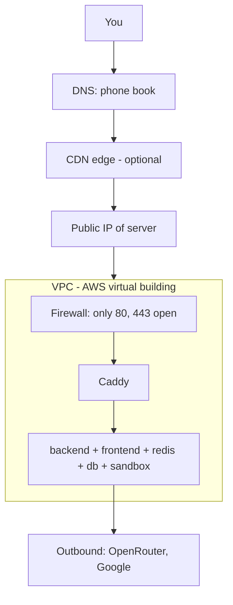
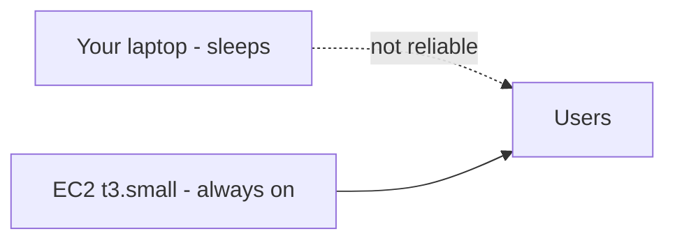
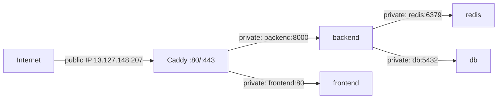
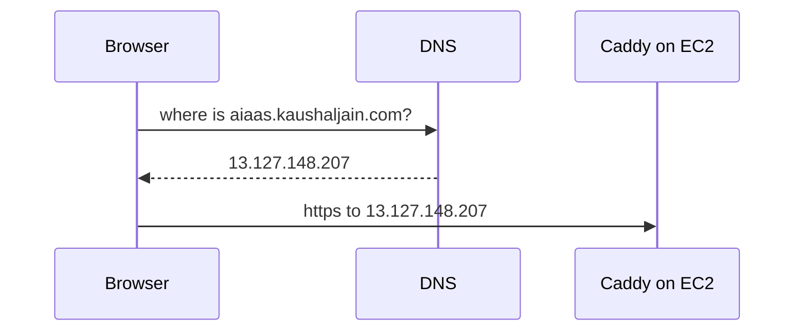
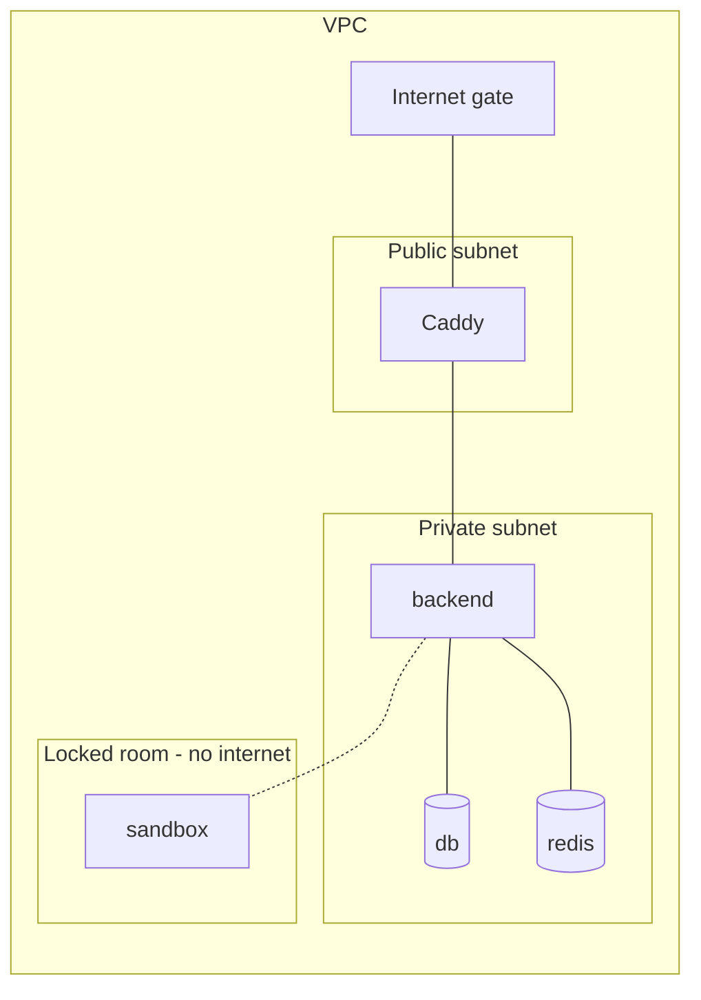
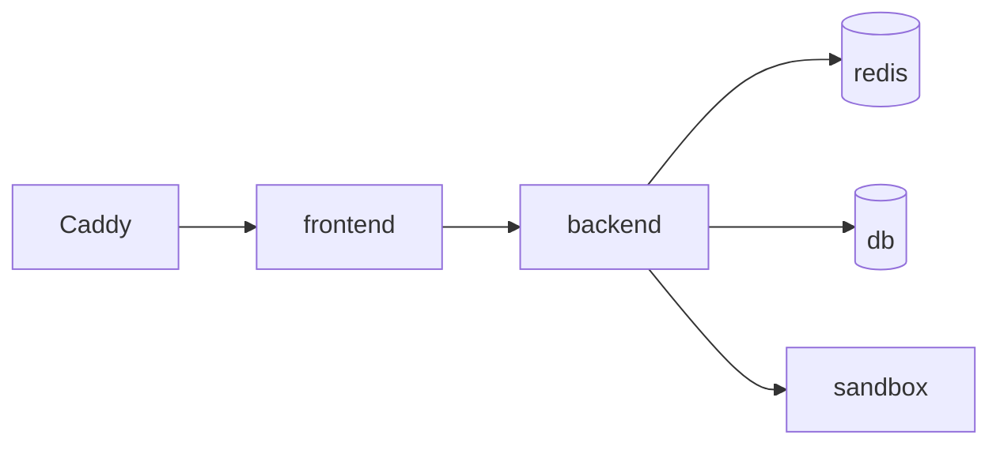
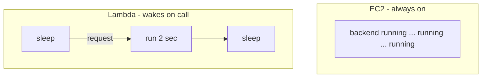
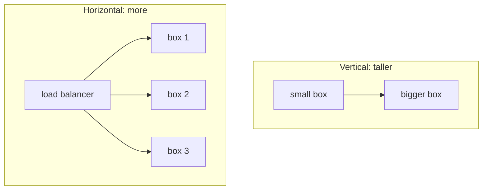
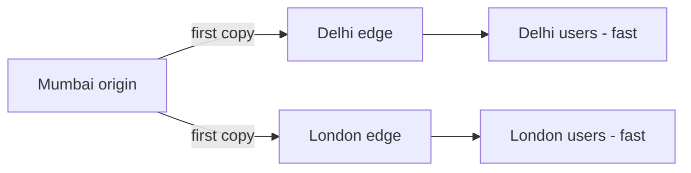
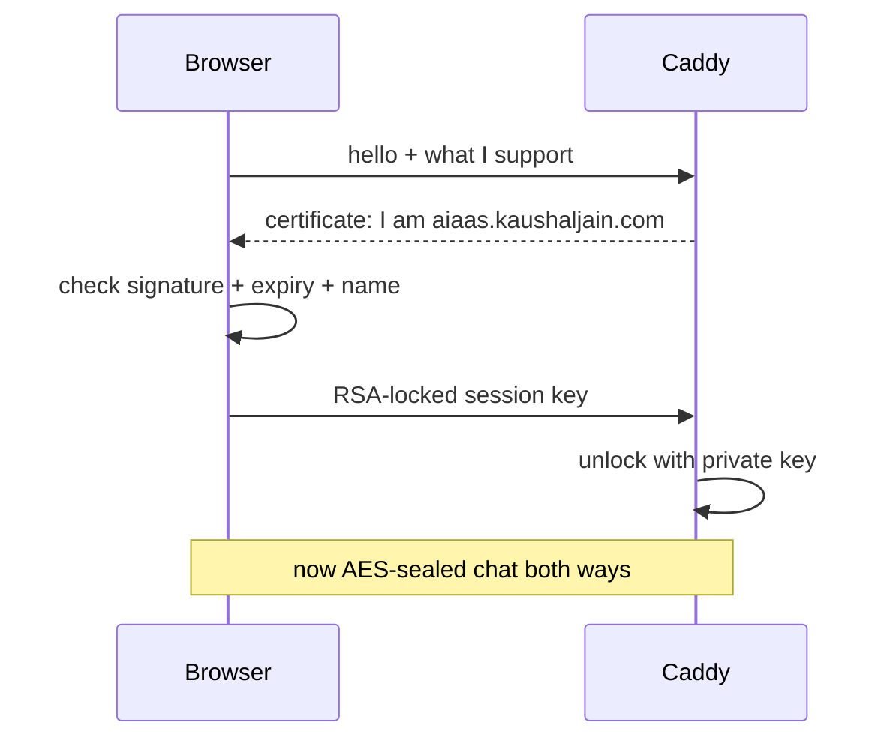

# Cloud, Network & Scaling — Simple Guide

> Plain-words companion to `INFRASTRUCTURE_SIMPLE_GUIDE.md`.
> Same rule: short sentences, one picture per idea, tied to this app where it helps.

---

## 1. Map of everything in one picture

You type a name. DNS gives an address. Firewall checks the door. Caddy lets you in. App answers. App itself calls out for AI models.

---

## 2. VPS and EC2 — rented computers

**Problem:** your laptop sleeps, Wi-Fi drops, IP changes. A website needs a computer that never sleeps.

**VPS = one rented slice of a big computer.** EC2 is Amazon's VPS shop.

* This app runs on `EC2 t3.small`: 2 CPU, 2 GB RAM, 8 GB disk.
* You pick region, size, disk. AWS gives you a machine in ~1 minute.
* You pay while it runs, stop pays less.

Think of it like renting a shop instead of selling from home. Home closes at night. Shop stays open.

**Golden rule from `DEPLOYMENT.md`:** nothing is built on EC2. Images are built on dev machine, pushed to Docker Hub, pulled on EC2. Small box should only run, not compile.

---

## 3. Public IP, private IP, Elastic IP

* **Private IP** like `172.18.0.5`: house room number. Only works inside the Docker/VPC building. Our `backend:8000`, `redis:6379` use these. Internet cannot reach them.
* **Public IP** like `13.127.148.207`: street address. Internet can reach it. Only Caddy has this (ports `80,443`).
* **Elastic IP:** a public IP you keep. Normal public IPs change on reboot. Ours changed once: `15.252.76.239 -> 13.127.148.207`, and `ALLOWED_HOSTS` broke until updated. Elastic IP stops that pain.

> Check: `nslookup aiaas.kaushaljain.com` must show the *current* public IP before you trust any IP written in docs.

---

## 4. DNS — the phone book

**Problem:** humans remember `aiaas.kaushaljain.com`, computers need `13.127.148.207`.

**DNS = phone book.** You ask "where is this name?", it answers with the number.

Common records:

| Record | Does | Example |
|---|---|---|
| `A` | name -> IPv4 | `aiaas -> 13.127.148.207` |
| `AAAA` | name -> IPv6 | rarely used here |
| `CNAME` | name -> another name | `www -> aiaas.kaushaljain.com` |
| `TTL` | how long to remember answer | low TTL = fast change, more queries |

DNS here points straight at the box, no proxy in front. So Caddy itself does TLS.

---

## 5. VPC, subnets, firewall — the building, floors, guard

**VPC = your private building inside AWS.** No stranger walks in by default.

* **Subnet:** one floor. Public floor has road to internet. Private floor does not.
* **Security group = guard with list.** Ours: allow `80, 443` in, everything else closed. Redis/DB have no public door at all.
* **Docker networks do the same inside the box:** `aiaas-network` (app talks), `sandbox-net: internal:true` (sandbox has no road out at all).

**Inbound vs outbound:**

* **Inbound = world -> you.** Only `80/443` to Caddy. SSH `22` only for you during deploy, then closed. This is why prod compose publishes no host ports except Caddy.
* **Outbound = you -> world.** Backend calls OpenRouter, Google, npm. Sandbox calls nothing — its network is cut, so leaked AI code cannot phone home.

If inbound is open wrongly, anyone can try Redis/DB. If outbound is open wrongly, a hacked tool can send your data out.

---

## 6. Microservices — small shops, not one mall

**Monolith = one big shop does everything.** Easy start, hard to grow, one fire closes all.

**Microservices = many small shops with one gate.** Each does one job, talks over network, restarts alone.

This app is microservices-lite with Compose:

| Box | One job | If it dies |
|---|---|---|
| `caddy` | TLS + forward | Nobody enters |
| `frontend` | Files + routing | Blank page, API still alive |
| `backend` | Thinking (Django) | Page opens, chat fails |
| `db` | Remembering | Login + history fail |
| `redis` | Live wires | Streams freeze |
| `sandbox` | Running AI code | Code tool says busy, chat still works |

Why good here: sandbox can be killed/updated without touching users. DB can be backed up alone (`pg_dump` via `aiaas-db` container).

Why not more pieces: each box eats RAM. On 2 GB, 6 boxes is already full. More boxes = more OOM kills.

---

## 7. Server vs serverless (Lambda) — owning vs renting per second

* **EC2 / Docker = you rent the shop all month.** Good for always-on website, WebSockets, long agent runs (40 steps, 2 hours). You pay even at 3 AM with zero users.
* **Lambda / serverless = you rent the oven only while bread bakes.** Upload a function, AWS runs it on a request, you pay per millisecond. No server to patch. But: max ~15 min run, no long WebSocket, cold start delay, no local disk.

**Why this app is NOT Lambda:**

* Chat SSE + `ws/` stay open for minutes/hours — Lambda closes them.
* Agent checkpoint + scheduler lease need one warm process.
* `sandbox` needs persistent locked containers, not 15-min functions.

Where Lambda *would* fit: nightly thumbnail job, image resize on upload, webhook ping — short, rare, no memory of yesterday.

---

## 8. Scaling — taller vs more

**Vertical scaling = bigger machine.** `t3.micro -> t3.small -> t3.medium`. Like replacing a small shop with a bigger shop.

* Easy: change one number, restart.
* Limit: biggest machine + cost + one failure kills all.
* We did this: box grew to 2 GB, `backend mem_limit 384m`, `db 256m`, `sandbox 600m` tuned to fit.

**Horizontal scaling = more machines behind a load balancer.** Like opening 3 same shops, guard sends customers round-robin.

**What breaks when you add boxes (why we stay at 1):**

* Scheduler lease (`SchedulerLease`) exists so exactly one box fires schedules — 2 boxes without lease = double emails.
* WebSocket sticky sessions needed — user on box-1, event on box-2 = no stream unless Redis pub/sub shares it (we already use Redis, good).
* DB pool math: `DB_POOL_MAX_SIZE 10 + checkpoint 4 = 14` must stay under `max_connections 25`. Two backends = 28 > 25 = Postgres refuses.
* Checkpoints + volumes must move to shared disk/S3, else box-2 cannot see box-1 files.

> Rule: scale vertical until money or CPU says stop. Go horizontal only with shared DB, shared Redis, shared files, and one lease-holder.

---

## 9. CDN — photocopy shops near users

**Problem:** user in Delhi downloads JS from Mumbai server — slow.

**CDN = copies of static files in 300+ cities.** First user in a city fetches from origin, rest get nearby copy. Dynamic chat (`/api`, `/ws`) still goes to origin — never cached.

We don't run a CDN yet. Our mini-version: Nginx caches `/assets/ 1 year` in browser + Caddy `zstd` compression. Adding CloudFront/Cloudflare later = put it in front of Caddy, keep `/api/*, /ws/*` as `bypass-cache`.

---

## 10. Encryption, HTTPS, RSA, certificates — the sealed letter

**Problem:** `http` is a postcard — Wi-Fi owner, ISP, anyone in middle can read passwords and tokens.

**HTTPS = sealed envelope + ID check.** Two parts:

1. **Encryption (TLS + RSA once, AES after):** RSA (two big keys, public locks, private opens) safely agrees on a short session key. Then fast AES locks all chat text. Nobody in middle can read.
2. **Certificate = ID card:** "Yes, this really is `aiaas.kaushaljain.com`, signed by Let's Encrypt, valid till X date." Browser checks signature + expiry + name match. Wrong name = warning.

**Here:** Caddy gets/renews Let's Encrypt certs automatically (`caddy_data` volume holds them). No manual `.pem` upload. Inside Docker, traffic is plain `http` — safe because it never leaves the box. Outside, always `https`.

Also at rest: `CREDENTIAL_ENCRYPTION_KEY` AES-locks API keys in DB. Lose that key = all stored credentials become unreadable. Back it up like a house key.

---

## 11. More things you will meet — one line each

* **Load balancer:** traffic policeman for horizontal scaling. Caddy/Nginx are simple ones; AWS ALB is managed one.
* **Reverse proxy vs forward proxy:** reverse = gate for server (Caddy/Nginx here). Forward = gate for users (office firewall, VPN).
* **Ports:** door numbers. `80=http, 443=https, 5432=postgres, 6379=redis, 8000=django`. Firewall opens doors, compose maps them.
* **Healthcheck:** doctor knock. `redis-cli ping`, `GET /api/health/`, `GET /health`. Dead box gets restarted, traffic waits for `healthy`.
* **S3 / object storage:** infinite file room. `USE_S3` moves uploads out of `backend_media` so any box can read them — needed before horizontal scaling.
* **Managed DB (RDS):** AWS runs Postgres for you — backups, patching, failover. We run `db` container to save money; RDS is the grown-up move.
* **Secrets manager:** locker for keys (`SECRET_KEY`, OAuth secrets). Today in `.env` file — must never go to git. Manager adds rotation + audit.
* **IAM:** who-can-do-what cards in AWS. Backend uses one role, human uses another, deploy key can only `pull/up`, never delete DB.
* **Logs + metrics:** `docker logs -f backend`, Caddy access logs (rotated `10m x3` or disk fills). Next step: Sentry (`SENTRY_DSN`) for errors, disk/RAM alerts before OOM kills Daphne.
* **Backup:** `docker exec aiaas-db pg_dump -U user -Fc db > backup.dump` before every deploy. Also keep `backend_media`. Test restore on local, never restore local over prod.
* **CI/CD:** robot that tests → builds → pushes → pulls on EC2 on every `git push`. Today manual (`build/push/pull/up`). Robot removes "forgot to push" deploys.

---

## 12. Remember in 30 seconds

* **VPS/EC2** = rented computer that never sleeps.
* **Public IP** = street address, **private IP** = room number, **Elastic** = address you keep.
* **DNS** = phone book, name -> number.
* **VPC + firewall** = building + guard. Inbound = who enters, outbound = where app calls.
* **Microservices** = small shops, one dies, rest stay open.
* **Lambda** = pay per bake, not per shop. Bad for long chats, good for night jobs.
* **Vertical** = bigger shop. **Horizontal** = more shops + balancer.
* **CDN** = photocopy shops near users, static only.
* **HTTPS** = sealed letter + ID card. RSA shakes hands, AES carries chat, cert proves name.
