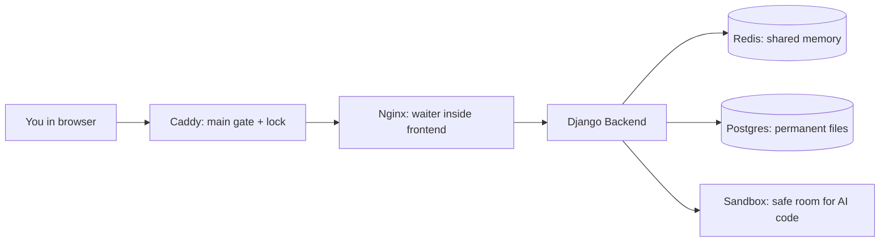
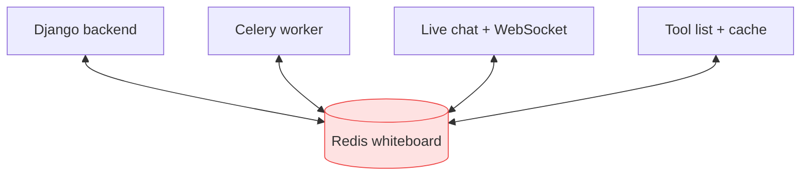
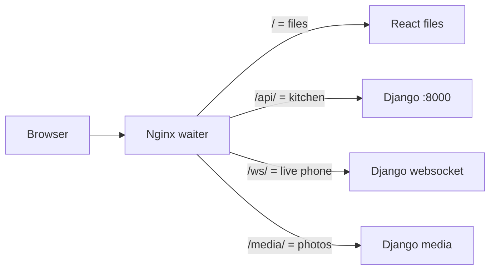
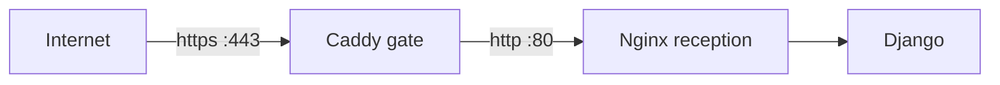
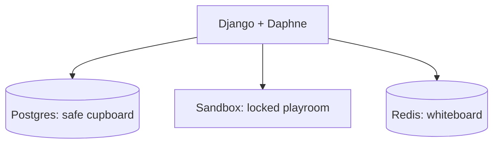
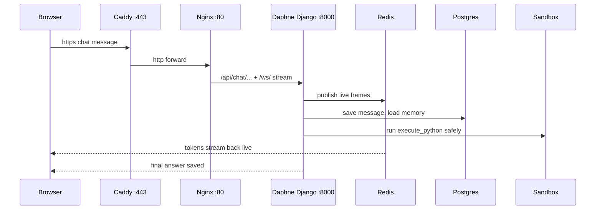
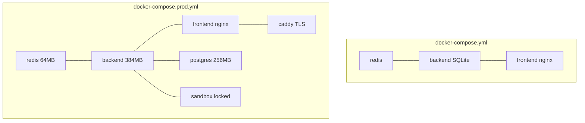

# How This App Actually Runs — Simple Guide

> Docker, Redis, Nginx, Caddy, Postgres, Sandbox — explained in plain words.
> Your code is Django + React. These tools turn that code into a real website that stays online.

---

## 1. The big idea in one picture

A normal coding tutorial stops here:

```
Your laptop: Python + React = works for you only
```

A real deployable system looks like this:



**Simple rule:** your code does the thinking. These tools do the carrying, locking, remembering, and protecting.

---

## 2. Docker — same box, everywhere

**Problem:** "It works on my laptop but not on the server."

**What Docker does:** it packs your app + Python + settings into a sealed box called an **image**. That box runs the same on any computer.

Think of it like a lunchbox. Without it, you carry curry in your hands. With it, the same lunch reaches office safely.

```mermaid
flowchart TB
    subgraph Laptop["Your laptop"]
        Code[Your code]
    end
    subgraph Image["Docker image"]
        Code2[Your code] + Python[Python 3.12] + Setup[Settings]
    end
    subgraph Server["EC2 server"]
        Box1[backend box]:::b
        Box2[frontend box]:::f
        Box3[redis box]:::r
    end
    Laptop --> Image --> Server
    classDef b fill:#dbeafe,stroke:#3b82f6;
    classDef f fill:#dcfce7,stroke:#22c55e;
    classDef r fill:#fee2e2,stroke:#ef4444;
```

**In this project:**

| File | What it builds |
|------|----------------|
| `Backend/Dockerfile` | Backend box: installs Python packages, collects static files once, starts with `manage.py boot && daphne` |
| `better-n8n-frontend/Dockerfile` | Frontend box: builds React with Node, then serves it with Nginx |
| `Backend/sandbox_service/Dockerfile` | Sandbox box: tiny locked Python room for AI-written code |
| `docker-compose.yml` | Local set: redis + backend + frontend |
| `docker-compose.prod.yml` | Server set: redis + database + sandbox + backend + frontend + caddy |

**Volumes = memory that survives restart.** Without volumes, a redeploy wipes the database. With them (`pgdata`, `backend_data`, `redis_data`), files stay safe.

---

## 3. Redis — the shared short memory

**Problem:** Django forgets everything after each request. But chat needs live streaming, and agent runs go for 2 hours.

**What Redis does:** it is a super-fast notebook that all boxes can read and write at the same time.

Think of it like a whiteboard in a shared office. Everyone sees the same notes instantly.



**3 jobs of Redis here:**

1. **Live wires** — `USE_REDIS_CHANNEL_LAYER=True`. Chat messages and run logs travel through Redis to your screen via WebSocket / SSE.
2. **Work queue** — `CELERY_BROKER_URL=redis://redis:6379/0`. Long tasks wait in a line instead of blocking the website.
3. **Fast cache** — tool lists, vision checks, small repeated answers. No need to ask the database again and again.

> In production Redis is capped at `64 MB` with `allkeys-lru` — old notes are thrown first so one burst never kills the small server.

---

## 4. Nginx — the waiter inside the frontend

**Problem:** React is just files. Someone must serve files, send `/api` calls to Django, and keep video-like chat streams open.

**What Nginx does:** it lives *inside* the frontend box (`nginx:1.27-alpine`). It decides: "Is this a file? An API call? A live wire?"

Think of it like a restaurant waiter. You talk to one person, he runs to kitchen, file room, or phone desk.



**Real rules from `better-n8n-frontend/nginx.conf`:**

* `/api/` → `backend:8000`, `proxy_buffering off`, timeout `300s` — chat streams must flow, not wait.
* `/ws/` → `backend:8000`, `Upgrade` header, timeout `86400s` — execution logs stay open all day if needed.
* `/assets/` → cache `1 year` (file names have hash, safe). `/index.html` → `no-cache` (else users see old site after deploy).
* `/health` → returns `healthy` so Docker knows the box is alive.

---

## 5. Caddy — the main gate with lock

**Problem:** Nginx talks `http` inside. The internet needs `https` (padlock), compression, and one door for the whole site.

**What Caddy does:** it is the only box with open doors to the world (`80, 443`). It adds the `https` lock automatically and forwards everything to Nginx.

Think of it like the building security gate. Nginx is the reception inside. You cross the gate first.



**Real rules from `Caddyfile`:**

```
aiaas.kaushaljain.com {
  encode zstd gzip
  reverse_proxy frontend:80 { flush_interval -1 }
}
```

* Auto-TLS for `aiaas.kaushaljain.com` — no manual certificates.
* `encode zstd gzip` — makes JS bundle smaller, site loads faster.
* `flush_interval -1` — do not hold back chat streams.

**Nginx vs Caddy — do not confuse:**

| | Caddy | Nginx |
|---|---|---|
| Where | Edge, faces internet | Inside frontend box |
| Job | Lock (TLS), compress, forward | Serve files, route `/api`, `/ws` |
| Ports | `80, 443` open | Only talks inside Docker network |

---

## 6. The helpers: Postgres, Daphne, Sandbox



**Postgres (`db` service, prod only):** the permanent cupboard. SQLite is a notebook — fine locally, breaks with many writers. Postgres + small pool (`max_connections=25`) safely holds real users, agents, run history.

**Daphne (not `runserver`):** `runserver` is a bicycle for testing — single-threaded, restarts on file change and kills live streams. Daphne is the ASGI bus — handles normal requests + WebSockets together. That's why `CMD` is `exec daphne -b 0.0.0.0 -p 8000`.

**Sandbox (sidecar):** the AI writes Python code. You cannot run stranger's code in your kitchen. So it runs in a locked playroom: `read_only`, `cap_drop: ALL`, no internet (`internal:true` network), memory + process caps. Even if code escapes Python, it is still inside a throwaway box with no secrets.

---

## 7. One request, full journey

What happens when you send a chat message on `https://aiaas.kaushaljain.com`:



1. **Caddy** removes the lock, compresses.
2. **Nginx** sees `/api/` → sends to Django, keeps stream open.
3. **Django/Daphne** checks auth, loads memory from Postgres, runs the agent loop.
4. **Redis** carries each token to your screen instantly.
5. **Sandbox** runs any Python the model wrote, returns numbers only.
6. **Postgres** keeps the chat for tomorrow.

---

## 8. Local vs Server — same code, different wiring



| | Local | Server |
|---|---|---|
| Build | `build:` from your folders | `image:` pulled from Docker Hub, nothing built on server |
| Database | SQLite file in volume | Postgres in `db` box |
| Async | Optional `worker + beat` with `--profile async` | No Celery — scheduler loop lives inside backend |
| Entry | `localhost:3000` direct | `https` via Caddy only |

---

## 9. Remember in 30 seconds

* **Docker** = same box everywhere. No "works on my laptop" excuse.
* **Redis** = shared whiteboard. Live chat, job line, fast cache.
* **Nginx** = indoor waiter. Files vs `/api` vs `/ws`.
* **Caddy** = outdoor gate. Auto `https` + compression + forward.
* **Postgres** = cupboard that never forgets.
* **Sandbox** = locked playroom for AI code.
* **Daphne** = real server that can hold many live wires at once.

> Framework code answers one question. This system delivers that answer fast, live, safely, to everyone, even after a restart.
