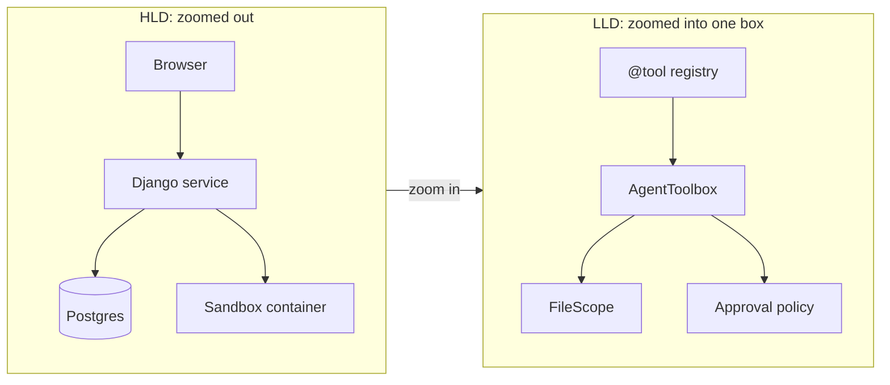
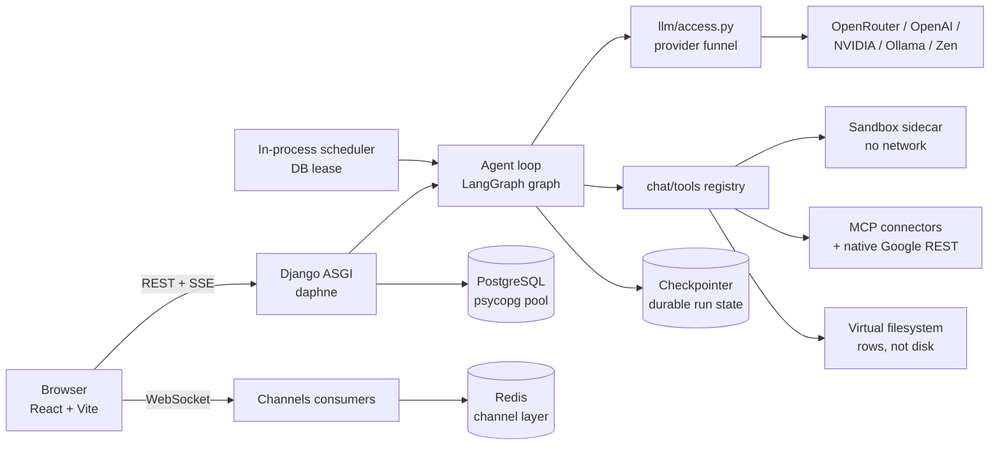
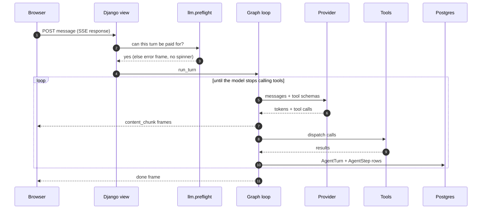
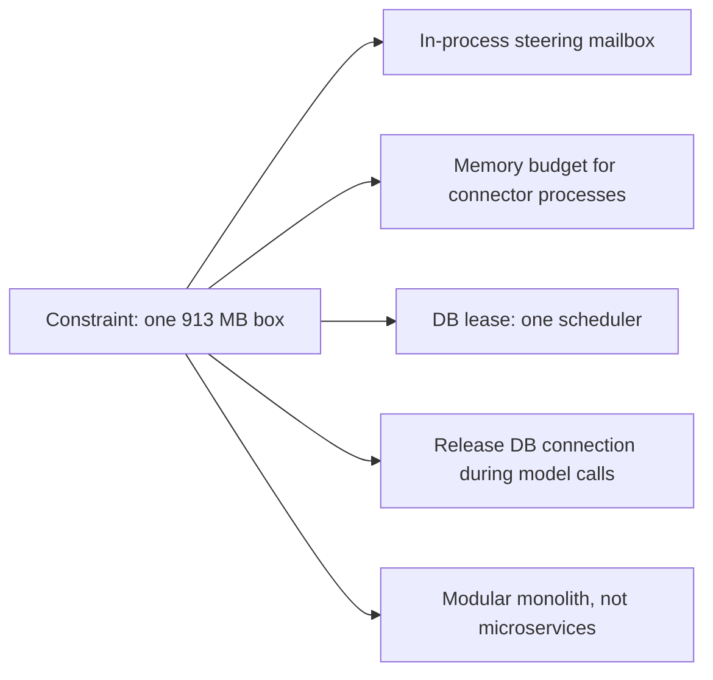
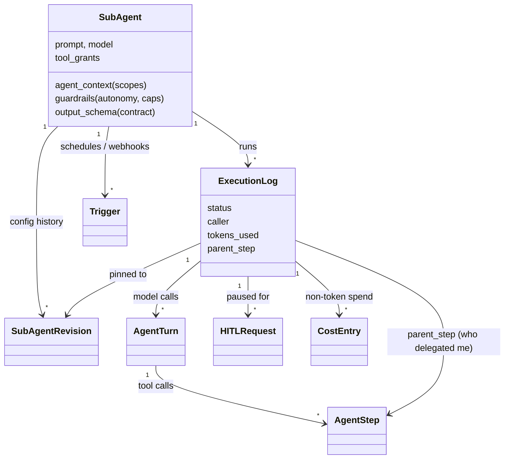
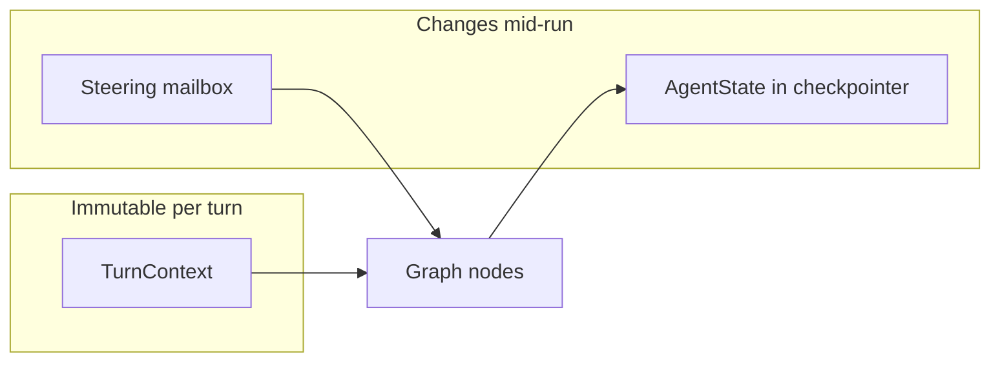
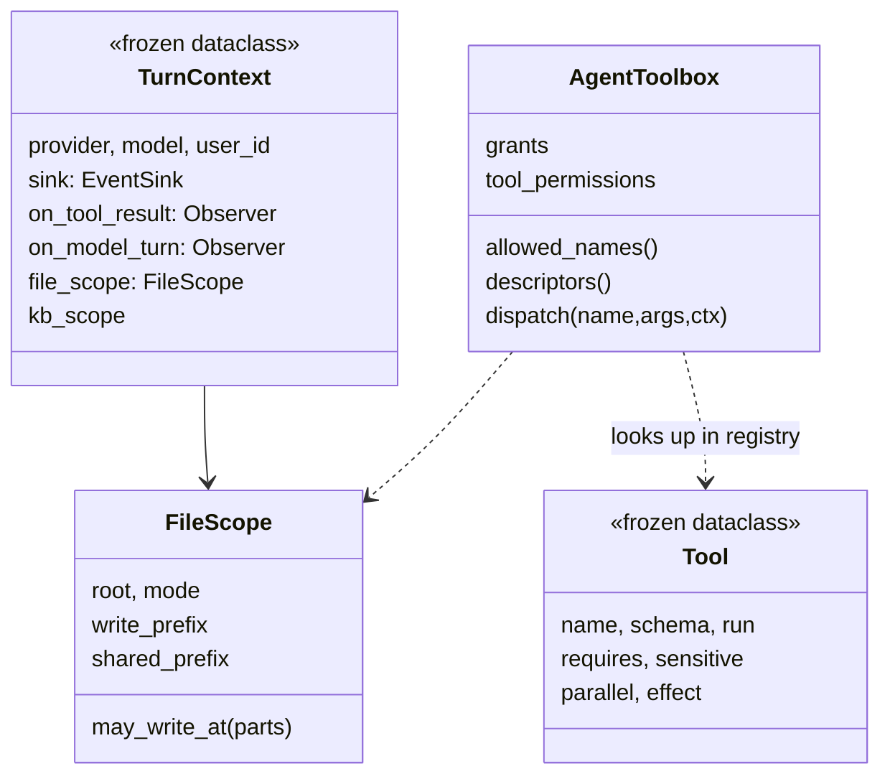

# Part 1 — HLD and the Object Model

> What the big boxes are, how a request travels, and which classes carry the design.
> Back to the [index](README.md).

---

## 0. How to use this guide

- **Read one pattern at a time.** Open the linked file beside the section. The
  excerpts here are trimmed; the file has the full reasoning in its comments.
- **For each pattern, learn three things:** what problem it solves, where it
  lives here, and what it costs. The cost is what separates a candidate who
  memorised patterns from one who has used them.
- **Say the "interview line" out loud.** It is written to be said in about 20
  seconds.
- Paths are relative to this file, so the links open in VS Code and on GitHub.

A rule to keep in your head the whole way through:

> **A pattern is an answer to a force.** Name the force first ("tools are added
> often and must never drift from their schema"), then the pattern ("so the
> decorator *is* the registration"). Naming the pattern first sounds like a
> textbook.

---

## 1. HLD vs LLD in one page

| | High-level design (HLD) | Low-level design (LLD) |
|---|---|---|
| **Question** | What are the big boxes, and how do they talk? | What is inside one box, and how is it shaped? |
| **Units** | Services, databases, queues, caches, networks | Classes, interfaces, functions, data structures, state machines |
| **Decisions** | Sync vs async, SQL vs NoSQL, where state lives, how it scales, what fails | Which pattern, which class owns what, which invariants hold, how errors travel |
| **Artefacts** | Box-and-arrow diagram, data flow, capacity numbers | Class diagram, sequence diagram, interfaces, pseudocode |
| **Interview** | "Design WhatsApp" | "Design a parking lot / rate limiter / LRU cache" |
| **In AIAAS** | React → Django ASGI → LangGraph loop → providers; Postgres, Redis, sandbox sidecar | `@tool` registry, `AgentToolbox.dispatch`, `FileScope`, steering mailbox |

They are not separate jobs. **HLD decides the constraints; LLD honours them.**
Example from this project: the HLD says "one 913 MB box, one web process" (see
`learning/13` and `learning/16`). That single fact drives LLD choices all the way
down: in-process mailboxes instead of Redis queues, a memory *budget* on
connector subprocesses, a DB lease so only one scheduler runs, and connection
release before long model calls.

---

## 2. The high-level design of AIAAS

### 2.1 What the product is

A person chats with an **orchestrator** (the chat agent). It reads, plans and
delegates. The real work is done by **subagents** — saved configurations (a
prompt, a model, the tools it may use, its limits). Subagents can also run on a
schedule or from a webhook. Everything they do is recorded, can be paused for a
human's approval, and can be evaluated.

### 2.2 The boxes

The same picture as a Mermaid diagram:

### 2.3 The one data flow to know by heart

1. The browser POSTs a message. The response is a **Server-Sent Events** stream
   (`api/sse.ts` reads it — `EventSource` can't POST).
2. `chat/turn/pipeline.py` does **preflight** first: can this turn be paid for?
   If not, fail before showing any "thinking" (see §10).
3. The **graph** runs: `agent → tools → curate → steering → agent …` until the
   model answers without calling a tool.
4. Each node emits **events** into a sink. The sink writes SSE frames. The
   frontend **reducer** folds frames into screen state.
5. Every model call becomes an `AgentTurn` row, every tool call an `AgentStep`,
   under one `ExecutionLog`.

### 2.4 HLD decisions worth defending

| Decision | Why | What it costs |
|---|---|---|
| **Modular monolith** (Django apps as modules) | One small box; one deploy; one DB transaction can span modules | Needs discipline to stop modules tangling → import contracts (§4.5) |
| **SSE for chat, WebSocket for run logs** | SSE is one-way, works over plain HTTP, easy to resume; WS only where the server pushes unasked | Two transports to maintain |
| **One door for runs** (`start_agent_run`) | Guardrails can only be forgotten in a second door | Every caller must fit one signature |
| **Sandbox as a separate container** | A Python breakout lands somewhere with no secrets and no network | An extra hop per `execute_python` |
| **Durable checkpointer as a setting** | Long runs must survive deploys in prod; tests want isolation | Three backends to keep compatible |
| **Postgres pool, not PgBouncer** | Django 5.1 pools natively; one less process on a tiny box | Pool size must stay under `max_connections` |

**Interview line (HLD):** "It's a modular monolith on one small box, so most of
my scaling work was *inside* the process: bounded pools, admission control on
subprocesses, releasing DB connections across slow model calls, and making runs
durable so a deploy doesn't lose them."

---

## 3. The object model: the classes that matter

### 3.1 The run record

Why it is shaped like this — each is an LLD decision:

- **A run is a loop of turns, so `AgentTurn` is a row**, not a JSON blob. A
  grouping you must rebuild at read time cannot be queried.
- **`AgentStep` is written *before* the tool runs.** A tool can start a child
  run (delegation), and the child needs a step id to point at.
- **Delegation points at a step, not a run.** `parent_step.execution` answers
  "which run asked?", and `parent_step.turn.reasoning` answers "what was it
  thinking?". One foreign key, two answers.
- **A run is pinned to a config revision** at *open* time, so editing an agent
  mid-run cannot rewrite history.

### 3.2 The agent at runtime

- `TurnContext` is **immutable** (`frozen`). Settings for a turn never change
  mid-turn; anything that must change mid-run (a steer, an autonomy switch)
  goes through a separate mailbox (§7.6). Immutability here removed a whole
  class of "who changed this?" bugs.
- `AgentToolbox` is the **policy object**: it knows the grants and answers two
  questions — what to *offer*, and whether to *allow* a call.
- `Tool` is a **value object**: a frozen record, compared by content.

**Interview line:** "I model *records* as rows so they're queryable, *settings*
as frozen dataclasses so they can't drift mid-run, and *policy* as one object
that owns both the offer and the check."

---
