# Part 2 — Backend LLD Patterns (Django / Python)

> SOLID, then every GoF and system-level pattern the backend uses, each with the real code,
> the force behind it, and what it costs. Back to the [index](README.md).

---

## 4. SOLID, shown in this code

### 4.1 S — Single Responsibility

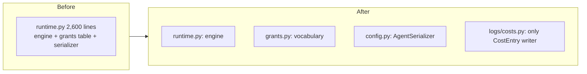

"A module should have one reason to change."

- `agents/grants.py` holds **only** the permissions vocabulary (`GRANT_TOOLS`,
  `AUTONOMY_LADDER`, `CALLERS`...). It used to live inside the 2,600-line
  runtime, so reading a table meant importing the whole engine. Now it has one
  reason to change: the vocabulary changed.
- `logs/costs.py::record` is the **only** writer of `CostEntry`. One writer
  means one place to get rounding and "unpriced is estimated, never free" right.
- The chat page was split into props-only pieces (`ChatHeader`,
  `ChatMessageItem`, `ToolApprovalCard`...). They hold no hooks and call no API.
  State lives in one owner (`StandaloneChat`); drawing lives in the pieces.

### 4.2 O — Open/Closed

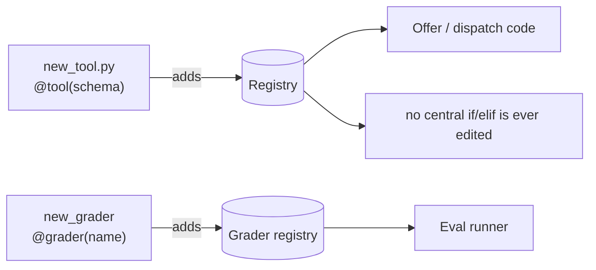

"Open for extension, closed for modification."

Adding a tool, a grader, a contract, a provider, or a slash command means
**adding** a declaration. No central `if/elif` is edited. See the registries in
§7.1. The test of it: *could two people add two tools on the same day without a
merge conflict?* Here, yes.

### 4.3 L — Liskov Substitution

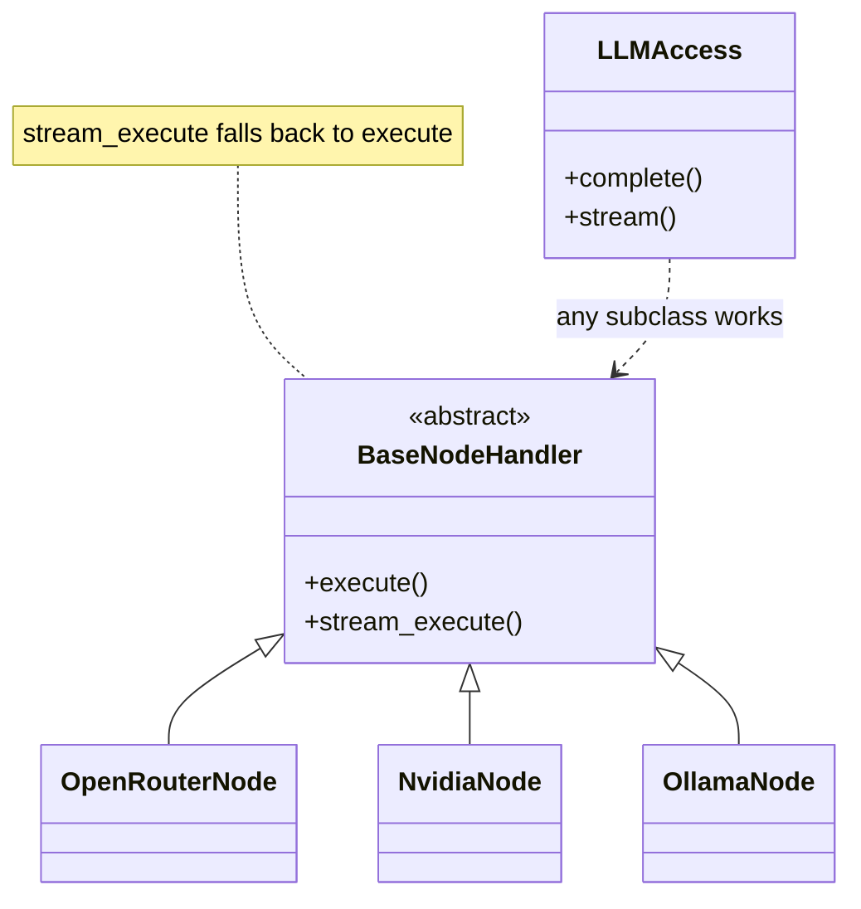

"A subclass must work anywhere its parent does."

- Every provider handler (`OpenRouterNode`, `NvidiaNode`, `OllamaNode`...) is a
  `BaseNodeHandler`. `llm/access.py` calls `execute()` / `stream_execute()`
  without knowing which one it got.
- `BaseNodeHandler.stream_execute` has a **default** that calls `execute()` and
  yields it as one chunk. So a provider that cannot stream still satisfies the
  streaming contract. That default *is* LSP in practice.
- Both sandbox engines return **the same result envelope** (`success`,
  `output`, `stderr`, `timed_out`...). The caller cannot tell them apart.

### 4.4 I — Interface Segregation

"Don't force clients to depend on methods they don't use."

- The event sink is a one-method `Protocol`
  ([`chat/turn/events.py:82`](../Backend/chat/turn/events.py#L82)). A node that
  emits events needs nothing else.
- `BaseNodeHandler` was **trimmed**: it used to carry canvas fields (`icon`,
  `color`, `inputs`, `outputs`, `get_schema()`...). No provider used them once
  the canvas was gone, so they were removed. A fat base class forces every
  subclass to pretend.

### 4.5 D — Dependency Inversion

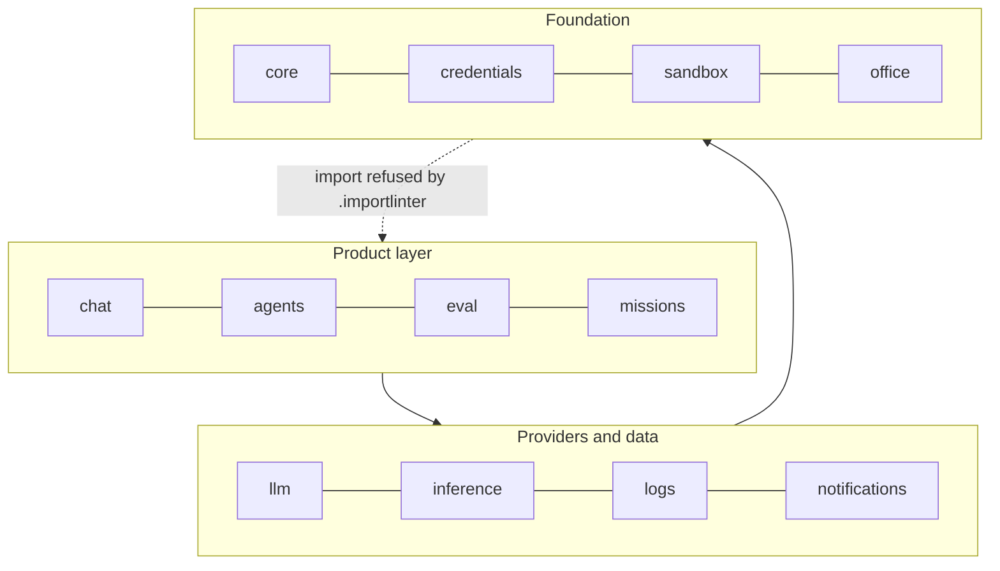

The duck-typed environment, as a picture:

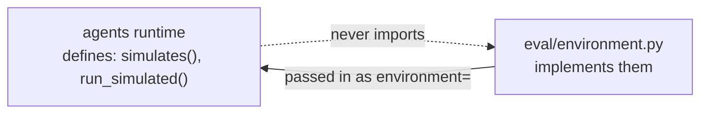

"Depend on abstractions, not on concrete modules."

- **The eval environment is duck-typed.** `agents/` must not import `eval/`
  (a lower layer may not import a higher one). So the runtime accepts any object
  with `simulates(name)` and `run_simulated(...)`, and `eval` passes one in.
  The high-level policy (the runtime) owns the interface; the detail (eval)
  plugs into it.
- **Import contracts enforce the direction.** `Backend/.importlinter` states the
  layers (foundation → providers/data → product) and a test fails CI if a lower
  layer imports a higher one. Most people *describe* layering; this project
  *tests* it.

**Interview line:** "Dependency inversion here is enforced by a test: the agent
runtime can't import eval, so eval hands the runtime an object that matches a
small interface the runtime defines."

---

## 5. Creational patterns

### 5.1 Singleton — `ProviderRegistry`

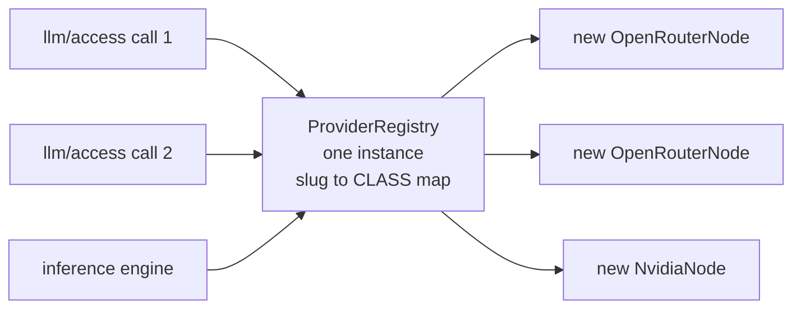

[`llm/handlers/registry.py`](../Backend/llm/handlers/registry.py)

```python
class ProviderRegistry:
    _instance: 'ProviderRegistry | None' = None
    _handlers: dict[str, Type[BaseNodeHandler]] = {}

    def __new__(cls):
        if cls._instance is None:
            cls._instance = super().__new__(cls)
        return cls._instance
```

- **Force:** every model call needs "slug → handler class", and building that
  map twice is waste.
- **Note the subtlety:** it stores **classes**, and `get_handler()` returns a
  **new instance** each call. The *registry* is shared; the *handlers* are not.
  So no request state can leak between calls.
- **Other singletons here:** `CredentialManager` (one process-wide cache),
  `ConnectorSupervisor` (one budget for all connector subprocesses).

**The cost you must mention:** a singleton is global state. The project hit
exactly this: `CredentialManager`'s cache is keyed `{user_id}:{credential_id}`,
test databases restart ids at 1, so cached entries leaked between tests. The fix
is `cache.clear()` in `setUp`. In Python, a **module-level object** is usually a
simpler singleton than `__new__` tricks.

### 5.2 Factory — `checkpoints.build()`

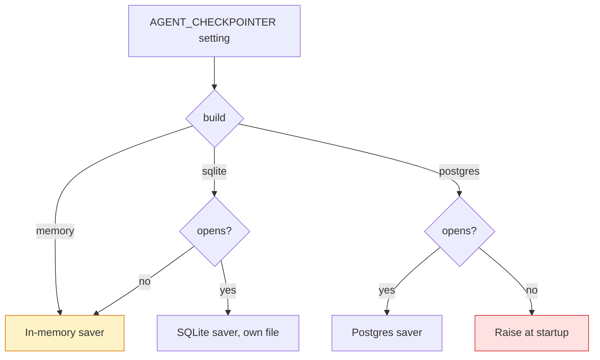

[`chat/turn/checkpoints.py:62`](../Backend/chat/turn/checkpoints.py#L62)

```python
def build():
    choice = _configured()           # 'memory' | 'sqlite' | 'postgres'
    if choice == 'memory':
        return _memory()
    if choice == 'sqlite':
        try:
            return _sqlite()
        except Exception:
            return _memory()         # dev-only: degrade, and say so
    return _postgres()               # prod: a failure is NOT swallowed
```

- **Force:** where run state lives depends on the environment.
- **Design detail worth quoting:** the factory has **different failure rules per
  product**. SQLite (dev) degrades to memory. Postgres (prod) raises at startup.
  "Durability that silently isn't is worse than never claiming it."
- **Other factories:** `vfs.build_scope(user, file_access)` turns a mode string
  into a `FileScope`; `get_registry()` lazily registers providers.

### 5.3 Lazy initialisation — `get_graph()`

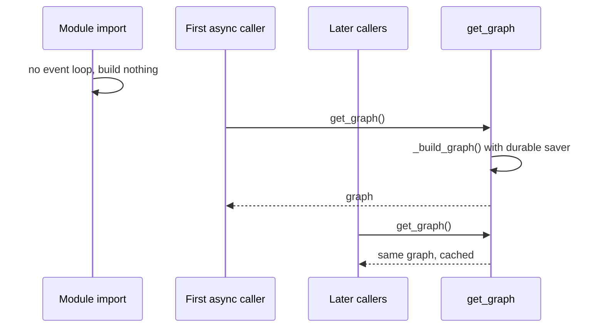

[`chat/turn/agent.py:2319`](../Backend/chat/turn/agent.py#L2319)

```python
_graph = None

def get_graph():
    global _graph
    if _graph is None:
        _graph = _build_graph()
    return _graph

def __getattr__(name):            # PEP 562: old imports keep working
    if name == "chat_agent_graph":
        return get_graph()
    raise AttributeError(name)
```

- **Force:** the durable saver needs a running event loop in its constructor.
  At import time there is none. So an eagerly built graph could only ever get
  the in-memory saver — silently.
- **Lesson:** *when* an object is built can be a correctness question, not just
  a speed one.

### 5.4 Builder — the graph and the system prompt

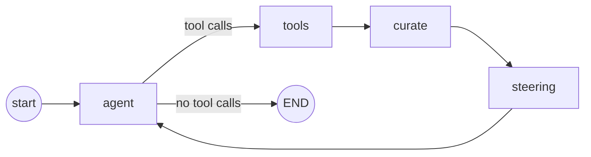

`StateGraph` is a textbook builder: `add_node`, `add_edge`, `compile()`.

[`chat/turn/agent.py:2280`](../Backend/chat/turn/agent.py#L2280)

```python
graph = StateGraph(AgentState)
graph.add_node("agent", agent_node)
graph.add_node("tools", tools_node)
graph.add_node("steering", steering_node)
graph.add_node("curate", curate_node)
graph.set_entry_point("agent")
graph.add_conditional_edges("agent", _next_step, {"tools": "tools", END: END})
graph.add_edge("tools", "curate")
graph.add_edge("curate", "steering")
graph.add_edge("steering", "agent")
return graph.compile(checkpointer=checkpoints.build())
```

The **order of edges is a design decision**, documented in the code: the steer
must land *after* tool results and *before* the model reads them — the only point
where a new user message cannot split an assistant turn from its tool replies.

`build_system_prompt(agent, gathered, file_scope, ...)` in the runtime is the
same idea for text: assemble a complex object in steps from parts.

---

## 6. Structural patterns

### 6.1 Facade — one door to a subsystem

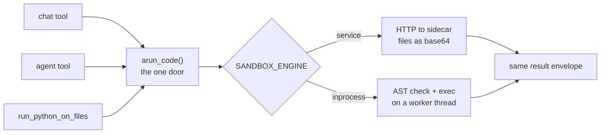

A facade gives a simple front to something complicated. This project calls it
**"one door"**, and uses it everywhere:

| Facade | Hides |
|---|---|
| [`sandbox/engine.py::arun_code`](../Backend/sandbox/engine.py) | Two engines, HTTP to a sidecar, threads, file transfer |
| `llm/access.py` | Credential lookup, platform-key fallback, context clamping, effort snapping, streaming |
| `eval/api.py` | Graders, sweeps, supervision — the only thing other apps may import from `eval` |
| `agents/agent/runtime.py::start_agent_run` | Every way a run can start |

```python
async def arun_code(code, *, files=None, collect=()):
    if _engine() == "service":
        return await run_via_service(code, files=files, collect=collect)
    outcome = await sync_to_async(get_sandbox().execute,
                                  thread_sensitive=False)(code, files=files, collect=collect)
    outcome.setdefault("timed_out", False)
    return outcome
```

**Why "one door" matters beyond tidiness:** every check you put behind the door
applies to every caller. A second door is a second place to forget a guardrail.
That is how the old DAG product ended up with three ways to start work, each
slightly different.

### 6.2 Adapter — five providers, one protocol

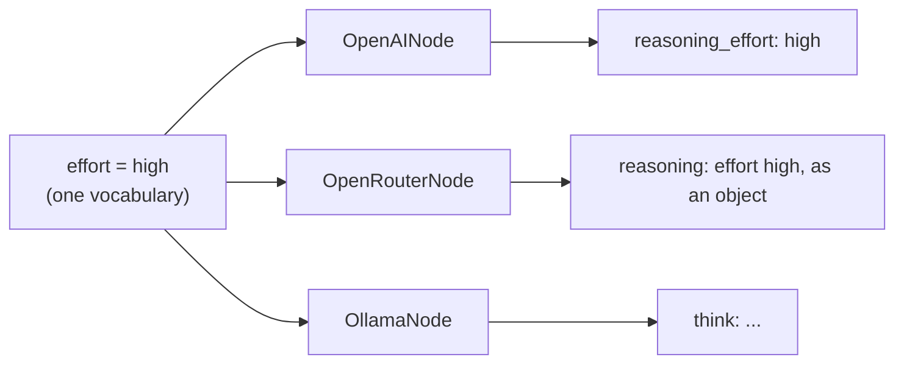

Every LLM provider spells things differently. OpenAI takes
`reasoning_effort: "high"`; OpenRouter takes `reasoning: {effort: "high"}`;
Ollama calls it `think`. The adapters hide that.

[`llm/handlers/openai_compatible.py:299`](../Backend/llm/handlers/openai_compatible.py#L299)

```python
def reasoning_payload(self, effort) -> dict:
    level = effort_levels.normalize(effort)
    if level is None or not self.effort_field:
        return {}
    if level == "none":
        level = "minimal"          # OpenAI has no "none"
    return {self.effort_field: level}
```

`OpenRouterNode` overrides this one method to return the wrapped shape. **The
hook returns a fragment to merge, not a value to assign**, because the providers
disagree about *shape*, not just the field name. That is a good adapter detail
to say out loud.

A second adapter: **eval simulators** (`eval/sim/`: mail, calendar, drive, web)
return results in exactly the real tools' shapes, "field for field", and a test
fails if a real tool gains no simulator.

### 6.3 Decorator — two meanings, both here

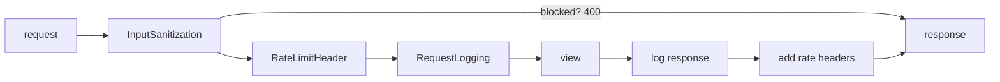

**Python decorator as registration.** `@tool(schema, ...)` returns the function
*unchanged* and records it (§7.1). Unchanged on purpose: the function stays
directly callable and testable, with no wrapper to debug through.

**GoF Decorator / pipeline: middleware.** Each middleware wraps `get_response`
and adds behaviour before or after.

[`core/http/middleware.py:25`](../Backend/core/http/middleware.py#L25)

```python
class HybridMiddleware:
    sync_capable = True
    async_capable = True

    def __init__(self, get_response):
        self.get_response = get_response
        self.async_mode = iscoroutinefunction(get_response)
        if self.async_mode:
            markcoroutinefunction(self)

    async def __acall__(self, request):
        response = self.process_request(request)          # may short-circuit
        if response is None:
            response = await self.get_response(request)    # the wrapped layer
        return self.process_response(request, response, await _auser_id(request))
```

`InputSanitizationMiddleware`, `RateLimitHeaderMiddleware` and
`RequestLoggingMiddleware` subclass it and override only the hooks — which is
also **Template Method** (§7.3). The performance reason it exists: the old sync
middleware made Django hop threads on every request.

### 6.4 Proxy — the eval environment

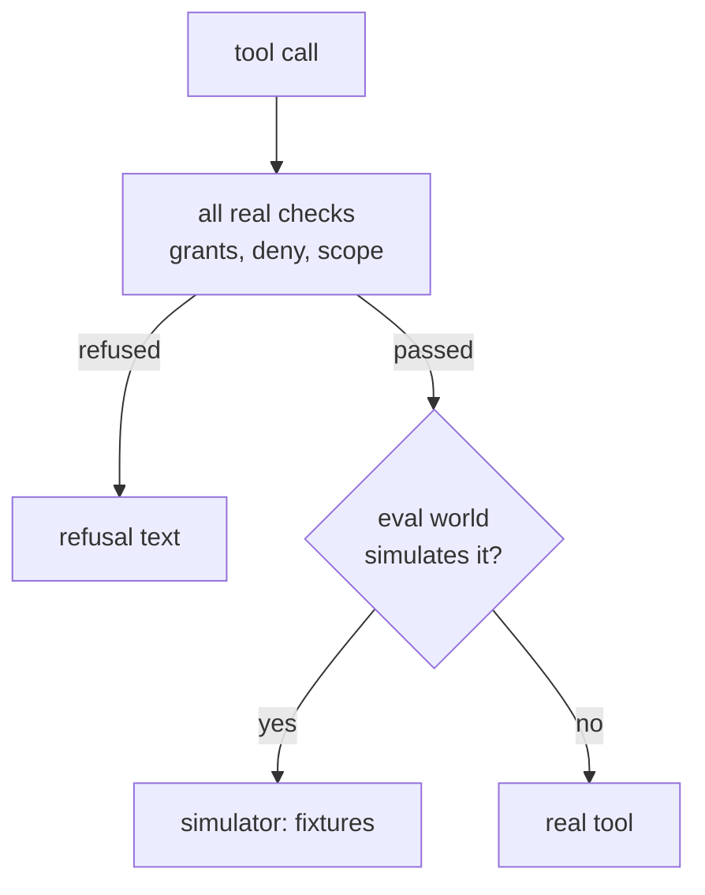

A proxy stands in front of a real object and controls access to it.
`AgentToolbox.dispatch` checks every real rule first, **then** asks the
environment whether to simulate:

```python
if self.environment is not None and self.environment.simulates(name):
    return await self.environment.run_simulated(name, args, context)
from chat.tools import execute_tool
return await execute_tool(name, args, context)
```

Why *last*: the first version simulated *before* the checks, so a "read-only
Gmail" agent could send mail in its eval. The eval was testing a stronger agent
than the real one. **Order in a proxy chain is part of the design.**

### 6.5 Composite-ish — delegation trees

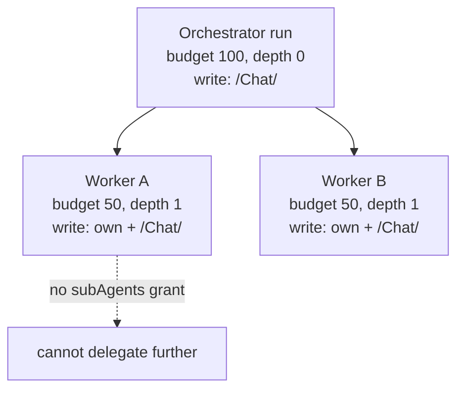

An orchestrator run delegates to workers, which are runs themselves. Runs form a
tree via `parent_step`. Limits compose down the tree: depth
(`MAX_DELEGATION_DEPTH`), budget (split up front), write paths and command
scopes (intersected, "most restrictive wins"). The composite rule to remember:
**a child can never have more than its parent.**

---

## 7. Behavioural patterns

### 7.1 Registry / Plugin — "the declaration is the schema"

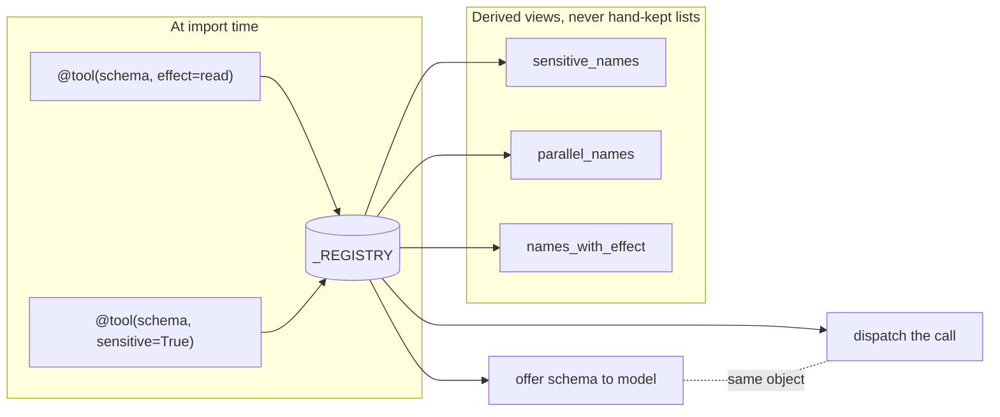

This is the single most repeated pattern in the codebase, and the one to lead
with in an interview.

[`chat/tools/registry.py:54-125`](../Backend/chat/tools/registry.py#L54)

```python
@dataclass(frozen=True, slots=True)
class Tool:
    name: str
    schema: dict
    run: ToolFunc
    requires: Requirement | None = None
    sensitive: bool = False
    parallel: bool = False                    # safe default
    effect: Effect = "irreversible"           # worst-case default
    connector: str | None = None

_REGISTRY: dict[str, Tool] = {}

def tool(schema, *, requires=None, sensitive=False, parallel=False,
         effect="irreversible", connector=None):
    name = schema["function"]["name"]
    def register(func):
        if name in _REGISTRY:
            raise RuntimeError(f"Tool {name!r} is registered twice")
        _REGISTRY[name] = Tool(name, schema, func, requires, sensitive,
                               parallel, effect, connector)
        return func
    return register
```

Using it:

```python
@tool(WEB_SEARCH_SCHEMA, parallel=True, effect="read")
async def web_search(args, context) -> str:
    ...
```

**The problem it replaced:** a tool was defined in three places — a schema list,
the implementation 800 lines away, and a dispatch dict. A schema without a
dispatch entry advertised a tool that answered "not recognized". Now the
advertised object *is* the dispatched object, so they cannot drift.

**Same pattern, five more times:**

| Registry | File | Key |
|---|---|---|
| Tools | `chat/tools/registry.py` | tool name |
| Graders | [`eval/graders.py:183`](../Backend/eval/graders.py#L183) | grader name |
| Output contracts | [`agents/contracts.py:281`](../Backend/agents/contracts.py#L281) | contract name |
| LLM providers | `llm/handlers/registry.py` | provider slug |
| Slash commands | `chat/commands/registry.py` | command name |

Details that make it production-grade:
- **Duplicate names fail at import**, not at run time.
- **Metadata lives on the declaration** (`requires`, `effect`, `parallel`), so
  filters read a field instead of matching names in some distant list.
- **Derived views are functions** (`sensitive_names()`, `parallel_names()`,
  `names_with_effect()`), never second lists kept in sync by hand.

**Interview line:** "Registration *is* the schema. Adding a tool is one
decorator; an advertised tool is dispatchable because it's the same object; and
defaults are the safe ones, because unknown tools — MCP tools minted at runtime —
can never carry a declaration."

### 7.2 Strategy — pick an algorithm by configuration

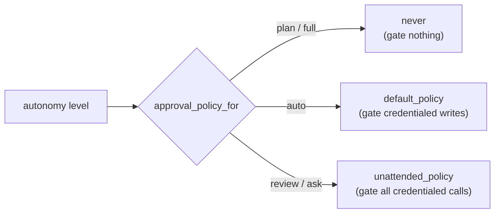

Same interface, swappable implementations, chosen at run time.

**Approval policies** — [`chat/tools/permissions.py:223`](../Backend/chat/tools/permissions.py#L223)
and [`agents/agent/runtime.py:808`](../Backend/agents/agent/runtime.py#L808):

```python
# Three strategies, one signature: (name, args, context) -> should_pause
async def default_policy(name, args, context) -> bool: ...    # chat: gate credentialed writes
async def unattended_policy(name, args, context) -> bool: ... # no human watching: gate all credentialed calls
async def never(name, args, context) -> bool: return False     # 'full' autonomy

def approval_policy_for(autonomy: str):
    if autonomy in ('full', 'plan'):
        return permissions.never
    if autonomy == 'auto':
        return permissions.default_policy
    return permissions.unattended_policy
```

In Python a strategy is often **just a function**. You don't need a class
hierarchy when the strategy has no state.

**More strategies here:**
- Sandbox engine: `service` vs `inprocess` (`SANDBOX_ENGINE`).
- Checkpointer: `memory` / `sqlite` / `postgres` (`AGENT_CHECKPOINTER`).
- Browser engine: `none` or a remote Chromium (`BROWSER_ENGINE`) — and with
  `none`, the tools are not even offered.
- Overlap policy on a trigger: `skip` / `queue` / `cancel` ...

**A rule this code follows:** *no automatic fallback between strategies* where
safety differs. If the sidecar is down, the run fails loudly rather than quietly
running on the weaker in-process engine.

### 7.3 Template Method — the provider base class

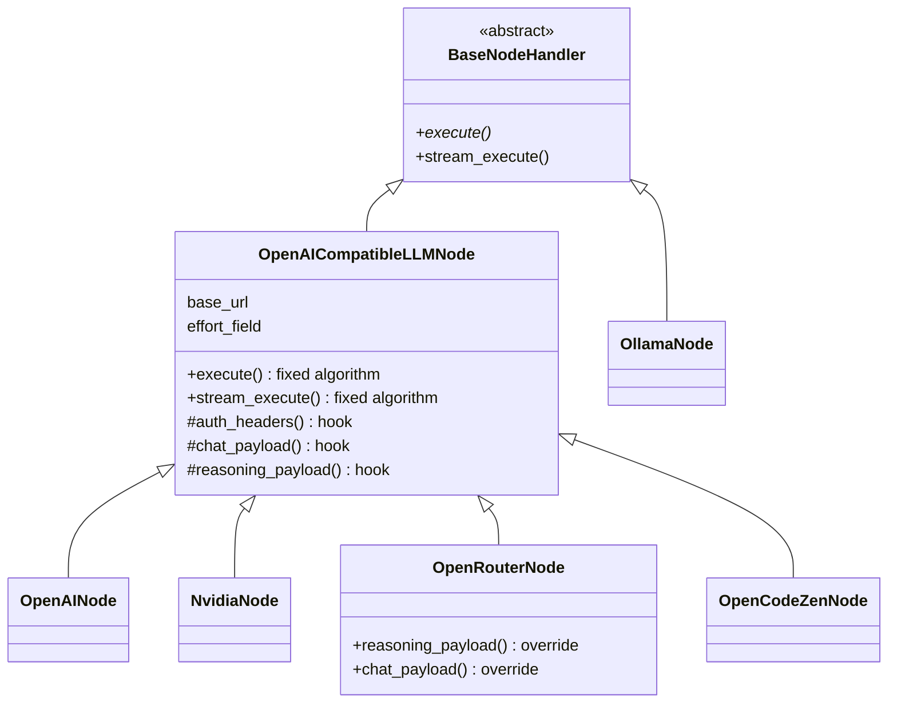

The base class fixes the algorithm; subclasses fill in steps.

[`llm/handlers/openai_compatible.py:205`](../Backend/llm/handlers/openai_compatible.py#L205)

```python
class OpenAICompatibleLLMNode(BaseNodeHandler):
    # ── per-provider declaration ──
    provider_slug = ""
    base_url = ""
    default_model = ""
    effort_field: str | None = "reasoning_effort"
    supports_stream_usage = True

    # ── overridable hooks ──
    def auth_headers(self, api_key): ...
    def chat_payload(self, *, model, messages, config, stream): ...
    def reasoning_payload(self, effort): ...

    # ── the fixed algorithm ──
    async def execute(self, input_data, config, context): ...
    async def stream_execute(self, input_data, config, context): ...
```

And a subclass is almost only data:

```python
class OpenAINode(OpenAICompatibleLLMNode):
    node_type = "openai"
    base_url = "https://api.openai.com/v1"
```

Four of the five providers share *all* of the HTTP, retry, streaming and parsing
code. Adding a provider that speaks the OpenAI protocol is ~15 lines.

**Template Method vs Strategy (a common interview question):** Template Method
varies *steps* through inheritance; Strategy swaps the *whole algorithm*
through composition. Here providers share 90% of the algorithm, so inheritance
fits. Approval policies share nothing, so plain functions fit.

### 7.4 Chain of Responsibility — the dispatch gauntlet


Each check either refuses (and stops) or passes to the next.

[`agents/agent/runtime.py:444`](../Backend/agents/agent/runtime.py#L444)

```python
async def dispatch(self, name, args, context) -> str:
    if is_mcp_tool(name):
        if not self.mcp_allowed:                      return _denied(name, 'MCP tools')
        allowed, why = self.mcp_call_allowed(name)
        if not allowed:                               return _denied(name, why)
        return await MCPToolProvider.execute(name, args, self.user_id)

    if name in CODE_TOOLS and not self.grants.get('codeExecution'):
        return _denied(name, 'code execution')
    if self.tool_permissions.get(name) == 'deny':     return "...per-tool permission is 'deny'..."
    if name not in self.allowed_names:                return _denied(name, name)
    ok, why = await self.native_call_allowed(name)
    if not ok:                                        return _denied(name, why)
    if self.environment and self.environment.simulates(name):
        return await self.environment.run_simulated(name, args, context)
    return await execute_tool(name, args, context)
```

Two design details:
- **Refusals are returned as text, not raised.** The caller is a model. A model
  told *why* ("per-tool permission is 'deny'") stops; a model told only
  "denied" retries until the iteration cap.
- **Each refusal names the real reason.** If the grant *is* held but the tool is
  denied per-tool, saying "not granted" would send the owner to flip a switch
  that does nothing.

The middleware stack (§6.3) is the other chain in the project.

### 7.5 Observer — hooks and event sinks

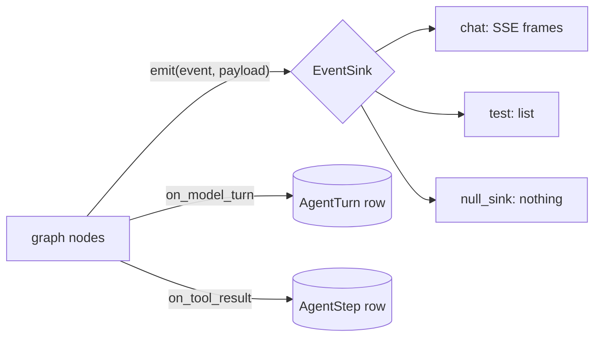

Subjects publish; observers react; neither knows the other's internals.

- **`TurnContext.on_tool_result` / `on_model_turn`** — the agent runtime passes
  observers that write `AgentStep` / `AgentTurn` rows. Chat passes `None` and is
  unaffected. The loop never imports the logging code.
- **`EventSink`** — every node emits `(event, payload)`. Chat's sink writes SSE
  frames; a test's sink appends to a list; the default is `null_sink`.
- **Django signals** — `post_delete` recounts a knowledge base.
- **WebSocket channel layer** — run logs published to a group; any open tab
  subscribes.

The rule the code states twice: **an observer must not raise.** A failure to
*record* must never fail the thing being recorded.

```python
# chat/turn/agent.py — _apply_side_effects
try:
    await handler(parsed, args, meta, sink)
except Exception:
    # A UI side effect must never fail the turn — the model already has
    # the result, which is what actually answers the user.
    logger.exception("[Tools] Side effect for %s failed", name)
```

### 7.6 Command + Producer/Consumer — the steering mailbox

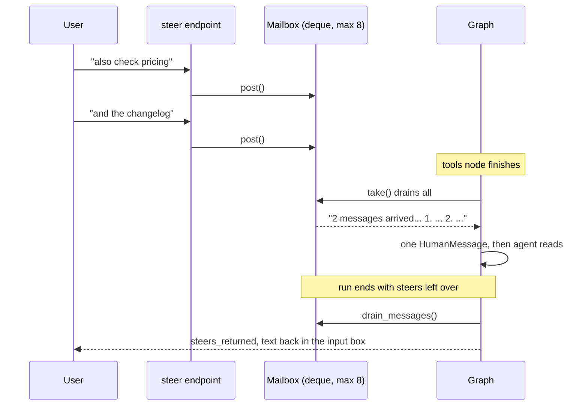

A user can type while an agent is working. That message is a **command object**
dropped in a **queue**, consumed at a safe point.

[`chat/turn/steering.py:63-160`](../Backend/chat/turn/steering.py#L63)

```python
@dataclass(slots=True)
class _Slot:
    messages: deque = field(default_factory=deque)
    dropped: int = 0
    delivered: int = 0
    autonomy: str = ''      # standing state: NOT drained on read

def post(key, message) -> bool:
    ...
    slot.messages.append(message)
    while len(slot.messages) > MAX_QUEUED_STEERS:
        slot.messages.popleft()          # drop OLDEST: the user waits on the newest
        slot.dropped += 1                # and count it, so the UI can say so
    return True

def take(key) -> str:
    items = list(slot.messages); slot.messages.clear()
    if len(items) == 1:
        return items[0]
    return f'{len(items)} messages arrived... in order:\n' + numbered(items)
```

Decisions to talk about:
- **It was a single slot (last write wins), then became a FIFO.** People steer
  *additively* ("also check pricing", "and the changelog"). Last-write-wins
  silently turned three instructions into one while reporting success for all.
- **Bounded, and drop-oldest.** An unbounded queue is a memory leak with extra
  steps. When cutting, keep what the user is waiting on — the newest.
- **Drain all into one message.** The consumer expects exactly one trailing
  human message; returning three would leave two unread but still billed.
- **Two kinds of data, two lifetimes.** A steer is *consumed once*. An autonomy
  mode is *standing state*. Mixing them would make "stop asking me" expire after
  one tool call.
- **Nothing is lost at the end.** Steers left over when the run finishes are
  handed back to the client (`steers_returned`) and put back in the input box.

Slash commands (`chat/commands/`) are the other Command pattern: `{name, args,
text}` objects, validated by the backend, stored on the message so "regenerate"
can replay them.

### 7.7 State machine — runs, triggers, approvals

Anything with a `status` column is a state machine. Draw it before coding it.

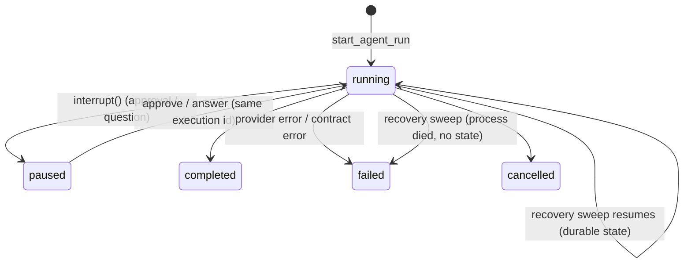

Rules the code enforces:
- **Transitions are guarded by a conditional UPDATE**, e.g. the HITL row is only
  answered `WHERE status='pending'`. That single filter is what stops the Inbox
  and a WebSocket from both answering the same question.
- **Resume on the original id.** A trace split across two ids can't be joined.
- **"Paused" keeps its checkpoint; terminal states drop it** (`forget_thread`).
- **A failed transient call is `failed`, not `completed`** — a run whose "answer"
  is an upstream error message was once recorded as success.

### 7.8 Dispatch table instead of `if/elif`

```mermaid
flowchart LR
    R[tool result] --> L{_SIDE_EFFECTS.get name}
    L -- web_search --> A[_on_web_search: sources panel]
    L -- render_chart --> B[_on_chart: chart frame]
    L -- write_file --> C[_on_file: file card]
    L -- missing --> Z[nothing to show]
```

[`chat/turn/agent.py:1283`](../Backend/chat/turn/agent.py#L1283)

```python
_SIDE_EFFECTS = {
    "web_search": _on_web_search,
    "render_chart": _on_chart,
    "update_todos": _on_todos,
    "write_file": _on_file,
    "edit_file": _on_file,
    ...
}
handler = _SIDE_EFFECTS.get(name)
```

A dict of functions is the Pythonic lightweight version of Strategy/Command.
Use it when behaviour is keyed by a string and each branch is independent.

### 7.9 Null Object

`null_sink` is an `EventSink` that does nothing. `TurnContext.sink` defaults to
it, so node code calls `await turn.sink(event, payload)` with no `if sink:`
checks anywhere. Fewer branches, fewer `NoneType` crashes.

### 7.10 Specification / Contract — validate the output shape

```mermaid
flowchart LR
    A[agent answer text] --> J{valid JSON object?}
    J -- no --> E[ContractError: got prose]
    J -- yes --> R[repair: fix near-misses]
    R --> K{required keys present?}
    K -- no --> E
    K -- yes --> OK[typed result with defaults]
    style E fill:#fee2e2,stroke:#dc2626
    style OK fill:#dcfce7,stroke:#16a34a
```

[`agents/contracts.py:38`](../Backend/agents/contracts.py#L38)

```python
@dataclass(frozen=True)
class Contract:
    name: str
    instruction: str                         # told to the model
    required: tuple[str, ...]
    optional: dict[str, Any]
    repair: Callable[[dict], dict] | None = None   # last-resort fix-up

def coerce(answer: str, contract: Contract) -> dict:
    payload = json.loads(strip_fence(answer))     # prose -> ContractError
    if contract.repair: payload = contract.repair(payload)
    missing = [k for k in contract.required if k not in payload]
    if missing: raise ContractError(...)
    ...
```

**Closed registry on purpose:** the UI can only render shapes it has a panel
for, so users pick a named contract, never write a free-form schema. And it
**fails rather than wraps**: silently wrapping prose in `{"text": ...}` would
make every agent "satisfy" every contract.

---

## 8. Data and persistence patterns

### 8.1 Soft delete through the default manager

```mermaid
flowchart LR
    Q1["Document.objects.filter(...)"] --> LM["LiveManager<br/>deleted_at IS NULL"] --> Live[visible rows only]
    Q2["all_objects / _base_manager"] --> All[every row incl. trashed]
    All --> Restore[restore]
    All --> Purge["purge sweep after 30 days"]
```

[`inference/models.py:9`](../Backend/inference/models.py#L9)

```python
class LiveManager(models.Manager):
    def get_queryset(self):
        return super().get_queryset().filter(deleted_at__isnull=True)

class Document(models.Model):
    objects = LiveManager()          # declared first -> the default manager
```

- **Force:** trash must disappear from *every* listing, including ones written
  next year by someone who never heard of trash.
- **Why not a "Trash" folder:** every query would have to remember to exclude
  one magic id, and forgetting would be silent. A default manager is the one
  guard that can't be forgotten.
- **Cost:** `post_delete` doesn't fire on a soft delete, so the trash path must
  call `recount_kb` itself. And `_base_manager` must stay unfiltered so restore
  and purge can still reach the rows.

### 8.2 Optimistic concurrency — "claim with a conditional UPDATE"

```mermaid
sequenceDiagram
    participant A as Sweep A
    participant DB as Trigger row
    participant B as Sweep B
    A->>DB: read next_due_at = 09:00
    B->>DB: read next_due_at = 09:00
    A->>DB: UPDATE ... SET 10:00 WHERE next_due_at = 09:00
    DB-->>A: 1 row: A fires the run
    B->>DB: UPDATE ... SET 10:00 WHERE next_due_at = 09:00
    DB-->>B: 0 rows: busy, B does nothing
```

Two schedulers must never fire the same slot. No locks held; just an UPDATE
that only succeeds if nobody changed the row since you read it.

[`agents/sweep.py`](../Backend/agents/sweep.py) (in `prepare`)

```python
claimed = Trigger.objects.filter(
    id=trigger.id,
    next_due_at=trigger.next_due_at,        # "...if it's still what I read"
).update(next_due_at=new_next)
if not claimed:
    return 'busy'                           # someone else took this slot
```

Same idea elsewhere:
- **File writes** take `expected_version` (the `updated_at` you read) and are
  refused when stale — the same check the office apps' autosave uses.
- **Code workers** get a stale-write guard: `ws_read` records a sha256, and
  `ws_edit` refuses if the file changed since.
- **Reminders** are claim-then-send: a conditional UPDATE per firing, handed
  back if delivery fails.

**Interview line:** "Optimistic concurrency is a compare-and-swap in SQL:
`UPDATE ... WHERE id=? AND version=?`, and a rowcount of zero means you lost the
race. It holds no lock, so it can't deadlock."

### 8.3 Leases — leader election on a database row

```mermaid
sequenceDiagram
    participant P1 as Process 1
    participant L as SchedulerLease row
    participant P2 as Process 2
    P1->>L: UPDATE holder=P1, expires=+90s WHERE mine OR expired
    L-->>P1: 1 row: leader
    P2->>L: same UPDATE
    L-->>P2: 0 rows: follower
    loop every 30 s
        P1->>L: renew
    end
    Note over P1: process dies
    Note over L: 90 s pass, lease expires
    P2->>L: same UPDATE
    L-->>P2: 1 row: new leader
```

Only one process should run the scheduler loop.

[`agents/scheduler.py:60`](../Backend/agents/scheduler.py#L60)

```python
def try_acquire(now=None) -> bool:
    SchedulerLease.objects.get_or_create(name=LEASE_NAME, defaults={...})
    return SchedulerLease.objects.filter(name=LEASE_NAME).filter(
        Q(holder=HOLDER) | Q(expires_at__lt=now)     # mine, or expired
    ).update(
        holder=HOLDER,
        expires_at=now + timedelta(seconds=LEASE_SECONDS),
        beat_at=now,
    ) == 1
```

- One atomic UPDATE takes or renews the lease. If the holder dies, the lease
  expires (90 s) and another process takes it.
- `HOLDER = hostname:pid:random` — unique per process.
- **Why not Redis locks or ZooKeeper?** The DB is already there and already
  consistent. Fewer moving parts on a tiny box.
- The same idea at file level: `CodeLease` lets coding workers claim paths;
  overlap is refused naming the holder.

### 8.4 Snapshot / versioning

```mermaid
flowchart LR
    E1[builder save] --> D{config diff empty?}
    D -- yes --> N[record nothing]
    D -- no --> R[new SubAgentRevision]
    Run[run opens] --> Pin[ExecutionLog.revision = latest]
    Edit[agent edited mid-run] -. "does not change" .-> Pin
```

- `SubAgentRevision` snapshots the agent config; **an empty diff records
  nothing**, because the builder PATCHes constantly.
- `DocumentVersion` keeps what each overwrite replaced (coalesced per 5 minutes,
  last 25).
- A **published agent is a snapshot, not a pointer** — otherwise the author
  could widen permissions on something already installed by others.

### 8.5 Materialised path for trees

```mermaid
flowchart TD
    Root["root = NULL"] --> F12["Reports<br/>id 12, path /12/"]
    Root --> F20["Agents<br/>id 20, path /20/"]
    F12 --> F45["2026<br/>id 45, path /12/45/"]
    F20 --> F51["Reporter<br/>id 51, path /20/51/"]
```

- Subtree of Reports: `path LIKE '/12/%'` (one indexed query)
- Is 45 inside 12? `'/12/45/'.startswith('/12/')` (no query)

`Folder.path` stores **ids**, e.g. `/12/45/`, not names.
- Rename is O(1) (names aren't in the path).
- "Is B inside A?" is `b.path.startswith(a.path)` — no queries. That's the
  cycle check for moves.
- A whole subtree is one indexed prefix query.
- Root is `NULL`, not a row — so the most-used location can't be forged, and
  old documents were correctly placed the moment the column appeared.

### 8.6 Multi-tier cache with a floor

```mermaid
flowchart LR
    Q[which tools does connector X have?] --> R{Redis}
    R -- hit --> A[answer]
    R -- miss --> D{DB catalogue row}
    D -- hit --> A2["answer, marked stale"]
    A2 --> BG[queue a background refresh]
    D -- miss --> L[live handshake]
    L --> W[write Redis + DB, never an empty list]
```

MCP tool lists: **Redis → database → live handshake.**
- The DB row is always reported *stale*, so the caller refreshes behind it.
- Invalidation drops **both** tiers (the floor survives cache loss, never an
  edit).
- **Never cache an empty answer** — every failure path returns `[]`, and
  caching that would record "timed out" as "has no tools".
- Negative caching where it *is* right: a failed connector start is remembered
  for 60 s so a broken row isn't re-dialled on every click; "over budget" only
  10 s, because "not right now" is a different claim from "broken".

### 8.7 Idempotency

```mermaid
flowchart LR
    I1["interrupt() re-runs the node"] --> O["open_request(execution, call_id)"]
    O --> C{row exists?}
    C -- yes --> Same[return it]
    C -- no --> New[create one]
```

- Opening a HITL request is idempotent on `(execution, call_id)`, because
  `interrupt()` re-runs the node from the top. Two rows would mean two reminder
  ladders for one question.
- Installing a pack is idempotent via `SubAgent.template_slug`.
- The Auto reviewer caches its verdict per `(session, call_id)`, so a resumed
  node doesn't judge the same call twice and maybe answer differently.

### 8.8 Ledger

`CostEntry` rows are append-only; spend is a **sum**, never a mutable counter.
Easy to audit, safe under concurrency. Watch for double counting: images are
excluded from the ledger total because they already ride in
`ExecutionLog.cost_usd`.

### 8.9 Choke point: one read door, enforced by a test (added 2026-09-28)

[`solutions/access.py`](../Backend/solutions/access.py)

```mermaid
flowchart LR
    T[chat tools] --> V
    A[REST API] --> V
    S[search] --> V
    C[capture dedupe] --> V
    V["visible(user_id, org_id)<br/>the only read"] --> DB[(Solution table)]
    X["any other Solution.objects.filter(...)"] -. "test fails" .-> DB
    style X fill:#fee2e2,stroke:#dc2626
```

```python
def visible(user_id, org_id, *, include_inactive=False) -> QuerySet:
    if not user_id:
        return Solution.objects.none()
    if org_id:
        rule = Q(author_id=user_id, shared=False, org_id=org_id)   # my private rows from this org
        if is_member(user_id, org_id):                             # checked live, every call
            rule |= Q(org_id=org_id, shared=True)                   # the org's shared rows
        else:
            return Solution.objects.none()                          # left the org: nothing
    else:
        rule = Q(author_id=user_id, shared=False, org__isnull=True) # personal chat
    return Solution.objects.filter(rule)
```

- **Force:** org isolation is a security boundary, and "every query remembers
  to add the org filter" fails the first time someone forgets.
- **Pattern:** a *choke point*. Every reader (tools, API, search, the capture
  job) starts from `visible()`, and `test_isolation.py::ChokePointTests` fails
  if `Solution.objects` is filtered anywhere else. The folder tree already used
  the same idea (`filesystem.resolve_folder`, with its own choke-point test),
  and so does the frontend: only `src/api/` may call the backend, enforced by
  lint.
- **Where the org comes from matters as much as the check.** The tools read
  `org_id` from the turn's context (the chat's own org), **never from a tool
  argument**. A model can't ask for another org's data, because there's no
  parameter to ask with.
- **Foreign and unknown ids look the same** (`get_visible` returns `None` for
  both → 404), the same no-oracle rule as the rest of the API.

**Interview line:** "Every read of the table goes through one function that
checks membership live. A test fails if anyone queries it another way. And the
org comes from the chat, not from anything the model can type."

### 8.10 Derived state: compute it when you read it (added 2026-09-28)

[`solutions/freshness.py`](../Backend/solutions/freshness.py)

A saved fix contains claims that go stale at different speeds. "Restart the
worker after changing the env file" (a `principle`) stays true. "The VPN portal
is at 10.2.0.4" (a `config`) might not. Each claim is stored with a **kind**,
and each kind has a shelf life:

| Kind | Safe to state without re-checking for |
|---|---|
| `principle` | ever |
| `procedure` | 365 days |
| `versioned` | 180 days (or never, if your versions differ from the one it was solved on) |
| `config` | 90 days |
| `time_sensitive` | 30 days |
| `ephemeral` | never saved at all |

```python
def claim_state(kind, as_of, *, now=None, env_mismatch=False) -> str:
    now = now or timezone.now()
    days = KINDS.get(clean_kind(kind))
    if kind == 'versioned' and env_mismatch:
        return 'check'                      # the version is the thing that moved
    if days is None:
        return 'fresh'
    return 'fresh' if now - as_of <= timedelta(days=days) else 'check'
```

- **Force:** "is this still true?" depends on *today's* date. A stored
  `is_stale` column would need a nightly job to keep it right, and would be
  wrong between runs of that job.
- **Pattern:** *derived state*. Store the facts (`kind`, `valid_as_of`) and
  compute the label (`fresh` / `check`) on every read. It's never out of date,
  and confirming a fix just moves `valid_as_of`.
- **Label, don't hide.** A stale claim is shown marked `check`, and the prompt
  rule obliges the model to re-verify it or say it may have changed. An old fix
  with a warning is worth more than no fix.

**Interview line:** "Freshness is computed at read time from when a claim was
last verified and how fast its kind goes stale, so no background job has to
keep a stale flag right."

### 8.11 Fair selection under a budget (fixed 2026-09-28)

[`core/memory.py::_select`](../Backend/core/memory.py)

User memory is a list of short facts ("prefers code first", "works in IST"),
grouped by category. Only **2,000 characters** of them fit in the system
prompt. The old code sorted categories **alphabetically** and filled until
full, so `context` ("anything else") used the space before `profile` ("who they
are") was reached. That's the opposite of what matters most.

```mermaid
flowchart LR
    subgraph Before["Before: alphabetical, fill until full"]
        B1[context 1] --> B2[context 2] --> B3[context 3] --> B4["...budget gone"]
        B5["profile: never reached"]
    end
    subgraph After["After: categories take turns"]
        A1[profile 1] --> A2[preference 1] --> A3[project 1] --> A4[context 1]
        A4 --> A5[profile 2] --> A6[preference 2] --> A7[...]
    end
```

- **Round-robin** in priority order (`profile, preference, project, context`),
  one fact per category per round, newest first within a category. A busy
  category can't crowd another out entirely. It's the same idea as fair
  queueing in a network scheduler.
- **Skip, don't stop:** a fact that doesn't fit is skipped, because a shorter
  one behind it may still fit.
- **One selection, two readers:** the prompt and the Memory settings tab both
  call it, so the tab can mark exactly which facts the model *isn't* seeing
  (`in_prompt: false`).
- **Duplicates are matched after normalising** (case, spacing, end
  punctuation), so "Works in IST." and "works in ist" are one fact.
- **Eviction is by least recently *saved*,** not used. Tracking every read
  would cost a database write on every turn. (An earlier design note said
  "used"; the note was corrected.)

**Interview line:** "When several groups share a fixed budget, fill it
round-robin in priority order and skip what doesn't fit, rather than filling in
sort order until it runs out."

---

## 9. Concurrency patterns

### 9.1 Detached tasks with their own context

```mermaid
flowchart LR
    subgraph Request["Request context (dies with the response)"]
        RX[CurrentThreadExecutor]
    end
    V[view] -- "asyncio.create_task" --> Bad["task inherits RX<br/>ORM later: RuntimeError"]
    V -- "spawn()" --> Good["fresh Context +<br/>own ThreadSensitiveContext"]
    Good --> Close[close DB connection when done]
    style Bad fill:#fee2e2,stroke:#dc2626
    style Good fill:#dcfce7,stroke:#16a34a
```

[`workflow_backend/background.py`](../Backend/workflow_backend/background.py)

```python
def spawn(coro, *, name=None):
    loop = asyncio.get_running_loop()
    return loop.create_task(_detached(coro), name=name,
                            context=contextvars.Context())   # fresh context

async def _detached(coro):
    async with ThreadSensitiveContext():                     # own executor
        try:
            return await coro
        finally:
            await sync_to_async(close_old_connections)()     # give the DB back
```

- **Bug it fixes:** `create_task` copies the request's context, including an
  executor that dies when the response is sent. The first ORM call afterwards
  raised `CurrentThreadExecutor already quit`.
- **Lesson:** a background task's **lifetime** must not borrow anything from a
  shorter-lived owner.

### 9.2 Plan, gather, then act in order

```mermaid
flowchart TD
    B["batch: search A, search B, write_file C"] --> P1["1. settle every approval gate"]
    P1 --> P2["2. plan calls in call order"]
    P2 --> P3{"3. dispatch"}
    P3 --> G1[search A]
    P3 --> G2[search B]
    G1 --> J[gather]
    G2 --> J
    J --> S1["write_file C, alone"]
    S1 --> P4["4. record results in call order"]
```

Tool calls in one model turn are independent (the model issued them all before
seeing any result). So `tools_node` runs in four passes:

1. `_settle_gates` — decide every approval *first*.
2. `_plan_calls` — plan in call order.
3. `_dispatch_calls` — `asyncio.gather` the ones marked `parallel=True`, run the
   rest one at a time.
4. `_record_results` — record **in call order**.

Why each rule:
- **Approvals first:** `interrupt()` re-runs the node. Dispatching the safe half,
  pausing on the sensitive one, then resuming would dispatch the safe half
  *again*. Graph state rolls back; the outside world does not.
- **Parallel is an allow-list:** `execute_python` swaps the process-global
  `sys.stdout`, so two at once interleave output. No name reveals that.
- **Record in call order:** completion order would reshuffle the transcript
  between runs of the same turn.
- **Each call gets its own context copy:** a shared dict's `call_id` would be
  overwritten by a sibling.

### 9.3 Admission control, not a counter

```mermaid
flowchart TD
    Start[tool call needs connector X] --> Est[estimate MB for X]
    Est --> Room{used + reserved + cost within budget<br/>and within container headroom?}
    Room -- yes --> Res[reserve estimate] --> Spawn[spawn process] --> Meas[measure real RSS, learn cost]
    Room -- no --> Ev{idle sessions to evict?}
    Ev -- yes --> Kill[evict LRU idle] --> Room
    Ev -- no --> Wait{waited 10 s?}
    Wait -- no --> Room
    Wait -- yes --> Refuse["refuse: remember 10 s"]
    style Refuse fill:#fee2e2,stroke:#dc2626
```

[`mcp_integration/supervisor.py:380`](../Backend/mcp_integration/supervisor.py#L380)

Starting a connector subprocess costs ~70-150 MB on a 384 MB container. The
supervisor **reserves an estimate before spawning**, evicts idle sessions (LRU)
to make room, and refuses after a short wait when nothing can be freed. It then
*measures* real RSS so the next estimate is better.

```python
def _has_room(self, cost: float) -> tuple[bool, str]:
    if MEMORY_BUDGET_MB > 0:
        if used + reserved + cost > MEMORY_BUDGET_MB:
            return False, "connector memory budget reached (...)"
    headroom = container_headroom_mb()
    if headroom is not None and cost > headroom:
        return False, "container has N MB before its ceiling"
    return True, ""
```

- **A count is not a budget.** "Max 6 sessions" can't stop an OOM when one
  session is 150 MB.
- **Check against what is *about to be* spent**, not a usage fraction measured
  after the fact — that answers one start too late.
- **Two independent ceilings.** Turning off one must not turn off the other
  (the first version did exactly that).
- **Degrade to permissive** where you can't measure (no `/proc` on Windows),
  instead of refusing everything.

### 9.4 Bounded LRU pool

```mermaid
flowchart LR
    subgraph Pool["OrderedDict: oldest to newest"]
        direction LR
        a[gmail] --> b[drive] --> c[notion]
    end
    Use[borrow drive] --> MoveEnd["move drive to the end"]
    Full[pool over cap] --> Evict["evict oldest idle: gmail"]
```

`_pool` became an `OrderedDict` with a max size. Recency is marked where a
session is *borrowed*, not created. The cap is soft: a session mid-call is never
evicted. This is LRU cache — the interview classic — in production (§14).

### 9.5 Retry only what is safe to retry

```mermaid
flowchart TD
    F[stream call failed] --> Q1{any token already sent?}
    Q1 -- yes --> Fail[fail: a retry would repeat text]
    Q1 -- no --> Q2{did the provider answer with a status?}
    Q2 -- "yes: 401, 402, 429" --> Fail2[fail: not transient]
    Q2 -- "no: connect error, timeout" --> R["retry, up to 2 times, ~4 s"]
```

`stream_execute` retries a failed connection twice (~4 s) **only while nothing
has been emitted**. Once tokens reached the user, a retry would repeat them.
An HTTP status the provider actually returned (401, 402, 429) is never retried:
401 isn't transient, and retrying a 429 turns a rate limit into an outage.

### 9.6 Timeouts that actually stop work

`Thread.join(timeout=...)` stops *waiting*, not the thread. The in-process
sandbox injects `SystemExit` into the thread, and **reports honestly** whether
it died. The production sidecar `killpg`s the whole process group. Lesson: a
timeout is only real if it frees the resource.

### 9.7 Starting async work from sync code (added 2026-09-28)

[`workflow_backend/background.py::run_in_thread`](../Backend/workflow_backend/background.py)

`spawn()` (§9.1) needs a running event loop. But some triggers arrive in
**sync** code. For example, a thumbs-up is saved by a sync DRF view, and a
signal then wants to start the (async) solution-capture job.

```python
def run_in_thread(coro, *, name=None) -> None:
    threading.Thread(target=asyncio.run, args=(_detached(coro),),
                     daemon=True, name=name).start()
```

```mermaid
flowchart LR
    V["sync view saves a thumbs-up"] --> SIG[post_save signal]
    SIG --> RT["run_in_thread(capture(...))"]
    RT --> TH["new daemon thread:<br/>asyncio.run(_detached(coro))"]
    TH --> CL[own executor, DB connection closed at the end]
```

- It reuses `_detached`, the same wrapper `spawn()` uses, so the job gets its
  own executor and **closes its database connection** when it ends. A thread
  per job that forgot this would leak one connection each time.
- The response goes back at once; the model call happens on the side.
- *Cost:* a thread per job with no queue. That's fine for a rare event like
  a thumbs-up, but the wrong tool for anything frequent.

---

## 10. Safety as a design property


```mermaid
flowchart LR
    M[model] --> Offer["Door 1: offer<br/>descriptors filtered"]
    M -- "names a tool it saw before" --> Disp["Door 2: dispatch<br/>re-checked"]
    Offer --> Disp
    Disp --> Run[run]
```

These are LLD choices, not policies bolted on later.

| Principle | Where | Why |
|---|---|---|
| **Fail closed by default** | `effect="irreversible"`, `parallel=False` on `Tool` | Unknown tools (MCP, minted at runtime) get the strictest treatment automatically |
| **Enforce at both doors** | Offer (`descriptors`) *and* dispatch (`dispatch`) | A model can name a tool it saw earlier; "we didn't offer it" isn't access control |
| **Allow-list, not deny-list** | Env vars given to subprocesses; `SHAREABLE_KEYS` when publishing | A deny-list leaks every field added later |
| **Refuse, don't truncate** | Delegation payload caps, chart series caps | A trimmed instruction is a worker confidently doing the wrong job |
| **Truncation must be visible** | `truncated` flags, spilled tool output with an id | A cut list and a complete one must not look alike |
| **Same 404 for every refusal** | Webhooks, public pages, folder ids | A 403 for "exists, not yours" is an ownership oracle |
| **Fail before looking busy** | `llm.preflight()` before the first status event | No spinner followed by an apology for a missing API key |
| **Scopes can only narrow** | Worker scopes = parent ∩ own | Delegation must not become a way around your own rules |
| **`None` vs empty are different** | `write_prefix`: `None` = nothing writable, `()` = anywhere | Conflating them once would have turned "no restriction" into "write anywhere" |
| **Paths are walked, never matched** | `vfs` resolves one folder hop at a time from the scope root | Traversal can't reach outside the tree; there is no host filesystem at all |

The `FileScope` object ([`inference/vfs.py:151`](../Backend/inference/vfs.py#L151))
is a compact example of several of these at once:

```python
@dataclass
class FileScope:
    user: Any
    root: Folder | None
    mode: str
    write_prefix: tuple[str, ...] | None = None    # None: read-only. (): anywhere.
    shared_prefix: tuple[str, ...] | None = None   # the delegator's folder

    def may_write_at(self, parts) -> bool:
        for prefix in (self.write_prefix, self.shared_prefix):
            if prefix is not None and tuple(parts[:len(prefix)]) == prefix:
                return True
        return False
```

It checks **segments**, not resolved rows, so a write can be refused *before*
`mkdir -p` creates parent folders for a write that won't happen.

---

## 12. Anti-patterns this project fixed

Recruiters remember stories about mistakes you caught. Each one here is a real
fix with a general lesson.

| Anti-pattern | What happened here | General lesson |
|---|---|---|
| **Shotgun definition** | A tool lived in 3 places; schemas drifted from dispatch | One declaration; derive the rest |
| **Dead switch** | `notifyOnHitl`, `allowUnattended`, `connectors` were stored and read by nothing | A setting nobody reads is a lie; test that each knob moves something |
| **Guardrail on an unwritten column** | Spend cap compared against `credits_used`, which nothing wrote | Enforce against the number you actually record |
| **Broad `except` hiding a bug** | The Auto judge did `llm.complete` on an empty package; every call failed "safely" into "ask" | Fail-safe paths need a test that the *happy* path runs (learning/14) |
| **Tests that each cover one hop** | The todo list passed 6 suites and no component rendered it | Add one end-to-end test on what the client actually receives |
| **Silent truncation** | Tool output middle-trimmed with no marker | Say what was cut and where to fetch it |
| **Rename leaving strings behind** | `select_related('execution__workflow')` after `Workflow` → `SubAgent` | Strings aren't type-checked; grep and test the paths |
| **Wrong join in an aggregate** | `Count('id')` across a LEFT JOIN tripled run counts and spend | Read the SQL your ORM writes for aggregates |
| **Order-dependent simulation** | Eval simulated tools before checking scopes | In a proxy chain, the real checks go first |
| **Budget sized for the old shape** | Recursion limit assumed 2 nodes per iteration; the loop had 4, so runs died at half their limit | Derive limits from the structure, and pin them with a test |
| **Two sources of truth** | Chat's earlier turns reached the model twice: summarised from the database *and* in full from the checkpoint, because each new message was appended to the old checkpointed transcript. It also made the per-turn tool limit count the whole session's calls (2026-09-28) | Pick one owner for each piece of data; test what actually reaches the provider on turn 3, not each piece alone |
| **Sort order used as a priority** | Memory categories were cut alphabetically, so "anything else" beat "who they are" | Say the priority explicitly; share a budget round-robin (§8.11) |
| **Docs describing the design, not the code** | The memory note said eviction was by least recently *used*; the code evicts by least recently *saved* | When you touch the code, re-read its description |

---
