# Part 3 — Frontend LLD Patterns (React / TypeScript)

> How the React app in `better-n8n-frontend/src/` is shaped: its layers, where its
> state lives, how it talks to the server, and the patterns behind each choice.
> Every section has the real code, the reason for it, and a line to say in an
> interview. Back to the [index](README.md).

---

## 11. Frontend LLD

### 11.0 The frontend at a glance

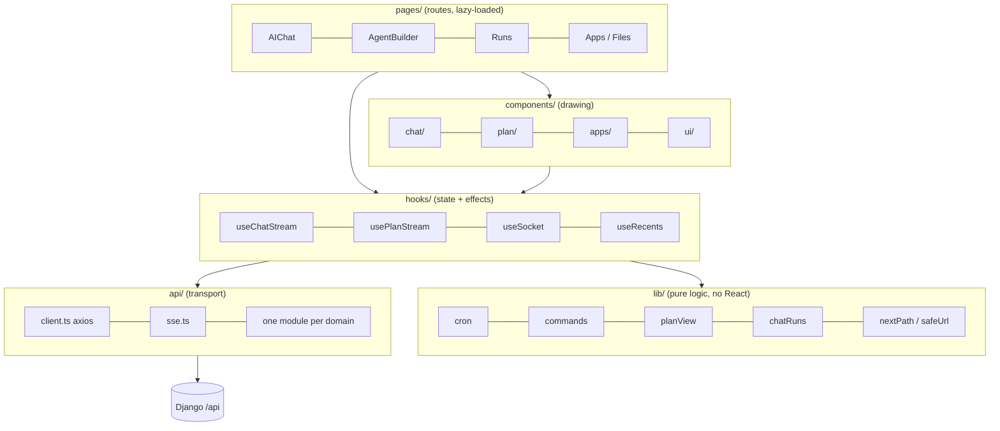
```mermaid
flowchart TB
    subgraph Pages["pages/ (routes, lazy-loaded)"]
      P1[AIChat] --- P2[AgentBuilder] --- P3[Runs] --- P4[Apps / Files]
    end
    subgraph Components["components/ (drawing)"]
      C1[chat/] --- C2[plan/] --- C3[apps/] --- C4[ui/]
    end
    subgraph Hooks["hooks/ (state + effects)"]
      H1[useChatStream] --- H2[usePlanStream] --- H3[useSocket] --- H4[useRecents]
    end
    subgraph Lib["lib/ (pure logic, no React)"]
      L1[cron] --- L2[commands] --- L3[planView] --- L4[chatRuns] --- L5[nextPath / safeUrl]
    end
    subgraph Api["api/ (transport)"]
      A1[client.ts axios] --- A2[sse.ts] --- A3[one module per domain]
    end
    Pages --> Components
    Pages --> Hooks
    Components --> Hooks
    Hooks --> Lib
    Hooks --> Api
    Api --> Server[(Django /api)]
```

The layering rule, even though no tool enforces it here the way `.importlinter`
does in the backend:

| Folder | Holds | May use | Never |
|---|---|---|---|
| `api/` | HTTP, SSE, one module per backend area | `client.ts` | React |
| `lib/` | Pure functions and small stores | other `lib/` | React components, the API (with a few documented stores as exceptions) |
| `hooks/` | State, effects, server cache | `api/`, `lib/` | Rendering |
| `components/` | Drawing | `hooks/`, `lib/` | Direct API calls in props-only pieces |
| `pages/` | Route roots, wiring | everything | Business rules |
| `contexts/` | App-wide state (auth, theme) | `api/`, `lib/` | — |

**Why it matters:** logic in `lib/` is plain TypeScript, so it's tested with
vitest in milliseconds and no DOM. That is where the rules live that the backend
also has to agree with (cron wording, the effort ladder, plan diffing).

**Interview line:** "Transport in `api/`, pure rules in `lib/`, state in hooks,
drawing in components. The pure layer is where the tests are cheap, so that's
where I push every rule I can."

---

### 11.1 The API layer: one client, one error reader, one list shape

#### 11.1.1 Singleton HTTP client with interceptors (Decorator / Chain)

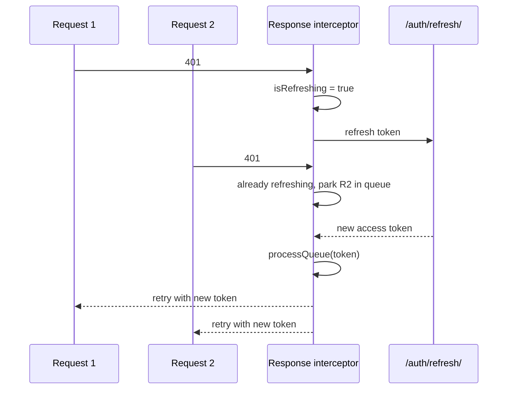
```mermaid
sequenceDiagram
    participant R1 as Request 1
    participant R2 as Request 2
    participant I as Response interceptor
    participant S as /auth/refresh/
    R1->>I: 401
    I->>I: isRefreshing = true
    I->>S: refresh token
    R2->>I: 401
    I->>I: already refreshing, park R2 in queue
    S-->>I: new access token
    I->>I: processQueue(token)
    I-->>R1: retry with new token
    I-->>R2: retry with new token
```

[`api/client.ts`](../better-n8n-frontend/src/api/client.ts)

One `axios` instance for the whole app. Interceptors wrap every request and
response — the frontend version of backend middleware.

```ts
const apiClient = axios.create({ baseURL: '/api', timeout: 300000 });

// Request: attach the token
apiClient.interceptors.request.use((config) => {
  const token = tokenManager.getAccessToken();
  if (token && config.headers) config.headers.Authorization = `Bearer ${token}`;
  return config;
});
```

**The refresh-token queue** is the part worth studying. When the access token
expires, *many* requests fail with 401 at once. Without care, each one would try
to refresh, and the refresh tokens would race.

```ts
let isRefreshing = false;
let failedQueue: Array<{ resolve: (t: string) => void; reject: (e: Error) => void }> = [];

apiClient.interceptors.response.use(r => r, async (error) => {
  const original = error.config;
  if (error.response?.status === 401 && !original._retry && !isAuthEndpoint) {
    if (isRefreshing) {
      // Someone is already refreshing: wait in line, then retry with the new token.
      return new Promise((resolve, reject) => failedQueue.push({ resolve, reject }))
        .then(token => { original.headers.Authorization = `Bearer ${token}`;
                         return apiClient(original); });
    }
    original._retry = true;          // never loop: one retry per request
    isRefreshing = true;
    const { access, refresh } = (await axios.post('/api/auth/refresh/', {...})).data;
    tokenManager.setTokens(access, refresh || refreshToken);
    processQueue(null, access);      // release everyone waiting
    return apiClient(original);
  }
  ...
});
```

Patterns inside it:
- **Single-flight:** only one refresh at a time; the rest wait on a queue.
- **Retry guard:** `_retry` stops an infinite 401 → refresh → 401 loop.
- **Exclusions:** auth and guest endpoints never trigger a refresh (a wrong
  password is a 401 too).
- **Callback injection:** `setUnauthorizedCallback` lets the auth context
  decide what "logged out" means, so the client doesn't import React routing
  (dependency inversion).

**Interview line:** "When the token expires, ten requests fail together. I let
the first one refresh and park the other nine on a promise queue, then replay
them with the new token. One `_retry` flag stops refresh loops."

#### 11.1.2 One stream reader for SSE

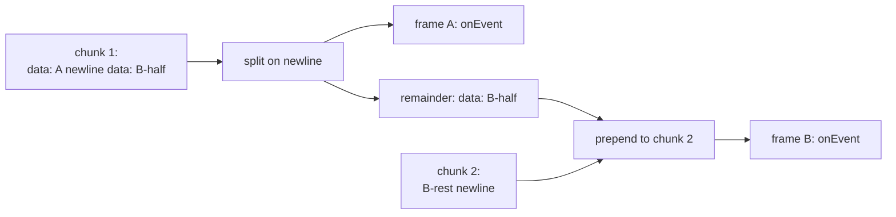
```mermaid
flowchart LR
    C1["chunk 1:<br/>data: A newline data: B-half"] --> S[split on newline]
    S --> F1["frame A: onEvent"]
    S --> Rem["remainder: data: B-half"]
    Rem --> J[prepend to chunk 2]
    C2["chunk 2:<br/>B-rest newline"] --> J
    J --> F2["frame B: onEvent"]
```

[`api/sse.ts`](../better-n8n-frontend/src/api/sse.ts)

Chat answers stream as `data: {json}` lines over a **POST**. `EventSource` can't
send a body or an `Authorization` header, so there's a small reader:

```ts
function drainFrames(buffer: string, onEvent: (e: SseEvent) => void): string {
  const lines = buffer.split('\n');
  const remainder = lines.pop() ?? '';        // a half line waits for the next chunk
  for (const line of lines) {
    if (!line.startsWith('data: ')) continue;
    try { onEvent(JSON.parse(line.slice(6))); }
    catch { /* one bad frame must not kill a good stream */ }
  }
  return remainder;
}
```

Design points:
- **It used to be copy-pasted, and the copies drifted:** one skipped the
  `response.ok` check, so a server 500 showed as an empty answer. One function
  fixes that everywhere (the backend's "one door", on the client).
- **Buffering partial lines:** network chunks don't respect line boundaries.
  Keep the tail, prepend it next time. (A classic streaming-parser question.)
- **Typed as `unknown`, not `any`:** `SseEvent` is `{type: string; [key]:
  unknown}`. Every consumer must narrow. This was fixed after a frame without a
  `content` field appended the literal string `"undefined"` to an answer.
- **Errors carry a machine `code`** (`StreamRequestError.code`, e.g.
  `SECURITY_VIOLATION`), so the UI acts on *why* instead of matching message
  text.

#### 11.1.3 Normalise at the boundary

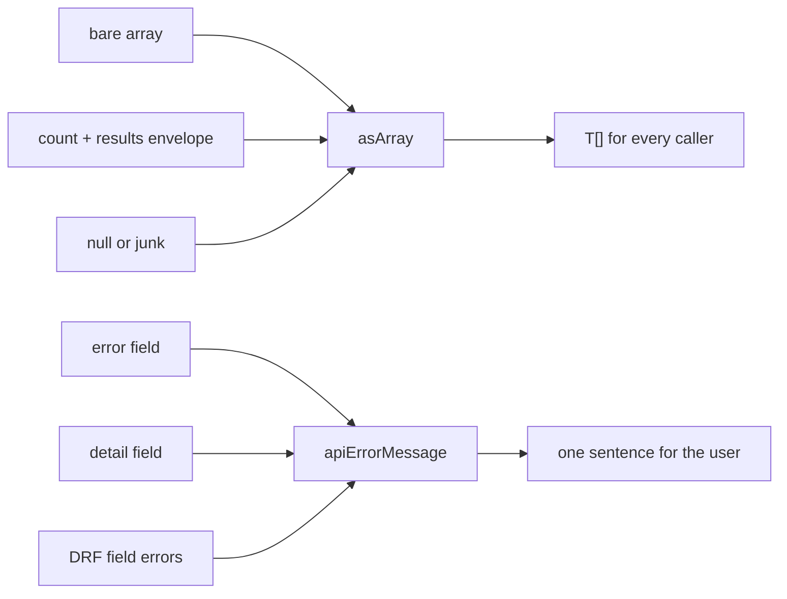
```mermaid
flowchart LR
    A1["bare array"] --> U[asArray]
    A2["count + results envelope"] --> U
    A3[null or junk] --> U
    U --> T["T[] for every caller"]
    E1["error field"] --> AE[apiErrorMessage]
    E2["detail field"] --> AE
    E3["DRF field errors"] --> AE
    AE --> Msg[one sentence for the user]
```

[`api/unwrap.ts`](../better-n8n-frontend/src/api/unwrap.ts),
[`api/paging.ts`](../better-n8n-frontend/src/api/paging.ts),
[`lib/apiError.ts`](../better-n8n-frontend/src/lib/apiError.ts)

Some backend endpoints return a bare array, some DRF's `{count, results}`
envelope. TypeScript believes whatever you declare, so the mismatch shows up as
`x.filter is not a function` somewhere far away. The fix is an **anti-corruption
layer**: normalise once, where data enters.

```ts
export function asArray<T>(data: unknown): T[] {
  if (Array.isArray(data)) return data as T[];
  const results = (data as { results?: unknown })?.results;
  return Array.isArray(results) ? (results as T[]) : [];
}

export interface Listing<T> { items: T[]; count: number; }   // count = "is this all?"
```

`apiErrorMessage(err, fallback)` does the same for errors. Every call site had
its own `err.response?.data?.error || err.message`, they drifted, and none read
DRF's field-error shape `{"cron": ["Expected five cron fields."]}`. Now one
function narrows `unknown` and every caller stays type-safe.

**The general rule:** *types are a claim; the boundary is where you check it.*

---

### 11.2 State management: pick the store by the state's lifetime

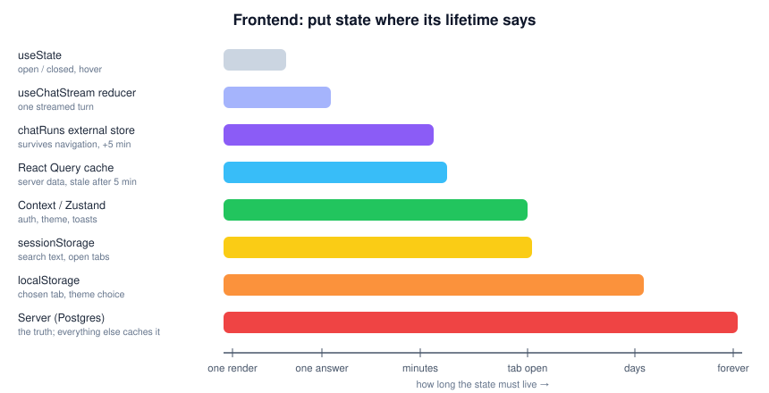

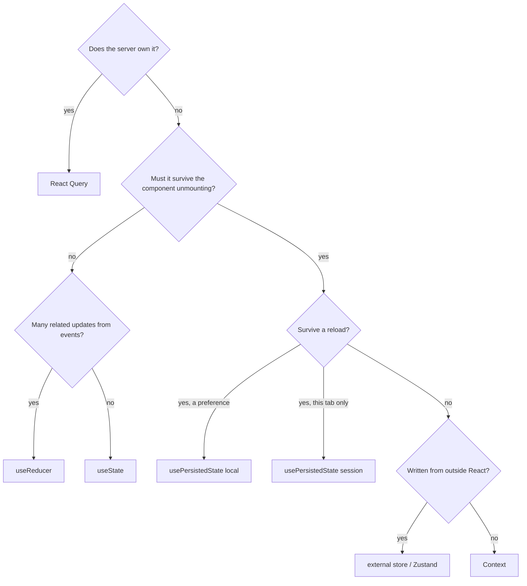
```mermaid
flowchart TD
    Q1{Does the server own it?} -- yes --> RQ[React Query]
    Q1 -- no --> Q2{Must it survive the component unmounting?}
    Q2 -- no --> Q3{Many related updates from events?}
    Q3 -- yes --> RED[useReducer]
    Q3 -- no --> US[useState]
    Q2 -- yes --> Q4{Survive a reload?}
    Q4 -- "yes, a preference" --> LS["usePersistedState local"]
    Q4 -- "yes, this tab only" --> SS["usePersistedState session"]
    Q4 -- no --> Q5{Written from outside React?}
    Q5 -- yes --> EXT["external store / Zustand"]
    Q5 -- no --> CTX[Context]
```

There's no single global store. Each kind of state lives where its **lifetime**
and **audience** say it should. This table is the most useful thing in this
chapter for an interview.

| Kind of state | Lifetime | Tool here | Example |
|---|---|---|---|
| Server data (lists, details) | Until stale | **React Query** | `useRecentFiles`, agent lists |
| One streamed turn | One answer | **`useReducer`** | `useChatStream` |
| A run that must survive navigation | Until finished (+5 min) | **External store** + `useSyncExternalStore` | `lib/chatRuns.ts` |
| App-wide, rarely changes | Session | **Context** | Auth, theme |
| App-wide, changes often, many writers | Short | **Zustand** | Toasts |
| One component's UI | While mounted | `useState` | Open/closed |
| UI preference to keep | Across visits | `usePersistedState('local')` | Chosen tab |
| Incidental UI context | While tab open | `usePersistedState('session')` | Search box text |
| Per-editor undo | Session | `useHistory` (refs) | Ctrl+Z in apps |

#### 11.2.1 Server state: React Query (cache-aside, stale-while-revalidate)

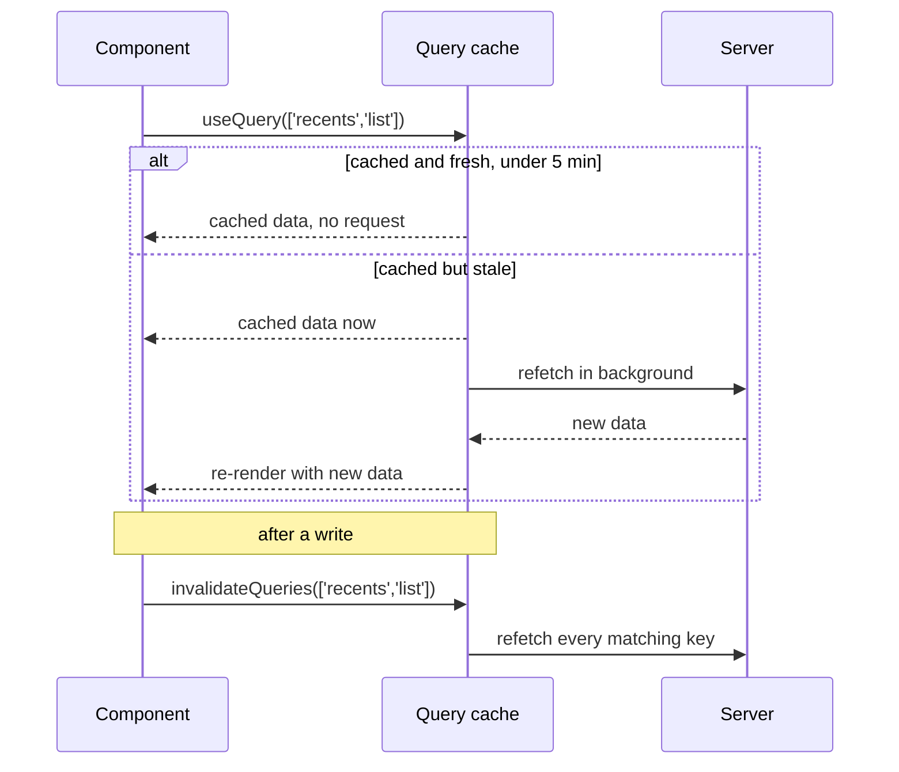
```mermaid
sequenceDiagram
    participant C as Component
    participant Q as Query cache
    participant API as Server
    C->>Q: useQuery(['recents','list'])
    alt cached and fresh, under 5 min
        Q-->>C: cached data, no request
    else cached but stale
        Q-->>C: cached data now
        Q->>API: refetch in background
        API-->>Q: new data
        Q-->>C: re-render with new data
    end
    Note over C,Q: after a write
    C->>Q: invalidateQueries(['recents','list'])
    Q->>API: refetch every matching key
```

[`lib/queryClient.ts`](../better-n8n-frontend/src/lib/queryClient.ts)

```ts
export const queryClient = new QueryClient({
  defaultOptions: {
    queries: {
      staleTime: 5 * 60 * 1000,        // fresh for 5 min: no refetch
      gcTime: 10 * 60 * 1000,          // unused data kept 10 min
      refetchOnWindowFocus: true,      // come back to the tab → revalidate
      retry: 1,
    },
  },
});
```

Query keys are **hierarchical arrays**, so invalidation can be broad or narrow:

```ts
// hooks/useRecents.ts
useQuery({ queryKey: ['recents', 'list', app ?? '', types?.join(',') ?? '', limit ?? 0], ... });
// after opening a file, refresh every recents list, whatever its filters:
qc.invalidateQueries({ queryKey: ['recents', 'list'] });
```

**Why not put server data in Redux/Context?** Server data is a *cache* of
someone else's truth. It needs expiry, dedupe of identical requests,
background refresh, and invalidation after writes. React Query is exactly that;
hand-rolling it in a store means re-inventing it badly.

#### 11.2.2 A reducer for a stream (Event Sourcing at component scale)

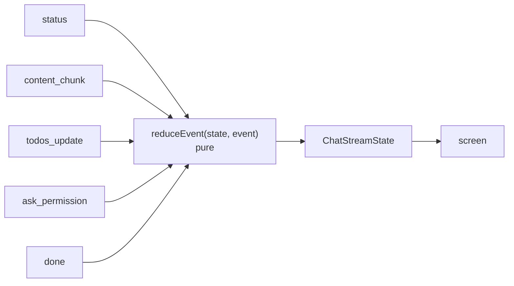
```mermaid
flowchart LR
    E1[status] --> R
    E2[content_chunk] --> R
    E3[todos_update] --> R
    E4[ask_permission] --> R
    E5[done] --> R
    R["reduceEvent(state, event)<br/>pure"] --> S[ChatStreamState]
    S --> UI[screen]
```

[`hooks/useChatStream.ts:200`](../better-n8n-frontend/src/hooks/useChatStream.ts#L200)

A streamed answer is a list of events. The screen is a **fold** over them.

```ts
function reduceEvent(state: ChatStreamState, event: StreamEvent): ChatStreamState {
  switch (event.type) {
    case 'status':         return { ...state, status: ... };
    case 'thinking_chunk': return { ...state, thinking: state.thinking + text };
    case 'content_chunk':  return { ...state, content: state.content + text };
    case 'content_reset':  return { ...state, content: '' };
    case 'todos_update':   return { ...state, todos: event.todos };   // whole list
    case 'files_update':   ...
    case 'ask_permission': return { ...state, pendingToolCall: ... };
    case 'ask_question':   ...
    case 'done':           ...
    case 'error':          ...
    default:               return state;          // unknown frames are ignored
  }
}
```

Why a reducer:
- **Pure.** `(state, event) → state` is unit-tested with no server and no DOM.
- **Replayable.** Feed the same frames again, get the same screen. That property
  is what makes §11.2.3 possible.
- **Forward compatible.** An unknown event type returns `state` unchanged, so a
  newer backend doesn't crash an older tab.
- **Whole-list replacement for lists** (`todos_update` carries the full list).
  A client applying deltas can build a state the server never sent. The backend
  made the same choice for `update_todos` (see Part 2).

**Batching:** the reducer also accepts `{type: 'events', events: [...]}` so a
burst of frames becomes one render.

#### 11.2.3 An external store that outlives components

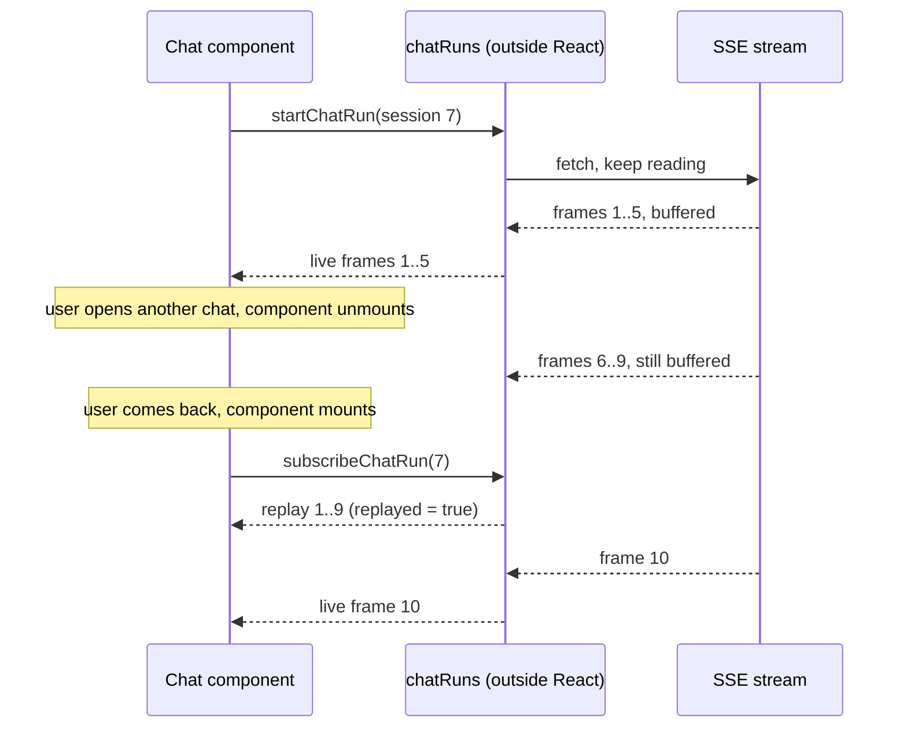
```mermaid
sequenceDiagram
    participant Chat as Chat component
    participant Store as chatRuns (outside React)
    participant API as SSE stream
    Chat->>Store: startChatRun(session 7)
    Store->>API: fetch, keep reading
    API-->>Store: frames 1..5, buffered
    Store-->>Chat: live frames 1..5
    Note over Chat: user opens another chat, component unmounts
    API-->>Store: frames 6..9, still buffered
    Note over Chat: user comes back, component mounts
    Chat->>Store: subscribeChatRun(7)
    Store-->>Chat: replay 1..9 (replayed = true)
    API-->>Store: frame 10
    Store-->>Chat: live frame 10
```

[`lib/chatRuns.ts`](../better-n8n-frontend/src/lib/chatRuns.ts)

**Problem:** the streamed answer used to belong to the chat component. Switch
conversation or page → component unmounts → the half-written answer is lost.

**Design:** hold each run *outside React*, keyed by session id. The fetch keeps
reading and **every frame is buffered**. A component that comes back subscribes
and gets the missed frames **replayed**, then live ones.

```ts
export function subscribeChatRun(key: string, listener: Listener): () => void {
  const run = runs.get(key);
  if (!run) return () => {};
  for (const frame of run.frames) listener(frame, true);   // replay (replayed = true)
  if (run.status !== 'running') listener({ type: RUN_STATUS_EVENT, status: run.status }, true);
  run.listeners.add(listener);                             // then live
  return () => { run.listeners.delete(listener); };        // unsubscribe
}
```

Patterns inside it:
- **Observer** with an unsubscribe function returned (the React-friendly shape).
- **Replay log** (like a Kafka consumer reading from offset 0). Because the
  screen is a fold (§11.2.2), replaying from the start is the only
  reconstruction that can't drift from the live path.
- **The `replayed` flag** lets a listener skip one-time side effects (toasts,
  appending to the transcript) while still folding the frame into view state.
  That's **idempotency** on the client.
- **Retention + GC:** finished runs stay replayable 5 minutes, then a timer
  frees them. A buffer without a limit is a memory leak.
- **`useSyncExternalStore`** exposes "which sessions are running" to React
  safely (no tearing under concurrent rendering). It drives the "still working"
  dot in the conversation list.
- **Explicit lifecycle verbs:** `startChatRun`, `abortChatRun`,
  `abortAllChatRuns` (on logout, because the token is about to vanish).

**Interview line:** "The stream lives in a store outside React. It buffers every
frame, and a component that remounts replays them through the same pure reducer,
so a user can switch chats mid-answer and come back to it intact."

`lib/planStream.ts` + `hooks/usePlanStream.ts` do the same for the coding-team
plan panel, as a **separate** reducer — worker heartbeats must not re-render the
transcript.

#### 11.2.4 Context, split for stability

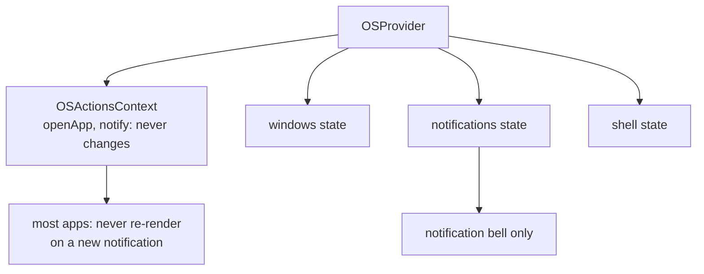
```mermaid
flowchart TB
    P[OSProvider] --> A["OSActionsContext<br/>openApp, notify: never changes"]
    P --> W[windows state]
    P --> N[notifications state]
    P --> S[shell state]
    A --> Most["most apps: never re-render<br/>on a new notification"]
    N --> Bell[notification bell only]
```

[`contexts/themeState.ts`](../better-n8n-frontend/src/contexts/themeState.ts)

```ts
export const ThemeContext = createContext<ThemeContextType | undefined>(undefined);

export function useThemeContext() {
  const context = useContext(ThemeContext);
  if (context === undefined) {
    throw new Error('useThemeContext must be used within a ThemeProvider');
  }
  return context;
}
```

Three small decisions:
1. **Default `undefined` + a guard hook.** Using the hook outside its provider
   fails loudly at once, instead of silently reading a fake default.
2. **The context object and hook live in `themeState.ts`; the provider alone in
   `ThemeContext.tsx`.** A file exporting both a component and plain values
   opts out of Vite's fast refresh, so editing the provider would remount the
   app and drop state. (Same split for auth, assistant, imagine, and toasts.)
3. **Split contexts by how often they change.** BrowserOS's `OSProvider`
   publishes *five* contexts: one with only stable actions (never changes
   identity) and four with state that changes at different rates. Components
   that only call `openApp()` never re-render when a notification arrives.
   This is **Interface Segregation for React context**.

**Interview line:** "Context re-renders every consumer when its value changes,
so I split it by rate of change: a stable actions context and separate state
contexts. Most components only need actions, so they never re-render."

#### 11.2.5 A tiny global store for frequent writes

[`lib/toastStore.ts`](../better-n8n-frontend/src/lib/toastStore.ts)

```ts
export const useToastStore = create<ToastStore>((set) => ({
  toasts: [],
  addToast: (toast) => { /* add, then auto-remove after duration */ },
  removeToast: (id) => set(s => ({ toasts: s.toasts.filter(t => t.id !== id) })),
}));

// Facade: callers never touch the store
export const toast = {
  success: (title, description?) => useToastStore.getState().addToast({ type: 'success', title, description }),
  error:   (title, description?) => useToastStore.getState().addToast({ type: 'error', title, description }),
  ...
};
```

- Zustand because toasts are written from **anywhere**, including non-React
  code (an API helper), via `getState()`.
- Components subscribe with a **selector**, so only the toast container
  re-renders.
- `toast.success(...)` is a **facade**: call sites don't know a store exists,
  so it could be swapped later.

#### 11.2.6 Persisted UI state that never breaks a page

[`hooks/usePersistedState.ts`](../better-n8n-frontend/src/hooks/usePersistedState.ts)

A drop-in `useState` that survives route changes. Two backing stores, chosen by
how the state expires:

- `local` — a preference the user chose (tab, sort). Keep it tomorrow.
- `session` — incidental context (search text). Keep it while the tab is open.

Every read is wrapped: blocked storage, corrupted JSON, or an old shape falls
back to the initial value. *"Persisted UI state is never important enough to
break a page over."* Keys are namespaced (`aiaas_ui:`).

`useAppTabs` goes one step further: open tabs per app live in `sessionStorage`
**and** on the server (`AppSession`), restored from the server only if the
browser tab has none — and it never writes before the restore finishes, or the
empty first render would wipe the saved session. That's a **race-condition
guard** you can explain.

---

### 11.3 Real-time: one socket primitive

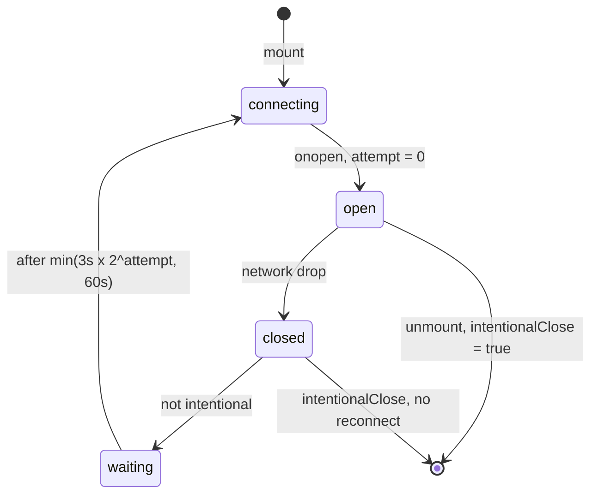
```mermaid
stateDiagram-v2
    [*] --> connecting : mount
    connecting --> open : onopen, attempt = 0
    open --> closed : network drop
    closed --> waiting : not intentional
    waiting --> connecting : after min(3s x 2^attempt, 60s)
    open --> [*] : unmount, intentionalClose = true
    closed --> [*] : intentionalClose, no reconnect
```

[`lib/websocket.ts`](../better-n8n-frontend/src/lib/websocket.ts)

**Before:** three places opened WebSockets, with three backoff policies and
three cleanup dances. **After:** `useSocket` is the only one. Every real-time
feature uses it.

```ts
export function backoffDelay(attempt: number, baseMs = 3000, capMs = 60000): number {
  return Math.min(baseMs * 2 ** attempt, capMs);   // exponential, capped
}

export function useSocket<TMessage>(options: UseSocketOptions<TMessage>) {
  const wsRef = useRef<WebSocket | null>(null);
  const attemptRef = useRef(0);
  const intentionalClose = useRef(false);    // unmount ≠ network failure
  const handlersRef = useRef(options);
  useEffect(() => { handlersRef.current = options; });   // latest callbacks
  ...
}
```

The four problems it solves (each is a classic interview follow-up):

1. **Reconnect storms** → exponential backoff with a ceiling; reset the counter
   on a successful open.
2. **StrictMode double-mount race** → React mounts, unmounts, and mounts again
   in dev. The old socket's `onclose` fires *after* the new one opened and
   schedules a reconnect. `intentionalClose` tells "we closed it" apart from
   "the network dropped it".
3. **Callbacks rebuilding the socket** → a parent passing `onMessage={() =>
   ...}` creates a new function each render. Putting callbacks in a ref, synced
   after commit, means the socket depends only on `path` and `enabled`.
4. **Token in the URL for WebSockets** → browsers can't set headers on a WS
   handshake, so the token rides in the URL for WS only (never for HTTP — the
   security review removed `?token=` HTTP auth).

**Choosing the transport** (learning/07 has the full story):

| Need | Use |
|---|---|
| Server streams one answer to a request | **SSE over POST** (`api/sse.ts`) |
| Server pushes events you didn't ask for (run logs, HITL pings) | **WebSocket** (`useSocket`) |
| Something changes rarely | **Polling**, only while visible/needed |
| Watching the DOM for changes | Never `MutationObserver` for data — ask the server |

---

### 11.4 Component design

#### 11.4.1 Container / presentational split

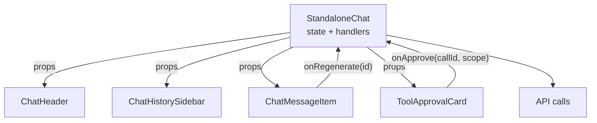
```mermaid
flowchart TB
    SC["StandaloneChat<br/>state + handlers"] -- props --> H[ChatHeader]
    SC -- props --> L[ChatHistorySidebar]
    SC -- props --> M[ChatMessageItem]
    SC -- props --> T[ToolApprovalCard]
    T -- "onApprove(callId, scope)" --> SC
    M -- "onRegenerate(id)" --> SC
    SC --> API[API calls]
```

`components/chat/StandaloneChat.tsx` **owns** the chat page's state and
handlers. The drawing is split into props-only pieces: `ChatHistorySidebar`,
`ChatHeader`, `ChatSettingsDialog`, `ChatMessageItem`, `ToolApprovalCard`.

Rules for the pieces:
- No hooks that fetch, no API calls. Every action is a **callback prop**.
- `components/chat/__tests__/chatPieces.test.tsx` pins the **arguments each
  callback receives** — that's the contract between container and piece.

Why: a 2,000-line page component can't be tested or reviewed. Pure pieces can
be rendered in a test with fake props. This is **SRP** for UI.

#### 11.4.2 Composition through context: the save contract

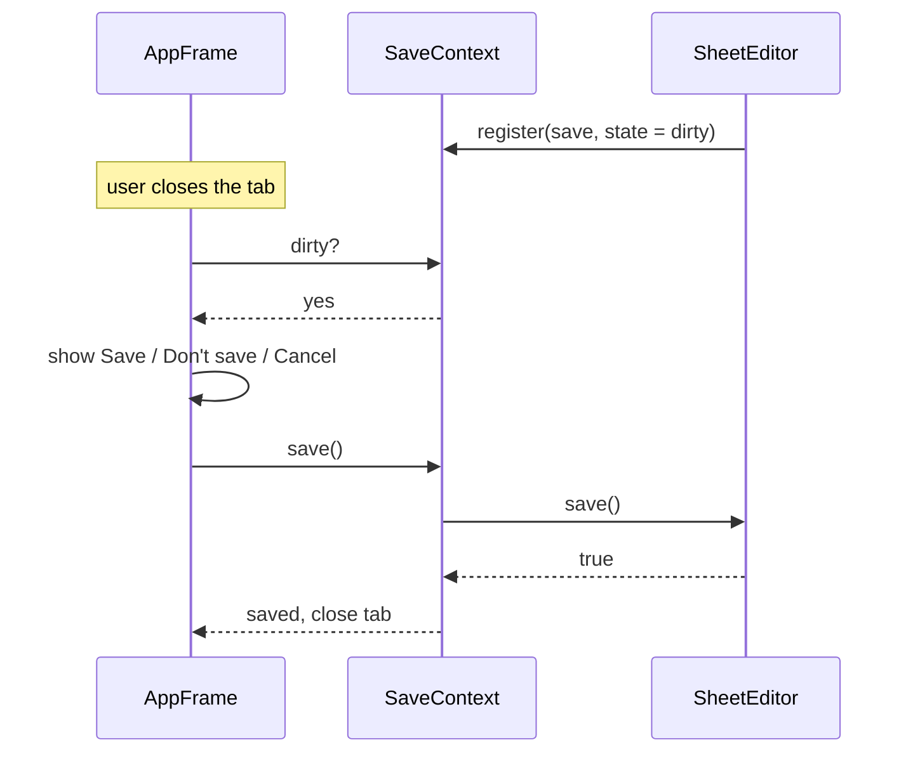
```mermaid
sequenceDiagram
    participant F as AppFrame
    participant C as SaveContext
    participant E as SheetEditor
    E->>C: register(save, state = dirty)
    Note over F: user closes the tab
    F->>C: dirty?
    C-->>F: yes
    F->>F: show Save / Don't save / Cancel
    F->>C: save()
    C->>E: save()
    E-->>C: true
    C-->>F: saved, close tab
```

[`components/apps/SaveContext.tsx`](../better-n8n-frontend/src/components/apps/SaveContext.tsx)

The app frame (`AppFrame`) shows the save status and an "unsaved changes"
dialog, but it doesn't know how a Sheet or a Doc saves. So each editor
**registers** its `save()` function into a context:

```ts
const register = useCallback((save: (() => Promise<boolean>) | null, next: SaveState) => { ... }, []);
```

- The frame depends on an **interface** (`save(): Promise<boolean>` + a state),
  not on Univer, TipTap or CodeMirror → **Dependency Inversion**.
- This is **Inversion of Control**: the child hands the parent a capability.
- The unsaved-changes dialog is an in-app component, never `window.confirm`,
  so it can offer Save / Don't save / Cancel and call the registered `save()`.

#### 11.4.3 Isolate what ticks

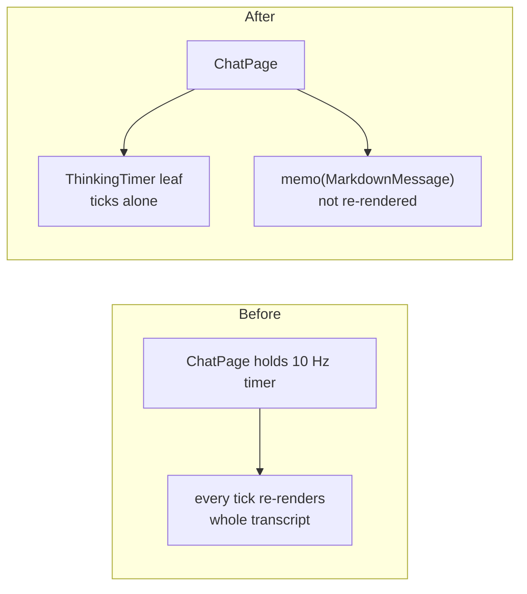
```mermaid
flowchart LR
    subgraph Before
        P1["ChatPage holds 10 Hz timer"] --> R1["every tick re-renders<br/>whole transcript"]
    end
    subgraph After
        P2[ChatPage] --> T2["ThinkingTimer leaf<br/>ticks alone"]
        P2 --> MM["memo(MarkdownMessage)<br/>not re-rendered"]
    end
```

`components/chat/ThinkingTimer.tsx` owns a 10 Hz interval. When the interval
lived in the chat page, every tick re-rendered the whole transcript and re-parsed
every message's markdown. `MarkdownMessage` is also wrapped in `memo`
(`export default memo(MarkdownMessage)`).

**Rule:** anything that updates faster than a person reads gets its own leaf
component, so its re-renders stay local. The plan panel's elapsed timers follow
the same rule.

#### 11.4.4 Error boundaries and Suspense

- One `ErrorBoundary` around the routes catches a render crash instead of a
  white screen. (One real bug it caught: HITL `options` were objects rendered as
  React children, which throws — the Inbox detail pane crashed for every
  request.)
- `<Suspense>` shows a fallback while a lazy page's code loads (§11.6).

#### 11.4.5 Mobile layout contract

The shell is `overflow-hidden`, so **every page owns its scroller**. Pages use
`pl-12` to clear the fixed hamburger. A Playwright spec
(`mobile-layout.spec.ts`) checks it. This is LLD for layout: a rule each page
must follow, plus a test that enforces it.

---

### 11.5 Hooks as units of design

Custom hooks are the frontend's classes: they bundle state + behaviour behind a
small interface.

| Hook | What it encapsulates | Pattern |
|---|---|---|
| `useChatStream` | One turn's state | Reducer |
| `usePlanStream` | The team plan panel | Reducer, separate from the transcript |
| `useSocket` | Connection lifecycle | Resource wrapper (RAII-like: effect cleanup closes) |
| `useHistory` (`lib/history.ts`) | Undo/redo stack | Command history with coalescing |
| `usePersistedState` | Durable UI state | Adapter over `Storage` |
| `useAppTabs` | Tabs per app | Two-tier persistence with a restore guard |
| `useRecordOpen` / `useRecentFiles` | "Recently opened" | Server cache + invalidation |
| `useCommands` | Slash-command catalogue | Load once per session (memoised) |
| `useChatModelSelection`, `useEffortSelection` | Pickers | Derived state + validation |
| `useBlobUrl` | Object URLs | Resource cleanup (`URL.revokeObjectURL`) |

#### Undo/redo with coalescing

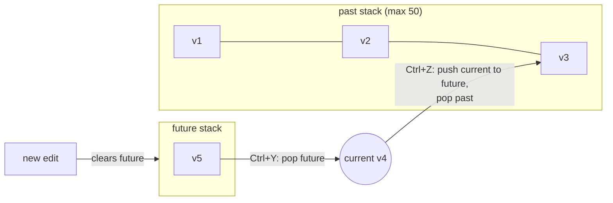
```mermaid
flowchart LR
    subgraph past["past stack (max 50)"]
        p1[v1] --- p2[v2] --- p3[v3]
    end
    subgraph future["future stack"]
        f1[v5]
    end
    cur((current v4))
    cur -- "Ctrl+Z: push current to future,<br/>pop past" --> p3
    f1 -- "Ctrl+Y: pop future" --> cur
    Edit[new edit] -- "clears future" --> future
```

[`lib/history.ts`](../better-n8n-frontend/src/lib/history.ts)

```ts
const CAP = 50;            // bounded
const COALESCE_MS = 800;   // a burst of typing = one undo step

const record = (prev: string) => {
  if (past.at(-1) === prev) { future = []; return; }        // no duplicate
  if (Date.now() - lastPush < COALESCE_MS && past.length) { // inside a burst
    future = []; return;                                    // keep the earlier state
  }
  past.push(prev);
  if (past.length > CAP) past.shift();
  lastPush = Date.now();
  future = [];                     // a new edit kills the redo branch
};
```

Classic **two-stack undo** (the Memento / Command history pattern), plus the two
details interviewers probe: **coalescing** (so one Ctrl+Z doesn't undo one
letter) and **a cap** (so a long session can't grow memory forever). The stacks
are refs, and only the *depth* is state, so typing doesn't re-render for every
push.

---

### 11.6 Performance by design

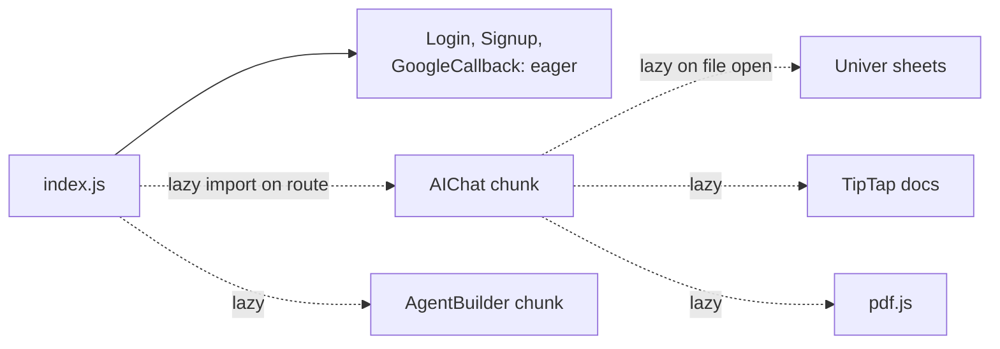
```mermaid
flowchart LR
    Entry[index.js] --> Auth["Login, Signup,<br/>GoogleCallback: eager"]
    Entry -. "lazy import on route" .-> Chat[AIChat chunk]
    Entry -. lazy .-> Builder[AgentBuilder chunk]
    Chat -. "lazy on file open" .-> Univer[Univer sheets]
    Chat -. lazy .-> TipTap[TipTap docs]
    Chat -. lazy .-> PDF[pdf.js]
```

| Technique | Where | Effect |
|---|---|---|
| **Route-level code splitting** | `App.tsx`: every page is `lazyPage(() => import(...))` | The first paint was a 1.23 MB single chunk; now login ships only what login needs |
| **Keep the auth screens eager** | Login / Signup / GoogleCallback are static imports | The first screen never waits on a second download |
| **Lazy heavy editors** | Univer (sheets), TipTap (docs), CodeMirror, pdf.js | Loaded only when an app opens that file type |
| **Lazy syntax highlighting** | `CodeView` registers grammars on demand; plain text first, colour when ready, none past 150k chars | Big files stay responsive |
| **`memo` on expensive leaves** | `MarkdownMessage` | Transcript doesn't re-parse on unrelated changes |
| **Isolated ticking** | `ThinkingTimer`, plan timers | Fast updates don't re-render parents |
| **Batched stream events** | `useChatStream` accepts `events` batches | Many frames → one render |
| **Stale-while-revalidate** | React Query defaults | Instant screens from cache, refreshed behind |
| **Worker per PDF** | PDF reader uses `workerSrc`, not a shared `workerPort` | Closing one PDF no longer kills the worker for the next |
| **Canvas cap** | PDF pages capped at 16 MP | iOS draws nothing above that; stay under it |

The `lazyPage` helper is typed narrowly on purpose:

```ts
const lazyPage = <T extends { default: React.ComponentType }>(
  load: () => Promise<T>,
) => lazy(load);
```

Routed pages take no props, so this is the narrowest type that still fits them
all — a typo'd import path or a page that forgot its default export fails at
compile time.

---

### 11.7 Security by design on the client

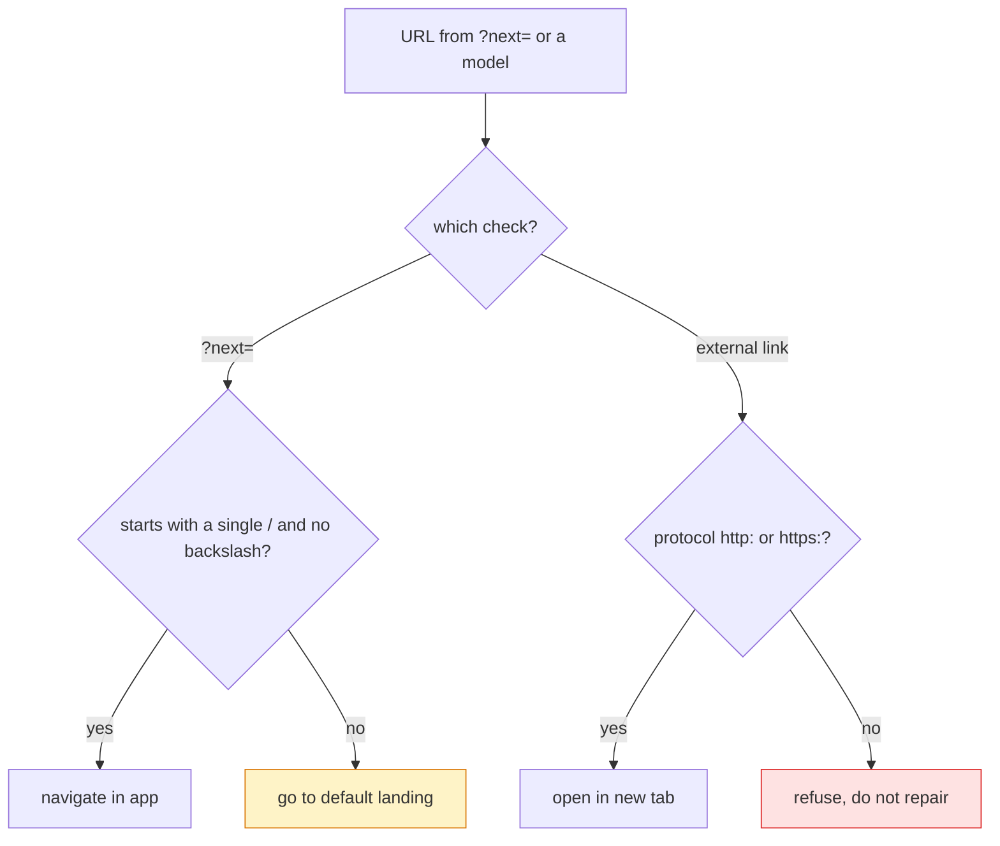
```mermaid
flowchart TD
    U["URL from ?next= or a model"] --> K{which check?}
    K -- "?next=" --> N{"starts with a single / and no backslash?"}
    N -- yes --> Go[navigate in app]
    N -- no --> Home[go to default landing]
    K -- "external link" --> S{"protocol http: or https:?"}
    S -- yes --> Open[open in new tab]
    S -- no --> Block[refuse, do not repair]
    style Block fill:#fee2e2,stroke:#dc2626
    style Home fill:#fef3c7,stroke:#d97706
```

| Rule | File | The attack it stops |
|---|---|---|
| **Only same-origin paths for `?next=`** | [`lib/nextPath.ts`](../better-n8n-frontend/src/lib/nextPath.ts) | Open redirect after sign-in (`//evil.example`, `javascript:`, `/\evil`) |
| **Only `http:`/`https:` URLs open** | [`lib/safeUrl.ts`](../better-n8n-frontend/src/lib/safeUrl.ts) | `javascript:` / `data:` / `blob:` links chosen by a model or web page |
| **Remote images render as links, not ``** | `MarkdownMessage` | Zero-click data leak: a model writes `` and the browser fetches it on render |
| **Previews in sandboxed iframes with a no-network CSP** | `FilePreview`, `HtmlArtifact` | A shared HTML file running script with this app's origin |
| **Notification `data` is not rendered** | `NotificationsTab` | Leaking ids and raw tool arguments; only `action_url` (allow-listed) and `pending_count` are shown |
| **Tool calls shown as a server-written sentence, raw args behind a disclosure** | `ToolApprovalCard` | Third-party text styling the screen that asks for your approval |

The shared rule, written in both `nextPath.ts` and `safeUrl.ts`:

> **Refuse rather than repair.** A "fixed" hostile value is still a value
> someone chose.

```ts
export function isSafeExternalUrl(url: string | null | undefined): boolean {
  if (!url) return false;
  try {
    const { protocol } = new URL(url);
    return protocol === 'http:' || protocol === 'https:';
  } catch {
    return false;          // unparseable → refused, not guessed at
  }
}
```

---

### 11.8 Keeping frontend and backend in agreement

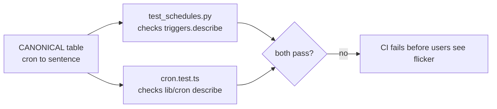
```mermaid
flowchart LR
    T["CANONICAL table<br/>cron to sentence"] --> PY["test_schedules.py<br/>checks triggers.describe"]
    T --> TS["cron.test.ts<br/>checks lib/cron describe"]
    PY --> OK{both pass?}
    TS --> OK
    OK -- no --> Fail[CI fails before users see flicker]
```

Some rules exist twice: once in Python, once in TypeScript. Drift between them
shows up as UI flicker or wrong labels. Three techniques used here:

1. **Shared golden tables.** The cron description ("Every weekday at 09:00") is
   computed by `lib/cron.ts::describe` while typing and replaced ~350 ms later by
   the server's. If the wording differs by one word, the sentence visibly
   rewrites itself. So the expected strings are **the same table** in
   `agents/tests/test_schedules.py::DescribeTests.CANONICAL` and
   `src/lib/__tests__/cron.test.ts`. Same for the effort ladder.
2. **Let the server own presentation data.** Connector names, taglines and
   categories come from the backend; the frontend maps only `icon_slug` → an
   icon component (because an icon can't be serialised). Never key presentation
   off a display name.
3. **Resolve every client path against the URL conf.** A check walks every
   `apiClient` path and matches it to a Django route — it catches dead wiring
   that both `tsc` and `pytest` miss.

**Interview line:** "When the same rule lives in two languages, I pin both to one
table of expected outputs, so a change on one side fails the other side's test."

---

### 11.9 Frontend testing strategy

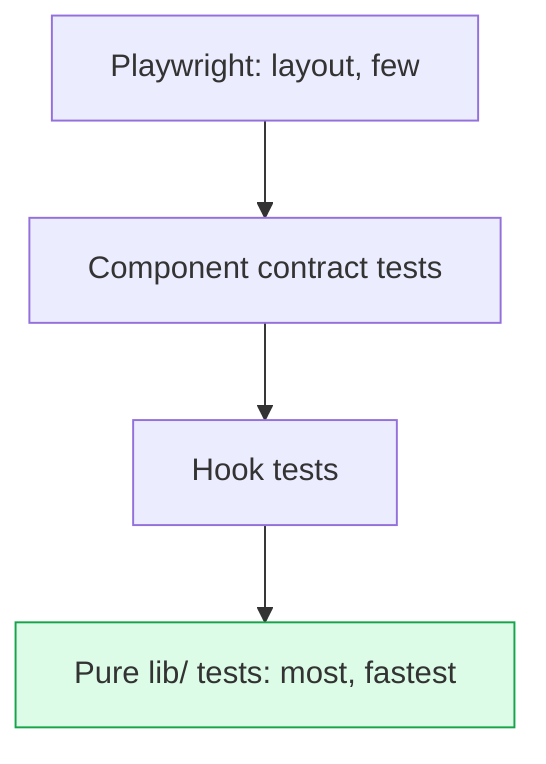
```mermaid
flowchart TB
    E2E["Playwright: layout, few"] --> C["Component contract tests"]
    C --> H[Hook tests]
    H --> P["Pure lib/ tests: most, fastest"]
    style P fill:#dcfce7,stroke:#16a34a
```

| Level | Tool | What is tested here |
|---|---|---|
| Pure logic | vitest | `lib/cron`, `lib/commands`, `lib/planView`, `lib/docSpec`, `lib/chartScale`, `lib/filePreview`, `lib/vfsPath`, `lib/pdfView` |
| Hooks | vitest | `hooks/__tests__/appTabs.test.ts`, `effort.test.ts` |
| Components (contract) | vitest + testing-library | `chatPieces.test.tsx` pins callback arguments |
| Layout | Playwright | `mobile-layout.spec.ts` |
| Types | `tsc -b --force` | Note: plain `tsc --noEmit` checks zero files here (root tsconfig only has references) |
| Lint | ESLint | Baseline is zero; any problem is a regression |

**Design for testability** is the underlying pattern: the more logic sits in
`lib/` as pure functions, the more of the app is covered by fast tests.

---

### 11.10 Frontend anti-patterns this project fixed

| Anti-pattern | What happened | Fix / lesson |
|---|---|---|
| **Copy-pasted transport** | Several SSE readers; one skipped `response.ok` | One `streamSse` |
| **`any` at the boundary** | Missing `content` appended `"undefined"` to answers | `unknown` + narrow |
| **Per-call-site error parsing** | Field errors never shown | `apiErrorMessage` |
| **Three WebSocket implementations** | Three backoff policies, StrictMode races | `useSocket` |
| **State owned by a component that unmounts** | Switching chat lost the streaming answer | External store + replay |
| **A 10 Hz timer in the page** | Every tick re-parsed all markdown | Leaf component + `memo` |
| **One 1.23 MB bundle** | Login downloaded the whole app | Lazy routes |
| **Rendering an object as a child** | Inbox detail crashed for every request | Type the data; error boundary as a net |
| **A feature with no renderer** | Todo list built, tested, streamed — and drawn by nothing | End-to-end test on what the client receives |
| **Deny button that only cleared local state** | The run stayed parked, the model never told | UI actions must call the server verb, not just reset the view |
| **`MutationObserver` to watch data** | Heavy, fragile | Ask the server; conditional polling or push |

---

### 11.11 Classic frontend LLD interview questions, answered from this code

**Q: Design an autocomplete / command palette.**
Keyboard model (up/down/enter/escape), ranking in a pure function
(`lib/commands.ts` ranks and parses — vitest-covered), a catalogue loaded once
(`useCommands`), 44 px rows for touch, a sheet on phones. The backend validates
the command, so the client never has to be trusted.

**Q: Design an infinite list / feed.**
Server returns `{items, count}` so the UI can say "showing 20 of 312";
keyset (not offset) pagination for stable pages (learning/10); React Query keys
per filter; never silently drop rows.

**Q: Design a real-time chat UI.**
Optimistic user bubble with a client id; SSE for the answer; pure reducer over
frames; external run store so navigation doesn't lose it; steering while busy
(the send button queues a steer when there's text, stops when empty); take the
optimistic bubble back out if the server refuses the message (`code:
SECURITY_VIOLATION`).

**Q: Design undo/redo for an editor.**
Two stacks, coalesce bursts, cap size, clear redo on a new edit, keep stacks in
refs and only depth in state (§11.5).

**Q: How would you handle token refresh with many concurrent requests?**
Single-flight refresh with a waiting queue and a one-retry flag (§11.1.1).

**Q: How do you stop a big React page from being slow?**
Split by route; lazy-load heavy editors; memo expensive leaves; isolate
fast-changing state into leaf components; split context by rate of change;
batch stream updates.

---

### 11.12 Frontend cheat sheet

| Pattern | Where | One line |
|---|---|---|
| Singleton client + interceptors | `api/client.ts` | One place for auth headers and refresh |
| Single-flight + queue | `api/client.ts` | One refresh, many waiters |
| Streaming parser | `api/sse.ts` | Buffer the partial line |
| Anti-corruption layer | `api/unwrap.ts`, `lib/apiError.ts` | Normalise where data enters |
| Reducer / event sourcing | `hooks/useChatStream.ts` | Screen = fold over events |
| Observable store + replay | `lib/chatRuns.ts` | State that outlives components |
| Context split by change rate | `contexts/*State.ts`, BrowserOS `osState.ts` | Stable actions, separate state |
| Facade over a store | `lib/toastStore.ts` | `toast.success(...)` |
| Adapter over storage | `hooks/usePersistedState.ts` | Durable UI state that never throws |
| Resource hook | `lib/websocket.ts` | Backoff, race guard, latest-callbacks ref |
| Container / presentational | `components/chat/*` | State in one owner, pieces take props |
| IoC via context | `components/apps/SaveContext.tsx` | Editors register `save()` |
| Memento / two-stack undo | `lib/history.ts` | Coalesce, cap, clear redo |
| Code splitting | `App.tsx` `lazyPage` | Eager auth, lazy everything else |
| Allow-list validation | `lib/nextPath.ts`, `lib/safeUrl.ts` | Refuse, don't repair |
| Golden tables across languages | `cron.test.ts` ↔ `test_schedules.py` | One expected output, two implementations |
| Honest state display | `lib/memory.ts::isHidden` | Show what the system really uses (§11.13) |

---

### 11.13 Recent additions (2026-09-28): showing users the real state

The organisations and solution-memory feature (Part 1 §3.3) added three
screens. They follow patterns already in this chapter, plus one new rule worth
naming: **show people what the system actually does, not what they assume.**

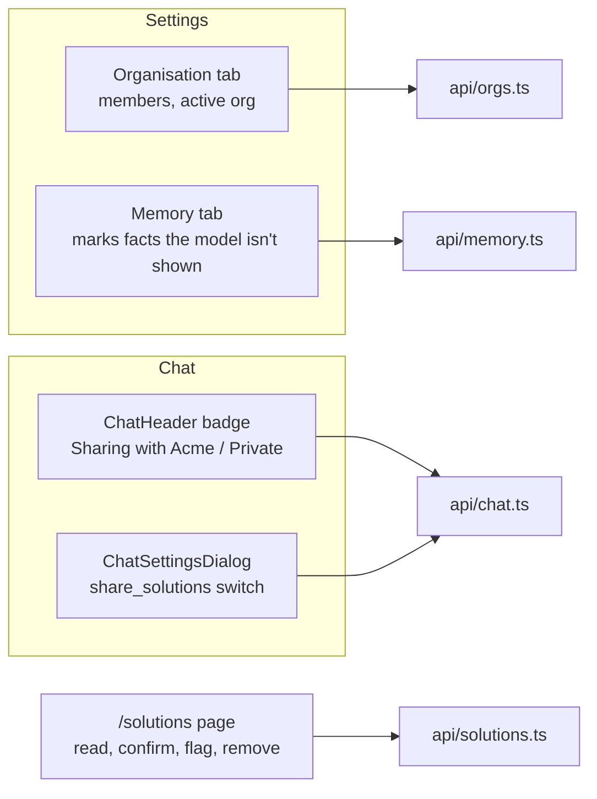
```mermaid
flowchart LR
    subgraph Settings
        O["Organisation tab<br/>members, active org"]
        M["Memory tab<br/>marks facts the model isn't shown"]
    end
    subgraph Chat
        H["ChatHeader badge<br/>Sharing with Acme / Private"]
        D["ChatSettingsDialog<br/>share_solutions switch"]
    end
    S["/solutions page<br/>read, confirm, flag, remove"]
    O --> API[api/orgs.ts]
    S --> API2[api/solutions.ts]
    M --> API3[api/memory.ts]
    H --> API4[api/chat.ts]
    D --> API4
```

**1. The Memory tab shows what the model can't see.** The backend returns
`in_prompt` for each stored fact, computed by the *same* selection that builds
the prompt (Part 2 §8.11). The tab greys out facts with `in_prompt: false`, so
"I told it this and it forgot" becomes visible instead of mysterious. The check
is written defensively:

```ts
export function isHidden(memory: UserMemory): boolean {
  return memory.in_prompt === false;   // only an explicit false counts
}
```

An older server sends no field at all, and `undefined` must not be read as
"hidden". This is §T6's rule (`??` and `===` vs truthiness) applied: **absent
and false are different values.**

**2. The chat header says where a solution would go.** A badge reads
"Sharing with ⟨org⟩" or "Private", and the settings dialog has a switch
(`share_solutions`). Anything the system might share should be visible at the
place you're working, not buried in settings.

**3. A chat's organisation is shown, never edited.** The backend makes
`ChatSession.org` read-only. The Organisation tab changes the *active* org,
which only affects **new** chats, and it says so. The UI matches the backend
rule rather than offering a control the API would refuse.

**4. The Solutions page** is ordinary React Query (§11.2.1): `useQuery` to
list, `useMutation` to confirm ("worked"), report a failure, flag as doubtful,
change who can see it, or remove. Each claim is labelled by kind ("General
rule", "Steps", "Setting", "Changes often"...) and a stale one is marked
"check", mirroring the backend's read-time freshness (Part 2 §8.10). The page
is lazy-loaded (`lazyPage`) and listed in `lib/navigation.ts`.

**Interview line:** "When the system makes a choice the user can't see, like
which memories fit in the prompt or whether a fix will be shared, I surface
that choice in the UI from the same code path that makes it."
