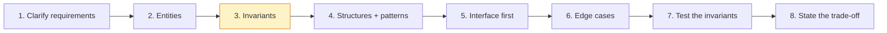
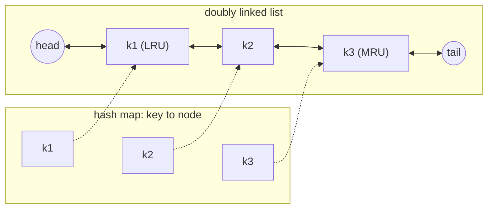
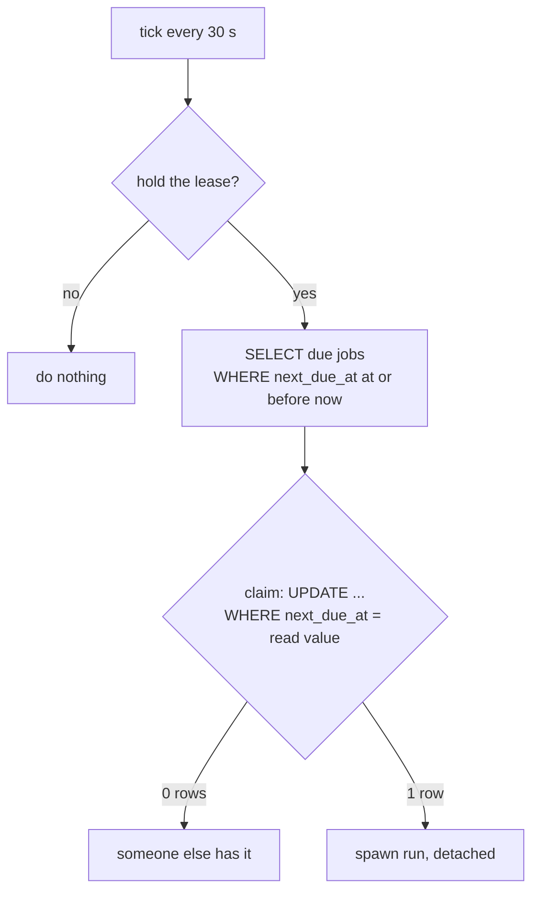
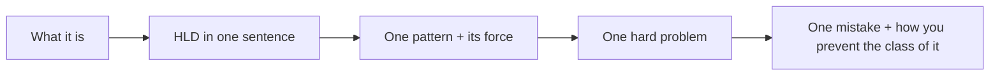
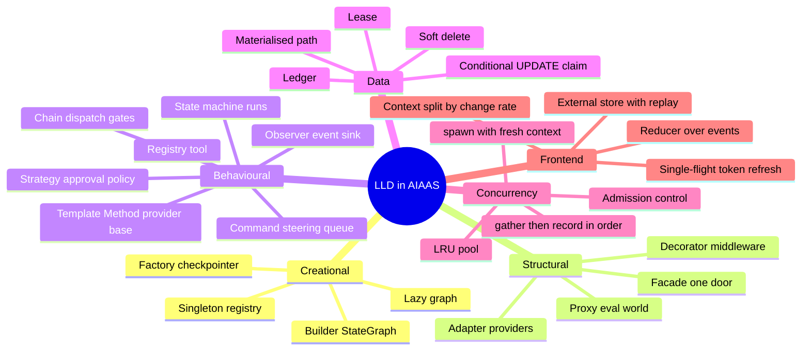

# Part 4 — Interview Kit

> Designing a feature end to end, the classic LLD problems mapped to this code,
> stories to tell, and a cheat sheet. Back to the [index](README.md).

---

## 13. Worked LLD: designing a feature end to end



Use this as a template for any "design X" question. The example: **"Let a user
send instructions to an agent while it's running."** (This is how steering was
built.)

**1. Clarify requirements.**
- Functional: user can send N messages mid-run; the agent sees all of them, in
  order, soon.
- Non-functional: must not corrupt the transcript; bounded memory; nothing
  silently lost.
- Out of scope: cross-process delivery (single web process — an HLD fact).

**2. Identify entities.**
- `Steer` (text), `Mailbox` per run (queue + counters), `Run` (consumer),
  `Endpoint` (producer).

**3. Find the invariants.** These drive the design more than the entities do.
- An assistant tool-call message must be immediately followed by its tool
  results. → Deliver only on the `tools → agent` edge.
- The graph treats exactly one trailing human message as the prompt. → Merge
  the queue into one message.
- A steer believed accepted must never vanish. → Count drops; return leftovers.

**4. Choose structures and patterns.**
- `deque` with a cap (Producer/Consumer, bounded buffer).
- Dict keyed by run id (registry of mailboxes).
- A graph node (`steering_node`) that drains it — no `interrupt()` needed,
  because nothing outside the graph needs to be *waited* for.

**5. Write the interface first.**

```python
def post(key: str, message: str) -> bool   # producer
def take(key: str) -> str                   # consumer: drain all, joined
def drain_messages(key: str) -> list[str]   # at run end: hand back leftovers
def set_autonomy(key: str, level: str)      # standing state, not drained
```

**6. Handle the edges.** Empty message, oversized message
(`MAX_STEER_CHARS`), queue full (drop oldest, count it), run finished (404),
steer arrives during the final answer (returned to client).

**7. Test the invariants, not the lines.** `chat/tests/test_steering.py`,
`chat/tests/test_undelivered_steers.py`.

**8. Say the trade-off.** In-process means it doesn't survive a restart or scale
to two web processes. Fine on one box; the upgrade path is Redis lists behind
the same four functions — which is *why* the interface is four functions and not
a class leaked everywhere.

---

## 14. Classic LLD interview problems, mapped to this code

When an interviewer asks a classic, you can say "I built a version of this"
and then solve the textbook one.

| Interview problem | Where it lives here | Key idea to reuse |
|---|---|---|
| **LRU cache** | MCP session pool (`OrderedDict`, `_touch` on borrow) | `OrderedDict.move_to_end` + `popitem(last=False)`; or hashmap + doubly linked list |
| **TTL cache with max size** | `CredentialManager._evict_cache` | Evict expired first, then oldest |
| **Rate limiter** | `core/http/throttling`, per-run caps (`notify_user`, `OUTBOUND_DAILY_CAP`) | Token bucket / sliding window; count from the source of truth |
| **Job scheduler / cron** | `agents/scheduler.py`, `agents/sweep.py`, `agents/triggers.py` | Indexed `next_due_at`, lease for one leader, claim-per-slot, overlap policy, DST rules |
| **Task queue with retries** | Recovery sweep, reminder claim-then-send | At-least-once + idempotent handlers |
| **Plugin system** | Tool / grader / contract registries | Decorator registration, fail on duplicate |
| **Permission system (RBAC-ish)** | Grants → scopes → per-tool allow/ask/deny → autonomy ladder | Separate *whether*, *which*, and *how* |
| **File system design** | `inference/vfs.py`, `Folder`/`Document` | Materialised path, walk don't match, soft delete |
| **Undo / version history** | `lib/history.ts`, `DocumentVersion` | Coalescing stack; keep what an overwrite replaced |
| **Pub/sub / notification system** | Event sink, channels, HITL reminder ladder | Escalate then back off; channels per urgency |
| **Parking lot / elevator (state + resources)** | Code leases, connector admission | Claim resources atomically, release on every terminal path |
| **Chat app message flow** | SSE turn stream + reducer | Ordered events, idempotent reducer |

### Quick solve: LRU cache (the way you'd write it in an interview)



`get`: map lookup O(1), move node to tail. `put`: insert at tail; if over capacity, drop the node after head.

```python
from collections import OrderedDict

class LRUCache:
    def __init__(self, capacity: int):
        self.capacity = capacity
        self.data: OrderedDict[int, int] = OrderedDict()

    def get(self, key: int) -> int:
        if key not in self.data:
            return -1
        self.data.move_to_end(key)          # mark as most recently used
        return self.data[key]

    def put(self, key: int, value: int) -> None:
        self.data[key] = value
        self.data.move_to_end(key)
        if len(self.data) > self.capacity:
            self.data.popitem(last=False)    # evict least recently used
```

Then add what production taught you: "In my MCP pool I also had to (1) mark
recency on *borrow*, not insert, (2) never evict an entry that's in use, and (3)
close evicted entries in the task that opened them, or the subprocess leaks."

### Quick solve: a job scheduler's core



```python
def tick(now):
    if not try_acquire_lease(now):        # only one leader
        return
    for job in due_jobs(now):              # WHERE next_due_at <= now, indexed
        if claim(job, expected=job.next_due_at, new=next_slot(job, now)):
            spawn(run(job))                # detached; claim was atomic
```

---

## 15. Talking about it: stories, questions, answers

### 15.1 Three stories in STAR form (practise these)

**Story 1 — The registry (design for change).**
- *Situation:* Tools were defined in three places and drifted; a tool could be
  advertised but not dispatchable.
- *Task:* Make adding a tool safe and one-step.
- *Action:* A `@tool(schema, ...)` decorator that registers a frozen `Tool`
  record; metadata (`effect`, `parallel`, `requires`) on the declaration;
  worst-case defaults; duplicate names fail at import.
- *Result:* Adding a tool is one place. The same pattern then carried graders,
  contracts, providers and slash commands.

**Story 2 — Memory on a tiny box (admission control).**
- *Situation:* One chat turn started 8 connector subprocesses and the kernel
  killed the web server.
- *Action:* Listing tools never spawns (served from a DB catalogue); starting is
  admitted against a megabyte budget reserved *before* spawn; LRU eviction of
  idle sessions; a separate container-headroom backstop.
- *Result:* No OOMs from connectors; later moved Google connectors to native
  REST tools, removing Node from the image.

**Story 3 — The test suite was green and the feature was invisible.**
- *Situation:* The todo-list feature passed six suites; no component rendered it.
- *Action:* Added an end-to-end test that drives the real graph and asserts on
  what a client receives (events + saved metadata).
- *Result:* It caught a second real bug on its first run. Lesson: unit tests per
  hop can pass while the chain connects nowhere.

### 15.2 Questions you should be able to answer

**Q: When would you use Strategy vs Template Method?**
A: Template Method when subclasses share most of an algorithm and vary a few
steps — my LLM providers share HTTP, streaming and parsing, and override only
payload hooks. Strategy when whole algorithms swap — approval policies share
nothing, so they're plain functions chosen by the autonomy level.

**Q: Isn't a singleton an anti-pattern?**
A: It's global state, so it hurts testing. I have one — the provider registry —
and it's safe because it stores classes and returns a fresh handler per call.
My credential cache singleton did bite me: ids restart per test DB, so cached
entries leaked across tests. Now tests clear it in `setUp`.

**Q: How do you prevent two workers doing the same job?**
A: A lease row for leader election — one conditional UPDATE, "mine or expired".
And per job a compare-and-swap claim: `UPDATE ... WHERE next_due_at = <what I
read>`. Rowcount zero means I lost; no lock is held, so no deadlocks.

**Q: How do you make a permission check impossible to bypass?**
A: One door, checked at both points: filter what's offered, and re-check at
dispatch. Defaults fail closed. And scopes intersect down a delegation tree so a
child never exceeds its parent.

**Q: How do you design for failure?**
A: Decide per failure whether to degrade or fail loudly. Dev checkpointer
degrades to memory; prod raises. Observers must never raise. Retry only
transport failures before any output. Timeouts must actually kill the work. And
fail before showing "thinking" if the call can't be paid for.

**Q: What's the difference between HLD and LLD in your project?**
A: HLD: a modular monolith on one small box — Django ASGI, Postgres pool,
Redis for channels, a no-network sandbox sidecar, SSE for chat. LLD: how that
box behaves inside — registries, the dispatch chain, the steering queue, leases,
the file scope, and the admission controller that keeps connectors inside a
memory budget.

**Q: How did you keep a 30+ app Django project from turning into spaghetti?**
A: Apps are grouped by mechanism, not by page. Layers are declared in
`.importlinter` and a test fails CI on a wrong-way import. Code other apps need
(the grants table, the serializer, the office library) was moved *out* of views
and tool modules into its own module so it can be imported without dragging the
engine along.

### 15.3 How to present this project in 2 minutes



1. **What:** "An agent platform: a chat orchestrator delegating to configurable
   subagents, with approvals, schedules, evals and a virtual filesystem."
2. **HLD in one sentence:** modular monolith, one box, SSE + WebSocket, sandbox
   sidecar, durable run state.
3. **One LLD pattern with its force:** the tool registry.
4. **One hard problem:** memory admission control, or concurrent schedulers.
5. **One mistake you caught and how you prevent the class of it:** the green
   test suite with an invisible feature → end-to-end test on the client contract.

---

## 16. Cheat sheet



| Pattern | One-line definition | AIAAS example | File |
|---|---|---|---|
| Singleton | One shared instance | `ProviderRegistry` | `llm/handlers/registry.py` |
| Factory | Build the right type from config | `checkpoints.build()` | `chat/turn/checkpoints.py` |
| Lazy init | Build on first use | `get_graph()` + PEP 562 | `chat/turn/agent.py` |
| Builder | Assemble step by step | `StateGraph(...).add_node...compile()` | `chat/turn/agent.py` |
| Facade | Simple front to a subsystem | `arun_code`, `llm/access`, `eval/api` | `sandbox/engine.py` |
| Adapter | Make interfaces fit | Provider payload hooks; eval simulators | `llm/handlers/openai_compatible.py` |
| Decorator | Wrap to add behaviour | Middleware stack; `@tool` | `core/http/middleware.py` |
| Proxy | Stand-in that controls access | Eval environment in `dispatch` | `agents/agent/runtime.py` |
| Registry | Name → implementation, self-registering | Tools, graders, contracts, commands | `chat/tools/registry.py` |
| Strategy | Swap algorithms | Approval policies, sandbox engines | `chat/tools/permissions.py` |
| Template Method | Fixed algorithm, overridable steps | `OpenAICompatibleLLMNode` | `llm/handlers/openai_compatible.py` |
| Chain of Responsibility | Pass along until handled/refused | `AgentToolbox.dispatch`, middleware | `agents/agent/runtime.py` |
| Observer | Notify without coupling | `on_tool_result`, `EventSink` | `chat/turn/agent.py` |
| Command | Request as an object | Steers, slash commands | `chat/turn/steering.py` |
| Producer/Consumer | Bounded queue between sides | Steering mailbox | `chat/turn/steering.py` |
| State machine | Explicit states + guarded moves | Run / HITL / trigger status | `agents/`, `logs/` |
| Null Object | Do-nothing default | `null_sink` | `chat/turn/events.py` |
| Specification | Validate a shape | Output `Contract` + `coerce` | `agents/contracts.py` |
| Soft delete | Hide via default manager | `LiveManager` | `inference/models.py` |
| Optimistic concurrency | CAS in SQL | Trigger slot claim, `expected_version` | `agents/sweep.py`, `inference/vfs.py` |
| Lease | Leader election with expiry | `SchedulerLease` | `agents/scheduler.py` |
| Materialised path | Tree as id path string | `Folder.path` | `inference/filesystem.py` |
| Admission control | Reserve before spending | `ConnectorSupervisor` | `mcp_integration/supervisor.py` |
| LRU | Evict least recently used | MCP session pool | `mcp_integration/client.py` |
| Reducer | Pure `(state, event) → state` | `useChatStream` | `src/hooks/useChatStream.ts` |

### The ten sentences to remember

1. Name the force, then the pattern.
2. Registration is the schema.
3. One door; check at both the offer and the call.
4. Default to the safe value, because unknown things can't declare themselves.
5. Refuse rather than truncate; when you must cut, say so.
6. `None` and empty are different values.
7. Claim with a conditional UPDATE; zero rows means you lost.
8. Observers must never fail the thing they observe.
9. A count is not a budget.
10. A test per hop can pass while the chain connects nowhere.
