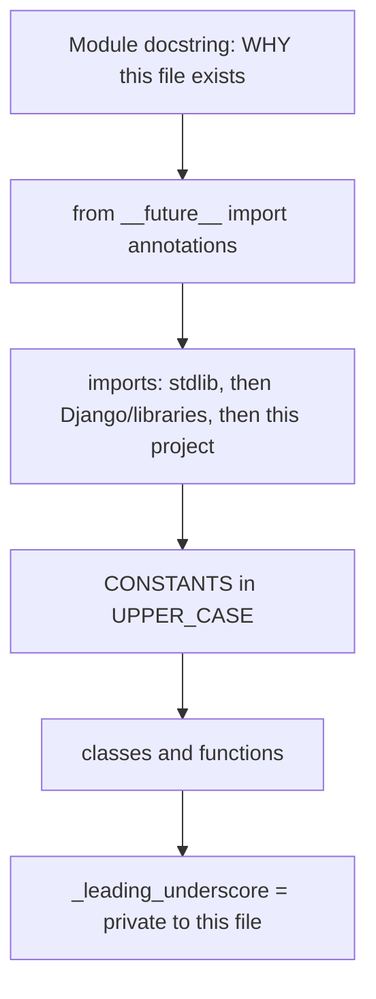
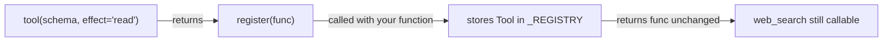
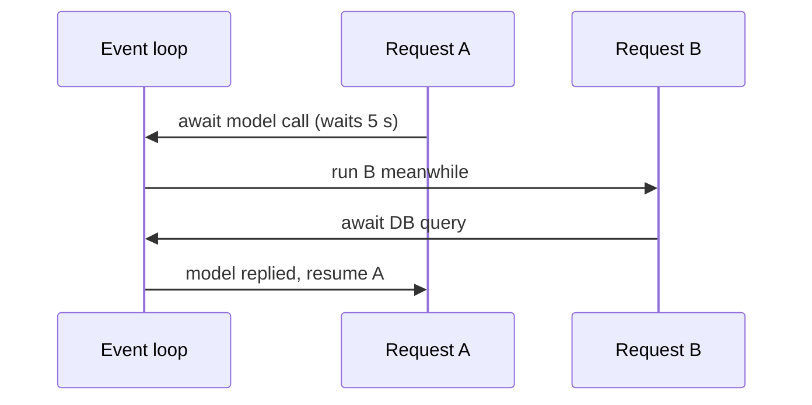

# Part 5 — Python Syntax You Will Meet in This Backend

> For a beginner. Start at **P-Start** if Python is new to you; skip to P0 if you
> already know the basics. Each item gives the syntax, what it means in plain
> words, and a real line from this project. Read this before Part 2 if the code
> there looks strange. Back to the [index](README.md).

**How to practise:** open a terminal, type `python`, and paste the small
examples. Seeing the output yourself is the fastest way to learn. (`exit()`
leaves.)

---

## P-Start. The absolute basics (10 minutes)

### Variables and printing

```python
name = "Kaushal"          # a variable holding text (a "string")
count = 3                 # a whole number (an "int")
price = 9.5               # a decimal number (a "float")
ready = True              # True or False (a "bool")
nothing = None            # "no value" (like null in other languages)

print(name, count)        # shows: Kaushal 3
```

`#` starts a comment. Python ignores everything after it on that line.

### Indentation *is* the structure

Other languages use `{ }` to group code. Python uses **indentation** (4 spaces).
A line ending in `:` starts a block; the indented lines below belong to it.

```python
if count > 2:
    print("many")         # inside the if
    print("still inside")
print("always runs")      # back out: not part of the if
```

### Decisions

```python
if count == 0:
    print("none")
elif count == 1:          # "else if"
    print("one")
else:
    print("several")
```

`==` compares; `=` assigns. `and`, `or`, `not` are words, not symbols.

### Lists and loops

```python
tools = ["web_search", "read_file", "write_file"]   # a list
print(tools[0])            # web_search  (counting starts at 0)
print(len(tools))          # 3

for tool in tools:         # do this once per item
    print(tool)

tools.append("render_chart")   # add to the end
```

### Dictionaries (key → value)

```python
agent = {"name": "Reporter", "model": "deepseek", "runs": 12}
print(agent["name"])           # Reporter
agent["runs"] = 13             # change a value
print(agent.get("owner"))      # None: .get() doesn't crash on a missing key
```

The backend is full of dicts, because JSON from the browser becomes a dict.

### Functions

```python
def greet(name):               # def = define a function
    return "Hello " + name     # return = the answer it gives back

message = greet("Kaushal")     # call it
```

### Classes (a blueprint for objects)

```python
class Counter:
    def __init__(self):        # runs when you create one
        self.value = 0         # self = "this particular counter"

    def add(self):             # a method: a function that belongs to the class
        self.value += 1

c = Counter()                  # make one (an "instance")
c.add()
print(c.value)                 # 1
```

### Using code from other files

```python
from datetime import timedelta           # take one name from a module
from agents.models import SubAgent       # a module in this project: agents/models.py
import json                              # take the whole module; use json.loads(...)
```

A **module** is one `.py` file. A **package** is a folder of them (with an
`__init__.py`). `agents.models` means `agents/models.py`.

### Coming from JavaScript?

| JavaScript | Python |
|---|---|
| `const x = 1;` / `let` | `x = 1` |
| `null` / `undefined` | `None` |
| `true` / `false` | `True` / `False` |
| `&&`, `\|\|`, `!` | `and`, `or`, `not` |
| `{ ... }` blocks | `:` and indentation |
| `function f(a) {}` / `(a) => ...` | `def f(a):` / `lambda a: ...` |
| `arr.length` | `len(arr)` |
| `obj.key` on a plain object | `d["key"]` on a dict |
| `` `Hi ${name}` `` | `f"Hi {name}"` |
| `this` | `self` (written explicitly) |
| `async`/`await`, `Promise.all` | `async`/`await`, `asyncio.gather` |
| `try/catch` | `try/except` |

---

## Words you'll see (glossary)

| Word | Plain meaning |
|---|---|
| **argument / parameter** | a value you hand to a function |
| **return value** | what a function hands back |
| **object / instance** | one thing made from a class |
| **attribute** | a value stored on an object: `scope.mode` |
| **method** | a function stored on an object: `scope.may_write_at(...)` |
| **module / package** | one `.py` file / a folder of them |
| **type hint** | a note saying what type a value should be (not enforced) |
| **decorator** | a line starting with `@` that wraps or registers the function below |
| **exception** | an error object; "raise" throws it, "except" catches it |
| **immutable** | can't be changed after it's made (tuples, frozen dataclasses) |
| **iterate** | go through items one by one (a `for` loop) |
| **coroutine** | what an `async def` function gives you; it runs when you `await` it |
| **event loop** | the scheduler that switches between waiting async tasks |
| **dunder** | "double underscore" names like `__init__`, which Python calls for you |

---

## P0. How to read a Python file here



Almost every file in `Backend/` starts with a long docstring (`"""..."""`)
explaining **why** the code is shaped the way it is. Read it first. It's the
best documentation in the project.

| Naming | Meaning | Example |
|---|---|---|
| `snake_case` | functions, variables, modules | `build_scope`, `file_access` |
| `PascalCase` | classes | `FileScope`, `AgentToolbox` |
| `UPPER_CASE` | constants (by convention; Python doesn't enforce it) | `MAX_STEER_CHARS = 4_000` |
| `_name` | "private": don't use from outside this file | `_REGISTRY`, `_denied()` |
| `__name__` | Python's special ("dunder") names | `__init__`, `__new__`, `__getattr__` |

`4_000` is just `4000`. Underscores in numbers are for readability.

---

## P1. Type hints

Python doesn't check types when it runs. Hints are for readers, editors and
tools like pyright. You'll see them everywhere here.

```python
def rupees_for(tokens: int | None) -> int: ...
#               ^ argument type       ^ return type
```

| Hint | Means |
|---|---|
| `int \| None` | an int, or `None` (older code writes `Optional[int]`) |
| `dict[str, Tool]` | a dict with string keys and `Tool` values |
| `tuple[str, ...]` | a tuple of any number of strings |
| `tuple[bool, str]` | exactly two items: a bool, then a string |
| `list[dict[str, Any]]` | a list of dicts; `Any` = anything |
| `Callable[[dict, dict], Awaitable[str]]` | a function taking two dicts and returning something you `await` to get a string |
| `Literal["read", "reversible", "irreversible"]` | only these exact strings |
| `frozenset[str]` | an immutable set |

Real example, [`chat/tools/registry.py`](../Backend/chat/tools/registry.py):

```python
Effect = Literal["read", "reversible", "irreversible"]          # a type alias
ToolFunc = Callable[[Dict[str, Any], Dict[str, Any]], Awaitable[str]]
```

**`from __future__ import annotations`** at the top of a file makes hints lazy
(stored as strings). That lets a hint name a class defined later in the file.

**`TYPE_CHECKING`** imports something only for the type checker, never at run
time. That avoids import cycles:

```python
from typing import TYPE_CHECKING
if TYPE_CHECKING:
    from llm.context import ExecutionContext     # never actually imported at run time

def execute(self, ..., context: 'ExecutionContext'): ...   # hint in quotes
```

---

## P2. Functions: arguments done carefully

```python
def tool(
    schema: Dict[str, Any],          # positional
    *,                               # everything after * MUST be passed by name
    requires: Requirement | None = None,
    sensitive: bool = False,
    parallel: bool = False,
    effect: Effect = "irreversible",
) -> Callable[[ToolFunc], ToolFunc]:
```

- **The bare `*`** forces keyword arguments. `tool(schema, True)` is an error;
  you must write `tool(schema, sensitive=True)`. This project uses it a lot so
  that calls read like sentences and can't mix up two booleans.
- **Defaults** (`= False`) make an argument optional.
- **`*args` / `**kwargs`** collect extra positional / keyword arguments:

```python
def __init__(self, *args, tool_name: str = '', **kwargs):
    self.tool_name = tool_name
    super().__init__(*args, **kwargs)     # pass everything else on to the parent
```

- **Returning two things** is really returning a tuple, and **unpacking** it:

```python
allowed, refusal = self.mcp_call_allowed(name)
```

- **Trap: never use a mutable default** like `def f(x=[])`. The list is shared
  by every call. Use `None` and create it inside, or `field(default_factory=...)`
  in dataclasses (P4).

---

## P3. Decorators

A decorator is a function that takes a function (or class) and returns one.
`@name` above a definition is shorthand:

```python
@api_view(['GET'])
def trigger_list(request): ...

# is exactly the same as:
def trigger_list(request): ...
trigger_list = api_view(['GET'])(trigger_list)
```



A decorator **with arguments** is a function that returns the real decorator.
This project's `@tool`, written out, is three layers: `tool(...)` → `register`
→ your function. It's worth tracing once in
[`chat/tools/registry.py:95`](../Backend/chat/tools/registry.py#L95).

Decorators you'll see:

| Decorator | Does |
|---|---|
| `@tool(...)`, `@grader(...)`, `@command(...)` | this project's registries |
| `@dataclass` | writes `__init__`, `__eq__`, `__repr__` for you (P4) |
| `@property` | lets you read a method like a field: `scope.writable` |
| `@classmethod` | method gets the class (`cls`), not an instance |
| `@staticmethod` | method gets neither |
| `@abstractmethod` | subclasses must implement it |
| `@api_view`, `@permission_classes` | Django REST Framework (see Part 6) |
| `@receiver(post_delete, sender=Document)` | Django signals |
| `@transaction.atomic` | run the whole function in one DB transaction |

---

## P4. Classes, dataclasses and friends

### Plain class

```python
class CredentialManager:
    def __init__(self):                 # constructor
        self._cache: dict[str, tuple[dict, datetime]] = {}
        self._cache_ttl = timedelta(minutes=5)

    def _evict_cache(self) -> None:     # every method gets `self` first
        ...
```

`self` is the instance, like `this` in Java/JS, but written explicitly.

### Dataclass: a class that is mostly data

```python
from dataclasses import dataclass, field

@dataclass(frozen=True, slots=True)
class Tool:
    name: str
    schema: dict
    run: ToolFunc
    parallel: bool = False            # field with a default
```

In plain words: you list the fields, and Python writes the boring code
(constructor, printing, comparing) for you. `Tool(name=..., schema=..., run=...)`
then just works.

- `frozen=True` → fields can't be changed after creation. That also lets you
  use the object as a dict key or put it in a set.
- `slots=True` → uses less memory, and a typo like `tool.nmae = 1` fails
  loudly instead of silently adding a new field.
- Mutable defaults need `field(default_factory=...)`:

```python
@dataclass(slots=True)
class _Slot:
    messages: deque = field(default_factory=deque)   # a NEW deque per slot
    dropped: int = 0
```

### Inheritance and abstract classes

```python
from abc import ABC, abstractmethod

class BaseNodeHandler(ABC):
    node_type: str = ""                       # class attribute, overridden per subclass

    @abstractmethod
    async def execute(self, input_data, config, context): ...

class OpenAINode(OpenAICompatibleLLMNode):   # (Parent) = inherits from
    node_type = "openai"
    base_url = "https://api.openai.com/v1"
```

`super().__init__(...)` calls the parent's version of a method.

### `@property`

```python
@property
def writable(self) -> bool:
    return self.write_prefix is not None or self.shared_prefix is not None

scope.writable        # no parentheses: reads like a field
```

### `Protocol`: an interface by shape (duck typing with types)

```python
class EventSink(Protocol):
    async def __call__(self, event: Event, payload: dict[str, Any]) -> None: ...
```

Any object with a matching `__call__` counts as an `EventSink`. It doesn't have
to inherit from anything. (`__call__` makes an object callable like a function.)

### `__new__`: control creating the object (used for the singleton)

```python
def __new__(cls):
    if cls._instance is None:
        cls._instance = super().__new__(cls)
    return cls._instance          # always the same object
```

---

## P5. `None`, truthiness, and the difference this code cares about

```python
if x:            # False for None, 0, '', [], {}, (), False
if x is None:    # ONLY None
if x is not None:
```

This project treats **empty and `None` as different values** on purpose:

```python
write_prefix: tuple[str, ...] | None
#   None -> nothing is writable
#   ()   -> everything is writable (an empty prefix matches every path)
```

So `if scope.write_prefix:` would be a **bug** here (it's falsy for both). The
code writes `is not None`. When you read a condition, ask: "is this truthiness
or identity?"

Other comparisons:

| Code | Means |
|---|---|
| `a == b` | equal values |
| `a is b` | the same object (use for `None`, `True`, `False`) |
| `x in collection` | membership: `name in _REGISTRY` |
| `a if cond else b` | inline if (ternary) |
| `x or default` | `x` if truthy, else `default`: `(agent.sandbox or {})` |

---

## P6. Collections and comprehensions

```python
names = [t.name for t in tools]                         # list comprehension
sensitive = [t.name for t in tools if t.sensitive]      # with a filter
by_name = {c.name: c for c in (RESEARCH, FILES)}        # dict comprehension
frozenset(t.name for t in _REGISTRY.values() if t.parallel)   # generator expression
```

Read a comprehension right to left: "for each `t` in `tools`, if `t.sensitive`,
take `t.name`".

| Type | Literal | Use it for |
|---|---|---|
| `list` | `[1, 2]` | ordered, changeable |
| `tuple` | `(1, 2)` or `(1,)` | ordered, fixed (note the comma for one item) |
| `dict` | `{'a': 1}` | key → value |
| `set` / `frozenset` | `{1, 2}` / `frozenset(...)` | unique items, fast `in` |
| `deque` | `deque()` | a queue: fast `append` and `popleft` |
| `OrderedDict` | `OrderedDict()` | dict with `move_to_end` (LRU caches) |

Slicing: `parts[:3]` = first three, `body[-8000:]` = last 8,000 characters,
`items[1:]` = all but the first.

Dict access: `d['k']` raises if missing; `d.get('k')` returns `None`;
`d.get('k', 0)` returns `0`. You'll see `.get(...)` constantly here, because
config dicts come from JSON and may lack keys.

---

## P7. Strings

```python
f"Tool {name!r} is registered twice"     # f-string: {expr} is inserted; !r shows it as code would (strings get quotes)
f"{used + reserved:.0f} MB"              # :.0f = format as a number, 0 decimals
f"{i}. {text}"
'\n'.join(lines)                          # glue a list into one string
text.split('\n')                          # and back
line.startswith('data: '), line[6:]
(message or '').strip()                   # guard against None, then trim spaces
```

Long strings are often written as adjacent literals, which Python joins:

```python
help_text=(
    "NULL is the user's root. There is deliberately no root row: NULL "
    'is unforgeable ...'
)
```

---

## P8. The walrus operator `:=`

Assign and test in one step:

```python
if tools := self._tools_for(config):     # compute, store in `tools`, then check it
    payload["tools"] = tools
```

Same as `tools = self._tools_for(config)` then `if tools:`.

---

## P9. Errors

```python
try:
    payload = json.loads(text)
except (json.JSONDecodeError, TypeError):      # catch these two kinds
    raise ContractError('got prose.') from None # new error; `from None` hides the old traceback
finally:
    await sync_to_async(close_old_connections)()   # always runs
```

- `except Exception:` catches almost everything. This project allows it only
  where a failure **must not** spread (observers, UI side effects), and marks it
  with a comment like `# noqa: BLE001`. Read learning/14 to see why a broad
  `except` once hid a real bug.
- Custom errors are one-line classes: `class ContractError(ValueError): """..."""`.
- `logger.exception("...")` logs the message **and** the traceback.

---

## P10. `async` / `await`

The backend runs on an **event loop** (ASGI). `async def` functions can pause at
`await` while waiting on the network, so one thread serves many requests.



```python
async def arun_code(code: str) -> dict:          # an async function ("coroutine")
    return await run_via_service(code)            # await = wait here without blocking others

results = await asyncio.gather(search_a(), search_b())   # run both at once, wait for both
task = spawn(run_agent(...))                             # start without waiting (see Part 2 §9.1)
```

Rules:
- You can only `await` inside an `async def`.
- Calling an async function **without** `await` doesn't run it. It gives you a
  coroutine object. (A classic bug.)
- **Blocking code** (a normal Django ORM call, `time.sleep`) inside an async
  function freezes every request. Wrap it: `await sync_to_async(fn)(...)`.

`async with` and `async for` are the async versions of `with` / `for`:

```python
async with ThreadSensitiveContext():   # set up, run the block, always clean up
    return await coro
```

**Async generators** produce a stream of values with `yield`:

```python
async def stream_execute(self, ...):
    yield {"type": "content", "content": "..."}
    yield {"type": "metadata", ...}

async for chunk in handler.stream_execute(...):   # consume them
    ...
```

---

## P11. Context managers: `with`

`with` guarantees clean-up, even if an error happens inside the block:

```python
with self._lock:                 # take a lock; always release it
    return sum(self._reserved.values())

with transaction.atomic():       # one DB transaction; rolled back on error
    ...
```

---

## P12. Module-level tricks this code uses

```python
_graph = None                    # module-level variable: one per process

def get_graph():
    global _graph                # assign to the module variable, not a local
    if _graph is None:
        _graph = _build_graph()
    return _graph

def __getattr__(name):           # runs when someone reads a missing module attribute
    if name == "chat_agent_graph":
        return get_graph()
    raise AttributeError(name)
```

- **Imports inside functions** (`from chat.tools import execute_tool` in the
  middle of `dispatch`) are deliberate. They break import cycles between apps
  and delay loading heavy modules. The project calls these "deferred imports".
- `if __name__ == "__main__":` runs code only when the file is run directly.

---

## P13. A decoder exercise

Read this real line and say what each piece does. Answers are below the code.

```python
return frozenset(t.name for t in _REGISTRY.values() if t.effect in wanted)
```

1. `_REGISTRY.values()`: every `Tool` in the registry dict.
2. `for t in ... if t.effect in wanted`: keep the tools whose effect is wanted.
3. `t.name`: take just the name.
4. `frozenset(...)`: an immutable set, so callers can't change it and `in` is fast.

And this one:

```python
if prefix is not None and tuple(parts[:len(prefix)]) == prefix:
```

"If there is a prefix (not `None`, though `()` counts), and the first
`len(prefix)` segments of the path equal it, the path is inside the writable
subtree."

---

## P14. Cheat sheet

| You see | It means |
|---|---|
| `x: int \| None = None` | typed, optional, defaults to None |
| `def f(a, *, b)` | `b` must be passed as `b=` |
| `@something` | decorator: wraps or registers the next definition |
| `@dataclass(frozen=True)` | immutable record class |
| `field(default_factory=list)` | new list per instance |
| `@property` | method read like a field |
| `class A(B)` | A inherits from B |
| `super().method()` | call the parent's version |
| `[f(x) for x in xs if p(x)]` | map + filter into a list |
| `a, b = f()` | unpack a returned tuple |
| `if y := g():` | assign and test |
| `f"{v!r}"` | formatted string, `repr` of v |
| `async def` / `await` | coroutine / wait without blocking |
| `asyncio.gather(a(), b())` | run concurrently |
| `with lock:` | acquire, then always release |
| `raise X from None` | new error, hide the old chain |
| `is None` vs falsy | identity vs "empty-ish" |
| `_private`, `CONSTANT` | naming conventions only |
