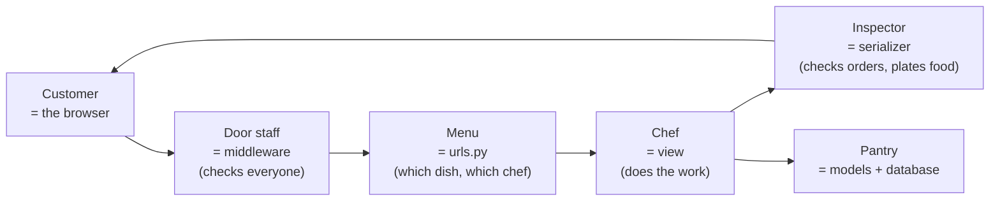
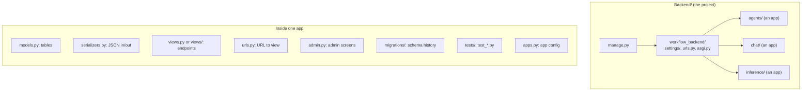
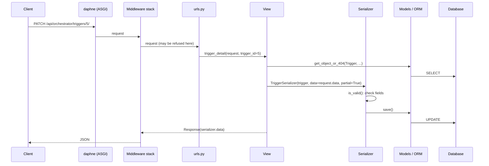
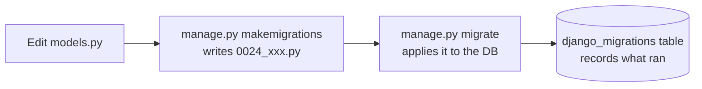
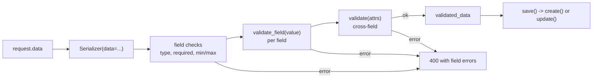
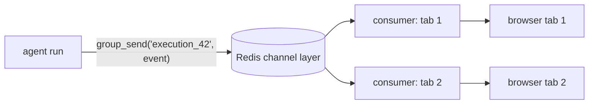

# Part 6 — Django and DRF, Read Through This Backend

> Enough Django to read every file in `Backend/` with confidence, starting from
> zero. Read **D-Start** first; it explains the ideas in plain words before any
> code. Read [Part 5 (Python)](05_Python_Syntax.md) first if Python itself is new.
> The project uses Django 5.2, Django REST Framework (DRF) 3.17 and Channels 4.
> Back to the [index](README.md).

---

## D-Start. Django in plain words

**Django is a Python framework for building the server side of a website.** It
receives requests from the browser, reads and writes the database, and sends
answers back. **DRF (Django REST Framework)** is an add-on that makes those
answers JSON, which is what a React app wants.

### An analogy: a restaurant



| Restaurant | Django | File |
|---|---|---|
| Customer's order | an HTTP **request** | — |
| Door staff | **middleware** | `core/http/middleware.py` |
| Menu (dish → chef) | **URL patterns** | `urls.py` |
| Chef | a **view** function | `views.py` or `views/` |
| Inspector / plating | a **serializer** (checks input, formats output) | `serializers.py` |
| Pantry shelves | **models** (each class = one table) | `models.py` |
| Stock-room changes log | **migrations** | `migrations/` |
| The meal served | an HTTP **response** (JSON) | — |

### The web basics Django assumes

**HTTP methods** say what the browser wants to do:

| Method | Means | Example in this project |
|---|---|---|
| `GET` | read something | list your agents |
| `POST` | create something / start an action | start an agent run |
| `PATCH` | change part of something | rename a schedule |
| `PUT` | replace something entirely | (rare here) |
| `DELETE` | remove something | delete a schedule |

**Status codes** say how it went:

| Code | Means |
|---|---|
| `200 OK` | worked, here's the data |
| `201 Created` | worked, a new thing exists |
| `202 Accepted` | started, will finish later (agent runs) |
| `204 No Content` | worked, nothing to send back (deletes) |
| `400 Bad Request` | your input is wrong (with details why) |
| `401 Unauthorized` | you're not logged in |
| `402 Payment Required` | no credit / key for this provider |
| `403 Forbidden` | logged in, but not allowed |
| `404 Not Found` | doesn't exist, *or* isn't yours (this project uses 404 for both on purpose) |
| `500 Server Error` | a bug on the server |

**JSON** is the text format both sides speak:
`{"name": "Reporter", "runs": 12, "enabled": true}`. In Python it becomes a
dict; in TypeScript, an object.

### Words you'll see (glossary)

| Word | Plain meaning |
|---|---|
| **endpoint / route** | one URL the server answers, like `/api/orchestrator/agents/` |
| **ORM** | "object-relational mapper": write Python instead of SQL; Django turns it into SQL |
| **model** | a Python class describing one database table |
| **row / record / instance** | one line in a table = one Python object |
| **field / column** | one property of a row: `name`, `created_at` |
| **foreign key** | a column pointing at a row in another table (a folder's `user`) |
| **QuerySet** | a *description* of a query; runs only when you read the results |
| **migration** | a file that changes the database's shape (add a column, a table) |
| **serializer** | converts JSON ↔ Python objects and checks the input |
| **view** | the function that handles one request |
| **middleware** | code that runs on every request before/after the view |
| **app** | one feature folder inside the project (`agents`, `chat`) |
| **transaction** | a group of DB changes that all happen, or none do |
| **N+1 queries** | the slow mistake of running 1 query for a list, then 1 more per item |
| **ASGI** | the server interface that lets Django handle async code and WebSockets |

---

## D0. The shape of a Django project



- A **project** is the whole site. An **app** is one feature module (`agents`,
  `chat`, `inference`...). Apps are listed in `INSTALLED_APPS` in
  `workflow_backend/settings/base.py`.
- **Settings are a package** here: `base.py` (shared), plus `local.py`,
  `deployment.py`, `test.py`, each starting with `from .base import *`.
- `manage.py` is the command-line entry point: `python manage.py migrate`,
  `runserver`, `test`, and custom commands (D9).

### What happens on one request



---

## D1. Models: a class is a table

[`inference/models.py`](../Backend/inference/models.py) (trimmed):

```python
from django.conf import settings
from django.db import models

class Folder(models.Model):                     # table: inference_folder
    user = models.ForeignKey(
        settings.AUTH_USER_MODEL,               # points at the User table
        on_delete=models.CASCADE,               # user deleted -> their folders deleted
        related_name='folders',                 # lets you write user.folders.all()
    )
    parent = models.ForeignKey(
        'self', on_delete=models.CASCADE,
        null=True, blank=True,                  # NULL allowed in DB / empty allowed in forms
        related_name='children',
    )
    name = models.CharField(max_length=255)
    path = models.CharField(max_length=1000, blank=True, db_index=True)   # indexed column
    depth = models.PositiveSmallIntegerField(default=0)
    deleted_at = models.DateTimeField(null=True, blank=True, db_index=True)
    created_at = models.DateTimeField(auto_now_add=True)   # set once on insert
    updated_at = models.DateTimeField(auto_now=True)       # set on every save

    objects = LiveManager()        # default manager: hides trashed rows
    all_objects = models.Manager() # a second manager that sees everything
```

| Field | Stores |
|---|---|
| `CharField(max_length=…)` / `TextField` | short / long text |
| `IntegerField`, `PositiveSmallIntegerField`, `DecimalField` | numbers |
| `BooleanField(default=False)` | true/false |
| `DateTimeField` | timestamp (timezone-aware) |
| `JSONField(default=dict)` | a JSON blob (used for `tool_grants`, `agent_context`) |
| `ForeignKey(Other, on_delete=…)` | many-to-one link (column `other_id`) |
| `OneToOneField` | one-to-one (e.g. `UserProfile` ↔ `User`) |
| `ManyToManyField` | many-to-many via a join table |
| `FileField` | a stored file (path in DB, bytes in storage) |

`on_delete` choices: `CASCADE` (delete children too), `SET_NULL` (needs
`null=True`), `PROTECT` (refuse the delete).

**`class Meta:`** inside a model sets table options: `ordering`, `indexes`,
`constraints` (e.g. `UniqueConstraint`), `db_table` (this project pins some
historical table names this way, like `nodes_aimodel`).

---

## D2. The ORM: querying without SQL

In plain words: `Model.objects` is the door to that table. You chain methods
to describe which rows you want, and Django writes the SQL.

**Try it yourself.** From `Backend/` (with the virtualenv active):

```bash
python manage.py shell
```
```python
>>> from agents.models import SubAgent
>>> SubAgent.objects.count()                  # how many agents exist
>>> qs = SubAgent.objects.filter(status='active')
>>> print(qs.query)                           # see the SQL Django will run
>>> qs.first()                                # now it actually runs
```

Real examples from the code:

```python
Trigger.objects.filter(subagent__user=request.user)     # WHERE subagent.user_id = ...
Folder.objects.get(id=5)                                # exactly one, or raises
Document.objects.filter(folder=None).exclude(file_type='other').order_by('-updated_at')[:20]
SchedulerLease.objects.get_or_create(name='triggers', defaults={...})   # (obj, created)
```

- **`__` (double underscore) walks relations and adds lookups.**
  `subagent__user` = "the trigger's subagent's user".
  `expires_at__lt=now` = "less than". Others: `__in`, `__isnull`,
  `__icontains`, `__startswith`, `__gte`.
- **QuerySets are lazy.** Building a `filter()` chain runs no SQL. It runs when
  you iterate, slice, `len()`, `list()`, or call `.first()`, `.count()`,
  `.exists()`.
- `get()` raises `DoesNotExist` or `MultipleObjectsReturned`. In views, use
  `get_object_or_404(...)`.

### Q objects: OR and NOT

```python
from django.db.models import Q

SchedulerLease.objects.filter(name=LEASE_NAME).filter(
    Q(holder=HOLDER) | Q(expires_at__lt=now)        # holder is me OR lease expired
)
```

`|` is OR, `&` is AND, `~Q(...)` is NOT.

### F expressions: use the column's own value, in the database

```python
Folder.objects.filter(...).update(depth=F('depth') + delta)   # UPDATE ... SET depth = depth + 5
```

No read-modify-write in Python, so two concurrent updates can't overwrite each
other.

### `update()` returns how many rows changed

This is the heart of the "claim" pattern (Part 2 §8.2):

```python
claimed = Trigger.objects.filter(id=t.id, next_due_at=t.next_due_at).update(next_due_at=new)
if not claimed:          # 0 rows: someone else changed it first
    return 'busy'
```

### Avoiding N+1 queries

```python
HITLRequest.objects.select_related('execution__subagent')  # JOIN a ForeignKey in the same query
agent.triggers.prefetch_related(...)                       # 2nd query for reverse / many-to-many
```

Without these, looping over 50 rows and touching `row.execution` runs 50 extra
queries.

### Aggregates

```python
from django.db.models import Count, Sum
qs.annotate(runs=Count('executions'))      # add a computed column per row
qs.aggregate(total=Sum('tokens_used'))     # one number for the whole set
```

**Trap this project hit:** `Count` across a JOIN counts joined rows, not parent
rows (a run with three approvals counted as three runs). Use
`Count('id', distinct=True)` or a subquery.

### Transactions and locks

```python
from django.db import transaction

@transaction.atomic                     # all or nothing
def move(folder, target): ...

with transaction.atomic():
    row = Document.objects.select_for_update().get(id=doc_id)   # lock this row until commit
    ...
```

---

## D3. Managers: change what `.objects` means

```python
class LiveManager(models.Manager):
    def get_queryset(self):
        return super().get_queryset().filter(deleted_at__isnull=True)
```

The **first** manager declared on a model is its default. Here that's
`LiveManager`, so every `Document.objects...` in the codebase skips trashed
rows automatically (Part 2 §8.1).

---

## D4. Migrations: schema as history



- Each app has a `migrations/` folder of numbered files. Each file lists its
  `dependencies` and `operations` (`AddField`, `CreateModel`, `RunPython`...).
- **Data migrations** use `RunPython` to change rows, not just columns. This
  project seeds curated connectors and credential types that way, so a fresh
  `migrate` gives a working install.
- **App label vs package:** the `agents/` package has label `orchestrator`, so
  migrations say `('orchestrator', '0024_...')` and ForeignKeys say
  `'orchestrator.SubAgent'`. See `CLAUDE.md` "App naming".

---

## D5. URLs

[`agents/urls.py`](../Backend/agents/urls.py):

```python
from django.urls import path
from .views import agents, runs

app_name = 'orchestrator'            # namespace for reverse()

urlpatterns = [
    path('agents/', agents.agent_list, name='agent_list'),
    path('agents/<int:agent_id>/', agents.agent_detail, name='agent_detail'),
    path('agents/<int:agent_id>/execute/', runs.agent_execute, name='agent_execute'),
]
```

- `<int:agent_id>` captures part of the URL and passes it to the view as
  `agent_id=5`. Other converters: `<str:…>`, `<slug:…>`, `<uuid:…>`.
- The project's root `urls.py` mounts each app under a prefix with `include()`
  (`/api/orchestrator/...`).
- `reverse('orchestrator:agent_detail', args=[5])` builds the URL from its
  name. Tests use it so they don't hard-code paths.

---

## D6. Views with Django REST Framework

This project mostly uses **function views** with DRF decorators.
[`agents/views/triggers.py`](../Backend/agents/views/triggers.py):

```python
from django.shortcuts import get_object_or_404
from rest_framework import status
from rest_framework.decorators import api_view, permission_classes
from rest_framework.permissions import IsAuthenticated
from rest_framework.response import Response

@api_view(['GET', 'PATCH', 'DELETE'])          # allowed HTTP methods
@permission_classes([IsAuthenticated])         # must be logged in (JWT)
def trigger_detail(request, trigger_id: int):
    trigger = get_object_or_404(
        Trigger, id=trigger_id, subagent__user=request.user,   # ownership check IN the query
    )
    if request.method == 'GET':
        return Response(TriggerSerializer(trigger).data)
    if request.method == 'DELETE':
        trigger.delete()
        return Response(status=status.HTTP_204_NO_CONTENT)

    serializer = TriggerSerializer(trigger, data=request.data, partial=True,
                                   context={'request': request})
    serializer.is_valid(raise_exception=True)   # invalid -> 400 with field errors
    trigger = serializer.save()
    return Response(TriggerSerializer(trigger).data)
```

What to notice:

| Piece | Meaning |
|---|---|
| `request.user` | the logged-in user (set by authentication) |
| `request.data` | the parsed JSON body |
| `request.query_params` | `?a=1&b=2` |
| `Response(data, status=...)` | serialises to JSON |
| `subagent__user=request.user` in the lookup | **the security check**: another user's id gives 404, not 403, so ids can't be probed |
| `partial=True` | PATCH: only the sent fields are validated/updated |

**Pagination note:** DRF's `PAGE_SIZE` setting does *not* apply to
`@api_view` function views, so every list view here sets its own cap
(Part 2 and `CLAUDE.md` "Nothing returns an unbounded list").

**Async views:** a view can be `async def`. Then ORM calls use the async API
(`await Model.objects.filter(...).afirst()`, `aget`, `acreate`) or
`sync_to_async(...)`. Chat streaming views are async because they hold a
response open while the model writes.

---

## D7. Serializers: validate input, shape output

### A `ModelSerializer`: fields come from the model

[`agents/serializers.py`](../Backend/agents/serializers.py):

```python
class HITLRequestSerializer(serializers.ModelSerializer):
    type = serializers.CharField(source='request_type', read_only=True)   # renamed field
    detail = serializers.SerializerMethodField()                          # computed field

    class Meta:
        model = HITLRequest
        fields = ['request_id', 'request_type', 'type', 'title', 'detail', 'status']
        read_only_fields = ['request_id', 'created_at']

    def get_detail(self, obj):          # SerializerMethodField looks for get_<name>
        ...
```

### A plain `Serializer`: validation only

[`tools_config/serializers.py`](../Backend/tools_config/serializers.py):

```python
class ToolConfigWriteSerializer(serializers.Serializer):
    enabled = serializers.BooleanField(required=False)
    config = serializers.DictField(required=False)

    def validate(self, attrs):                   # cross-field checks
        if self.tool_name in LOCKED_TOOLS and attrs.get('enabled') is False:
            raise serializers.ValidationError("... cannot be switched off ...")
        return attrs                             # must return the (cleaned) data
```



- `is_valid(raise_exception=True)` → 400 automatically on error.
- `serializer.validated_data` is the cleaned input; `serializer.data` is the
  output JSON.
- `context={'request': request}` lets validation see the user. That's how
  `AgentSerializer` (`agents/config.py`) checks you own every knowledge base
  and connection an agent names. It's the **one save path** for agents.

---

## D8. Signals: "when X happens, also do Y"

[`inference/signals.py`](../Backend/inference/signals.py):

```python
from django.db.models.signals import post_delete
from django.dispatch import receiver

@receiver(post_delete, sender=Document, dispatch_uid='inference.recount_kb_docs')
def recount_kb_documents(sender, instance: Document, **kwargs) -> None:
    recount_kb(instance.knowledge_base_id)
```

Common signals: `pre_save`, `post_save`, `post_delete`. They're connected when
the app loads (usually imported in `apps.py::ready()`).

**Caution:** signals are invisible at the call site. A bulk `queryset.update()`
or `.delete()` on a queryset doesn't call `save()` and skips `pre/post_save`.
A soft delete isn't a delete, so `post_delete` never fires; that's why the trash
path calls `recount_kb` itself.

---

## D9. Management commands: your own `manage.py xyz`

`app/management/commands/<name>.py` becomes `python manage.py <name>`.
[`core/management/commands/backup_db.py`](../Backend/core/management/commands/backup_db.py):

```python
from django.core.management.base import BaseCommand

class Command(BaseCommand):
    help = "..."

    def add_arguments(self, parser):              # argparse under the hood
        parser.add_argument("--keep", type=int, default=7)

    def handle(self, *args, **options):           # the work
        keep = options["keep"]
        ...
```

Others in this project: `boot` (migrate + seed once per container),
`recover_runs`, `purge_recycle_bin`, `benchmark`, `run_due_triggers`.

---

## D10. Admin

```python
@admin.register(SubAgent)
class SubAgentAdmin(admin.ModelAdmin):
    list_display = ['name', 'user', 'status', 'llm_provider']
    list_filter = ['status', 'llm_provider']
    search_fields = ['name', 'user__email']
    readonly_fields = ['execution_count', 'created_at']
```

Free CRUD screens at `/admin/` for staff users. Configuration only; no HTML.

---

## D11. Middleware

A middleware wraps every request/response (Part 2 §6.3). It's registered by
dotted path in `settings/base.py` → `MIDDLEWARE = [...]`. Order matters: the
first one listed sees the request first and the response last.

---

## D12. Real-time: Channels consumers

WebSockets don't fit the request/response view model. Channels adds
**consumers**. [`streaming/consumers.py`](../Backend/streaming/consumers.py):

```python
class ExecutionConsumer(SocketThreadConsumer):
    async def connect(self):
        await self.accept()                     # accept first (avoids a bare HTTP 403 drop)...
        ...                                     # ...then check the user; if not allowed:
        # await self.close(code=4001)           # close with a code the client can read
        await self.channel_layer.group_add(group_name, self.channel_name)   # join a "room"

    async def receive(self, text_data): ...                   # message from the browser

    async def disconnect(self, close_code): ...               # clean up
```



WebSocket routes live in a `routing.py` (not `urls.py`) and are served by
`asgi.py`.

---

## D13. Tests

[`agents/tests/test_install_pack.py`](../Backend/agents/tests/test_install_pack.py):

```python
from django.contrib.auth.models import User
from django.test import override_settings
from django.urls import reverse
from rest_framework import status
from rest_framework.test import APITestCase

class InstallPackTests(APITestCase):        # each test runs in a rolled-back transaction
    def setUp(self):                         # runs before EVERY test method
        self.user = User.objects.create_user('packer', 'p@example.com', 'pw')
        self.client.force_authenticate(user=self.user)   # skip login

    def test_the_office_pack_installs_three_specialists(self):   # must start with test_
        response = self.client.post(
            reverse('orchestrator:template_install_pack'),
            {"pack": "office"}, format='json',
        )
        self.assertEqual(response.status_code, status.HTTP_200_OK)
```

- Run them: `python manage.py test agents.tests` or `pytest agents/tests/test_install_pack.py`.
- `@override_settings(X=...)` changes a setting for one test or class.
- `APITestCase` gives you `self.client` for fake HTTP requests; `TestCase` for
  plain DB tests; `TransactionTestCase` when you need real commits (e.g. with
  async threads).
- Tests use their own database (`settings/test.py`), created and destroyed per run.

---

## D14. Cheat sheet

| You see | It means |
|---|---|
| `class X(models.Model)` | a table |
| `ForeignKey(Y, on_delete=CASCADE, related_name='xs')` | many-to-one; `y.xs.all()` goes back |
| `X.objects.filter(a__b__lt=3)` | WHERE across a relation with "less than" |
| `Q(a) \| Q(b)` | OR |
| `F('col') + 1` | use the column's DB value |
| `.update(...)` returns 1/0 | rows changed; basis of "claim" |
| `select_related` / `prefetch_related` | avoid N+1 queries |
| `transaction.atomic` / `select_for_update` | all-or-nothing / row lock |
| `objects = LiveManager()` first | changes the default query everywhere |
| `path('x/<int:id>/', view, name='n')` | URL → view with a captured int |
| `reverse('app:n', args=[1])` | URL from its name |
| `@api_view(['GET'])` + `@permission_classes([...])` | a DRF function view |
| `request.data`, `request.user` | JSON body, logged-in user |
| `get_object_or_404(M, id=…, user=request.user)` | fetch + ownership check, 404 otherwise |
| `Serializer.is_valid(raise_exception=True)` | validate or 400 |
| `SerializerMethodField` + `get_x` | computed output field |
| `@receiver(post_delete, sender=M)` | signal handler |
| `class Command(BaseCommand): handle()` | `manage.py` command |
| `APITestCase`, `setUp`, `force_authenticate` | API tests |
| `sync_to_async`, `aget`, `afirst` | ORM from async code |
