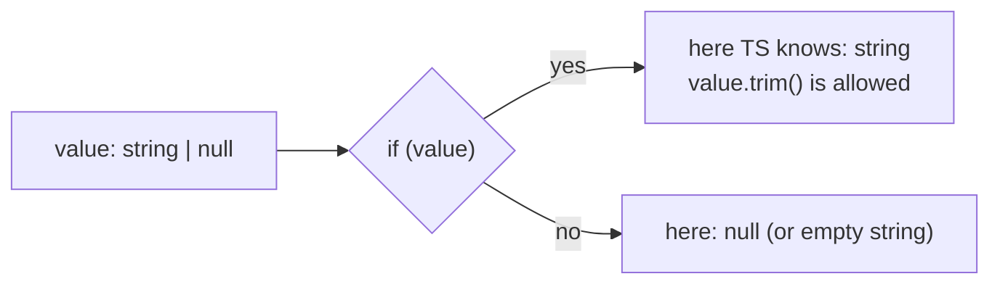

# Part 7 — TypeScript Syntax You Will Meet in This Frontend

> For a beginner. **TypeScript = JavaScript + types.** You write JavaScript and
> add notes saying what kind of value each thing is. The editor checks the notes
> while you type, and they're removed when the code runs in the browser.
> Start at **T-Start** if JavaScript is new to you. The frontend uses
> TypeScript 5.9. Back to the [index](README.md).

**How to practise:** paste examples into the TypeScript Playground
(typescriptlang.org/play). It shows errors as you type and the JavaScript that
comes out.

---

## T-Start. JavaScript basics in 10 minutes

### Variables

```ts
const name = "Kaushal";   // const: can't be reassigned (use this by default)
let count = 0;            // let: can be reassigned
count = count + 1;
// var: old style, don't use
```

### Values

```ts
"text"  'text'  `Hello ${name}`   // strings; backticks let you insert values
42  3.14                          // numbers (one number type)
true  false                       // booleans
null  undefined                   // "no value" (two flavours; see T6)
[1, 2, 3]                         // array
{ name: "Reporter", runs: 12 }    // object (key: value pairs)
```

### Functions: two spellings

```ts
function add(a, b) {
  return a + b;
}

const add2 = (a, b) => a + b;           // arrow function, same thing
const greet = (name) => {               // with a body: needs return
  return `Hello ${name}`;
};
```

This codebase mostly uses arrow functions, especially for callbacks:
`items.map((item) => item.name)`.

### Decisions and loops

```ts
if (count === 0) {          // === compares value AND type (always use ===, not ==)
  console.log("none");
} else if (count === 1) {
  console.log("one");
} else {
  console.log("many");
}

for (const tool of tools) {  // loop over an array
  console.log(tool);
}
```

### Arrays: the methods you'll see everywhere

```ts
const names = tools.map((t) => t.name);          // transform each item
const reads = tools.filter((t) => t.readOnly);   // keep some items
const found = tools.find((t) => t.name === "x"); // first match, or undefined
const total = runs.reduce((sum, r) => sum + r.tokens, 0);  // combine into one value
tools.some((t) => t.sensitive);                  // true if any match
tools.includes("web_search");                    // true if present
```

`map` and `filter` return **new** arrays and never change the original. React
relies on that (see Part 8).

### Objects: copying and pulling apart

```ts
const agent = { name: "Reporter", runs: 12 };

const updated = { ...agent, runs: 13 };   // spread: copy all fields, then override one
const { name, runs } = agent;             // destructuring: pull fields into variables
const list2 = [...list, newItem];         // spread works on arrays too
```

You'll see `{ ...state, content: newText }` hundreds of times in React code:
"a copy of `state`, with `content` changed".

### Modules: import and export

```ts
// lib/cron.ts
export function describe(expr: string): string { ... }   // named export
export default function ThinkingTimer() { ... }         // default export (one per file)

// elsewhere
import { describe } from '../lib/cron';                  // named: curly braces, exact name
import ThinkingTimer from './ThinkingTimer';            // default: any name you like
import type { SseEvent } from './sse';                  // types only; removed at build
```

### Coming from Python?

| Python | TypeScript / JavaScript |
|---|---|
| `x = 1` | `const x = 1` / `let x = 1` |
| `None` | `null` or `undefined` |
| `True`, `and`, `or`, `not` | `true`, `&&`, `\|\|`, `!` |
| `def f(a):` | `function f(a) {}` / `const f = (a) => {}` |
| `f"Hi {name}"` | `` `Hi ${name}` `` |
| `len(x)` | `x.length` |
| `[f(x) for x in xs if p(x)]` | `xs.filter(p).map(f)` |
| dict `d["k"]` | object `o.k` or `o["k"]` |
| `{**a, "k": 1}` | `{ ...a, k: 1 }` |
| `try/except` | `try/catch` |
| `await asyncio.gather(a(), b())` | `await Promise.all([a(), b()])` |
| type hints (not checked at run time) | types (checked by the compiler, gone at run time) |

---

## Words you'll see (glossary)

| Word | Plain meaning |
|---|---|
| **type** | what kind of value: `string`, `number`, an object shape… |
| **interface** | a named description of an object's shape |
| **union** | "one of these": `'light' \| 'dark'` |
| **generic** | a type with a blank to fill in: `Array<T>`, `useState<number>` |
| **narrowing** | an `if` check that lets TypeScript know a more exact type |
| **Promise** | a value that arrives later; `await` waits for it |
| **callback** | a function you pass to someone else to call later |
| **module** | one `.ts`/`.tsx` file with imports and exports |
| **`.tsx`** | a TypeScript file that also contains JSX (HTML-like React markup) |
| **compile / build** | TypeScript checks types, then outputs plain JavaScript |

---

## T1. Adding types

```ts
let count: number = 0;
const name: string = "x";
let ids: number[] = [1, 2];                   // array of numbers
let status: 'running' | 'done' = 'running';   // only these two strings allowed

function rupeesFor(tokens: number): number {  // input and output types
  return Math.ceil(tokens / 1000);
}
```

Often you don't need to write the type. TypeScript **infers** it:
`const count = 0` is already a `number`.

---

## T2. Describing objects: `interface` and `type`

From [`api/sse.ts`](../better-n8n-frontend/src/api/sse.ts):

```ts
export interface StreamRequest {
  path: string;
  body: Record<string, unknown>;          // an object with string keys, unknown values
  onEvent: (event: SseEvent) => void;     // a function that takes an event, returns nothing
  signal?: AbortSignal;                   // ? = optional: may be missing
  authenticated?: boolean;
}
```

From [`hooks/useChatStream.ts`](../better-n8n-frontend/src/hooks/useChatStream.ts)
and [`lib/chatRuns.ts`](../better-n8n-frontend/src/lib/chatRuns.ts):

```ts
export type RunStatus = 'running' | 'done' | 'error' | 'aborted';   // a union of strings

export type ApprovalScope = 'once' | 'session' | 'always';
```

**`interface` vs `type`:** both describe shapes. This code uses `interface` for
object shapes and `type` for unions and aliases. Either works for objects.

**`readonly`** marks a field that can't be changed after creation:

```ts
export class StreamRequestError extends Error {
  readonly status: number;
  readonly code?: string;
}
```

---

## T3. Unions and narrowing

A union says "one of these". **Narrowing** is how you find out which one, with
an `if`, before using it.



Real example, [`lib/apiError.ts`](../better-n8n-frontend/src/lib/apiError.ts):

```ts
export function apiErrorMessage(err: unknown, fallback: string): string {
  const data = (err as { response?: { data?: unknown } } | null)?.response?.data;

  if (typeof data === 'string' && data.trim()) return data;   // narrowed to string

  if (data && typeof data === 'object') {                     // narrowed to object
    const record = data as Record<string, unknown>;
    ...
  }
  return fallback;
}
```

Ways to narrow:

| Check | Narrows to |
|---|---|
| `typeof x === 'string'` | string (also `'number'`, `'boolean'`, `'object'`, `'function'`) |
| `Array.isArray(x)` | an array |
| `x instanceof StreamRequestError` | that class |
| `if (x)` / `if (x != null)` | not null/undefined |
| `'key' in x` | an object that has `key` |
| `switch (event.type) { case 'done': ... }` | the union member with that `type` |

That last one is a **discriminated union**, the pattern behind the chat
reducer: every event has a `type` field, and each `case` knows exactly which
fields that kind of event carries.

---

## T4. `unknown` vs `any`

- `any` switches type checking **off**. Anything goes, mistakes included.
- `unknown` says "I don't know yet". You **must** narrow before using it.

This project prefers `unknown` for data from the network, because a missing
field once put the word `"undefined"` into a chat answer:

```ts
export interface SseEvent {
  type: string;
  [key: string]: unknown;    // any other field may exist, but you must check it first
}
```

`[key: string]: unknown` is an **index signature**: "any other string key is
allowed; its value is unknown".

---

## T5. Generics: types with a blank to fill in

```ts
export function asArray<T>(data: unknown): T[] {      // T = "whatever the caller says"
  if (Array.isArray(data)) return data as T[];
  ...
}

const agents = asArray<Agent>(response.data);          // T is Agent here → Agent[]
```

You'll see generics mostly when **using** React:

```ts
const [status, setStatus] = useState<SocketStatus>('connecting');
const wsRef = useRef<WebSocket | null>(null);
const [lastMessage, setLastMessage] = useState<TMessage | null>(null);
```

Read `useState<SocketStatus>` as "a piece of state whose type is `SocketStatus`".

And a constrained generic, from [`App.tsx`](../better-n8n-frontend/src/App.tsx):

```ts
const lazyPage = <T extends { default: React.ComponentType }>(
  load: () => Promise<T>,
) => lazy(load);
```

`T extends {...}` = "T can be anything, **as long as** it has a `default` that is
a component".

---

## T6. `null`, `undefined`, and the operators that handle them

| Operator | Example | Means |
|---|---|---|
| `?.` optional chaining | `error.response?.status` | if `response` is missing, the result is `undefined` instead of crashing |
| `??` nullish coalescing | `policy?.baseMs ?? 3000` | use 3000 only if the left side is `null`/`undefined` |
| `\|\|` or | `name \|\| 'Untitled'` | use the right side if the left is *falsy* (`''`, `0`, `false` too) |
| `!` non-null assertion | `prom.resolve(token!)` | "trust me, this isn't null" (skips the check; use rarely) |

**`??` vs `||` matters:** `count || 10` turns a real `0` into `10`;
`count ?? 10` keeps the `0`. Real line from
[`lib/websocket.ts`](../better-n8n-frontend/src/lib/websocket.ts):

```ts
const baseMs = policy?.baseMs ?? 3000;
const maxAttempts = policy?.maxAttempts ?? Infinity;
```

---

## T7. Async code: Promises, `async`, `await`

A **Promise** is "a value that will arrive later" (like a receipt for an order).

```ts
async function load() {                          // async function always returns a Promise
  try {
    const response = await fetch('/api/x');       // wait here without freezing the page
    const data = await response.json();
    return data;
  } catch (err) {
    console.error(err);                           // network error, bad JSON...
  }
}
```

The older chained style appears too:

```ts
recentsService
  .recordOpen(docId, app)
  .then(() => qc.invalidateQueries({ queryKey: ['recents', 'list'] }))   // after success
  .catch(() => undefined);                                              // ignore failure
```

Creating your own Promise (from the token-refresh queue in `api/client.ts`):

```ts
return new Promise((resolve, reject) => {
  failedQueue.push({ resolve, reject });   // someone else will call resolve(token) later
});
```

---

## T8. Utility types you'll see

| Type | Means | Example |
|---|---|---|
| `Record<K, V>` | object with keys K and values V | `Record<string, unknown>` |
| `Partial<T>` | T with every field optional | patch objects |
| `Omit<T, 'id'>` | T without `id` | `addToast: (toast: Omit<Toast, 'id'>) => void` |
| `Pick<T, 'a' \| 'b'>` | only those fields | |
| `ReturnType<typeof f>` | whatever `f` returns | `ReturnType<typeof setTimeout>` for a timer id |
| `typeof X` | the type of a value | `type: typeof RUN_STATUS_EVENT` |
| `as const` | freeze literal values as exact types | `['a','b'] as const` |
| `x as T` | "treat x as T" (a type assertion, no runtime check) | `data as T[]` |

`as` doesn't convert or check anything. It only tells the compiler to trust
you. That's why this code narrows first and asserts only after checking.

---

## T9. Classes (less common in React code)

```ts
export class StreamRequestError extends Error {    // extends = inherits from
  readonly status: number;
  readonly code?: string;

  constructor(message: string, status: number, code?: string) {
    super(message);                                // call the parent constructor
    this.name = 'StreamRequestError';
    this.status = status;
    this.code = code;
  }
}

throw new StreamRequestError('refused', 400, 'SECURITY_VIOLATION');
```

---

## T10. A decoder exercise

Read this real line from [`lib/websocket.ts`](../better-n8n-frontend/src/lib/websocket.ts):

```ts
export function backoffDelay(attempt: number, baseMs = 3000, capMs = 60000): number {
  return Math.min(baseMs * 2 ** attempt, capMs);
}
```

- `export`: other files may import it.
- `baseMs = 3000`: a default value, so the type (`number`) is inferred.
- `: number` after the `)`: it returns a number.
- `2 ** attempt`: 2 to the power of `attempt`.
- `Math.min(..., capMs)`: never more than 60 seconds.

So attempts 0, 1, 2, 3 wait 3 s, 6 s, 12 s, 24 s, and never more than 60 s.

---

## T11. Cheat sheet

| You see | It means |
|---|---|
| `const x: number = 1` | typed constant |
| `a?: string` | optional field |
| `'a' \| 'b'` | union: one of these |
| `interface X { ... }` | object shape |
| `type X = ...` | type alias |
| `fn: (e: E) => void` | a function type |
| `Record<string, unknown>` | object with any string keys |
| `<T>` | generic: a type filled in by the caller |
| `unknown` then `typeof` check | safe handling of outside data |
| `x?.y` | safe property access |
| `a ?? b` | `b` only when `a` is null/undefined |
| `{ ...obj, k: v }` | copy with one change |
| `const { a, b } = obj` | destructuring |
| `arr.map(x => ...)` | transform every item |
| `async` / `await` / `Promise` | values that arrive later |
| `import type { X }` | import only a type |
| `x as T` | assertion: trust me, no check |
