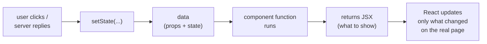
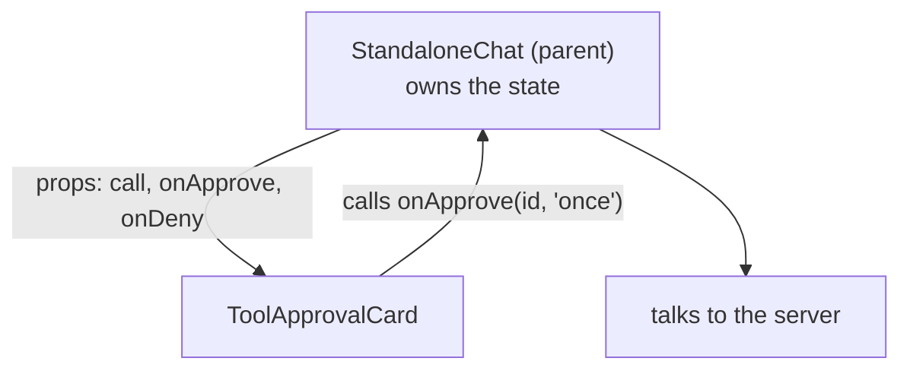
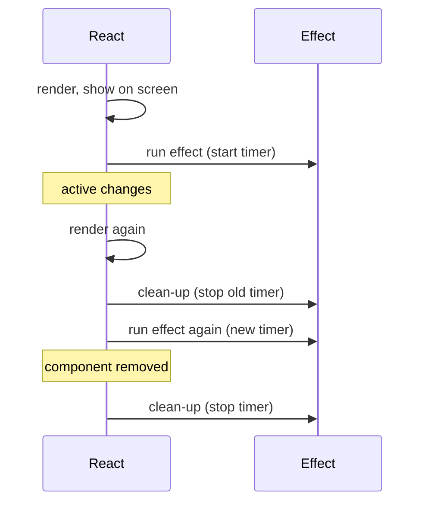
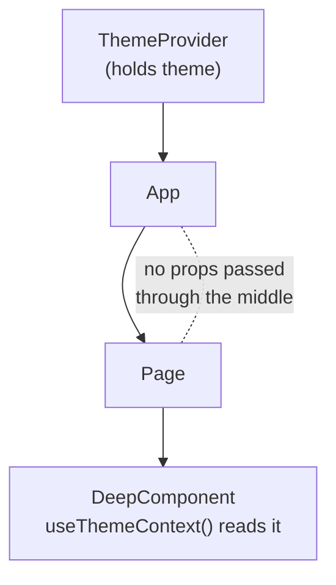
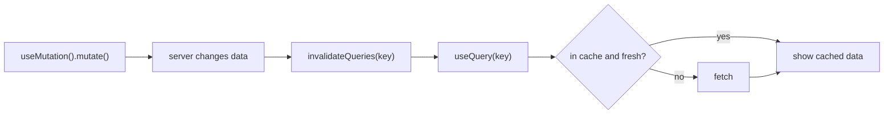
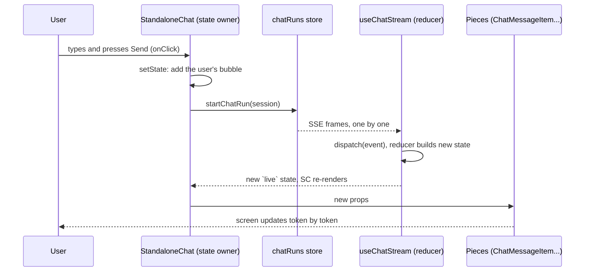

# Part 8 — React, Read Through This Frontend

> For a beginner. Read [Part 7 (TypeScript)](07_TypeScript_Syntax.md) first if
> JavaScript is new. This part builds React up one idea at a time, using real
> components from `better-n8n-frontend/src/`. The app uses React 19,
> React Router 7, TanStack React Query, Zustand and Tailwind CSS.
> Back to the [index](README.md).

---

## R-Start. What React is, in plain words

A web page is a tree of boxes (HTML elements). Changing it by hand gets messy
fast. **React lets you describe what the page should look like for the current
data, and it updates the real page for you when the data changes.**

Three ideas carry everything:

1. **Component**: a function that returns what to show. `ChatHeader`,
   `ToolApprovalCard` and `ThinkingTimer` are components.
2. **Props**: inputs a parent hands to a child, like function arguments.
3. **State**: data a component remembers between renders. **When state
   changes, React calls the component again and updates the screen.**



That loop is the whole mental model: **data → render → screen → event →
new data → render again.** You never edit the page directly; you change the
data.

### Words you'll see (glossary)

| Word | Plain meaning |
|---|---|
| **component** | a function that returns JSX |
| **JSX** | HTML-like syntax inside JavaScript: `<div>Hi</div>` |
| **render** | React calling your component to see what it should show now |
| **re-render** | calling it again because props or state changed |
| **props** | inputs from the parent |
| **state** | memory inside a component that triggers a re-render when changed |
| **hook** | a function starting with `use` that gives a component a power (state, effects…) |
| **effect** | code that talks to the outside world (timers, network, subscriptions) |
| **mount / unmount** | the component appears on / disappears from the page |
| **context** | a way to share a value with many components without passing props down |
| **route** | a URL path mapped to a page component |

---

## R1. Your first component, from this codebase

[`components/chat/ThinkingTimer.tsx`](../better-n8n-frontend/src/components/chat/ThinkingTimer.tsx)
(the "(3.4s)" counter while the assistant thinks), slightly trimmed:

```tsx
import { useEffect, useState } from 'react';

export default function ThinkingTimer({ active }: { active: boolean }) {
  const [seconds, setSeconds] = useState(0);            // state: starts at 0

  useEffect(() => {                                     // side effect: a timer
    if (!active) return;
    const id = setInterval(() => setSeconds((s) => s + 0.1), 100);
    return () => clearInterval(id);                     // clean-up: stop the timer
  }, [active]);                                         // re-run when `active` changes

  if (!active) return null;                             // show nothing
  return <span>({seconds.toFixed(1)}s)</span>;          // show "(3.4s)"
}
```

Line by line:

| Line | Plain words |
|---|---|
| `function ThinkingTimer({ active })` | a component; it receives props and pulls out `active` |
| `: { active: boolean }` | TypeScript: the props object has a boolean `active` |
| `useState(0)` | "remember a number, starting at 0"; gives back the value and a setter |
| `useEffect(() => {...}, [active])` | "after showing, start a timer; redo it when `active` changes" |
| `return () => clearInterval(id)` | "when done, stop the timer" (otherwise it leaks) |
| `return null` | render nothing |
| `<span>...</span>` | JSX: what to show |
| `{seconds.toFixed(1)}` | curly braces put a JavaScript value into the JSX |

Using it from a parent is like writing an HTML tag:

```tsx
<ThinkingTimer active={isStreaming} />
```

---

## R2. JSX rules

JSX looks like HTML, with a few differences:

```tsx
<div className="flex gap-3">              {/* class → className */}
  <h3>{call.title}</h3>                   {/* {} = any JavaScript expression */}
                  {/* tags with no children must self-close */}
  <button onClick={() => onDeny(call.id)} disabled={busy}>Deny</button>
</div>
```

| Rule | Example |
|---|---|
| `className`, not `class` | `<div className="p-4">` |
| `{ }` inserts a value | `<p>{count} runs</p>` |
| comments go in `{/* */}` | `{/* why this card leads with the action */}` |
| one outer element per return | wrap in `<div>` or a fragment `<>...</>` |
| events are camelCase and take functions | `onClick={handleClick}`, not `onclick="..."` |
| `style` takes an object | `style={{ width: 120 }}` |

### Showing things conditionally

```tsx
{open && <Panel />}                                  // show Panel only if open
{isLoading ? <Spinner /> : <List items={items} />}   // either/or
if (!active) return null;                            // whole component shows nothing
```

**Trap:** `{count && <Badge />}` shows a literal `0` when `count` is 0. Use
`{count > 0 && <Badge />}`.

### Showing lists

```tsx
<ul>
  {tools.map((tool) => (
    <li key={tool.name}>{tool.name}</li>     // key: a stable, unique id per item
  ))}
</ul>
```

`key` tells React which item is which between renders. Use an id, never the
array index when items can be reordered or removed.

---

## R3. Props: passing data and callbacks down

[`components/chat/ToolApprovalCard.tsx`](../better-n8n-frontend/src/components/chat/ToolApprovalCard.tsx):

```tsx
interface ToolApprovalCardProps {
  call: PendingToolCall;                                        // data in
  onApprove: (callId: string, scope: ApprovalScope) => void;   // "tell me when approved"
  onDeny: (callId: string) => void;                            // "tell me when denied"
}

export default function ToolApprovalCard({ call, onApprove, onDeny }: ToolApprovalCardProps) {
  return (
    <div>
      ...
      <button onClick={() => onApprove(call.id, 'once')}>Approve</button>
      <button onClick={() => onDeny(call.id)}>Deny</button>
    </div>
  );
}
```



**Data flows down as props; events flow up as callbacks.** The card doesn't
know how approving works. It just reports the click. That's what makes it easy
to test (Part 3 §11.4.1).

**`children`** is a special prop: whatever you put between the tags.
[`components/chat/CollapsiblePanel.tsx`](../better-n8n-frontend/src/components/chat/CollapsiblePanel.tsx):

```tsx
interface CollapsiblePanelProps {
  open: boolean;
  children: ReactNode;          // "anything React can render"
}

<CollapsiblePanel open={showTrace}>
  <ToolTrace steps={steps} />    {/* this is `children` */}
</CollapsiblePanel>
```

Props are **read-only**. A component never changes its own props.

---

## R4. State with `useState`

```tsx
const [olderDays, setOlderDays] = useState('30');   // value, setter, initial value
setOlderDays('90');                                  // schedule a re-render with '90'
```

Three rules:

1. **Never change state directly.** `state.items.push(x)` does nothing visible.
   Make a new value:

   ```tsx
   setItems([...items, x]);                          // new array
   setAgent({ ...agent, name: 'New' });              // new object
   ```

2. **When the new value depends on the old, pass a function:**

   ```tsx
   setSeconds((s) => s + 0.1);    // always uses the latest value
   ```

3. **The new value shows on the next render**, not on the next line:

   ```tsx
   setCount(5);
   console.log(count);   // still the old value here
   ```

### Controlled inputs (forms)

```tsx
const [olderDays, setOlderDays] = useState('30');

<input
  value={olderDays}                                  // React owns what's shown
  onChange={(e) => setOlderDays(e.target.value)}     // each keystroke updates state
/>
```

---

## R5. Effects with `useEffect`

An **effect** is for talking to things outside React: timers, subscriptions,
WebSockets, the browser's title, analytics.

```tsx
useEffect(() => {
  // runs AFTER the component shows on screen
  const id = setInterval(tick, 100);
  return () => clearInterval(id);    // clean-up: before re-running, and on unmount
}, [active]);                        // dependency list: re-run when these change
```



| Dependency list | Runs |
|---|---|
| `[a, b]` | after first render, then whenever `a` or `b` changes |
| `[]` | once after the first render (and clean-up on unmount) |
| none | after **every** render (rarely what you want) |

**In development, React runs effects twice on purpose** (StrictMode), to prove
your clean-up works. That's why `useSocket` has a guard against a double
connection (Part 3 §11.3), and `useRecordOpen` uses a ref so a file open isn't
counted twice.

**You often don't need an effect.** Values you can compute from props/state
should just be computed during render:

```tsx
const visible = tools.filter((t) => !t.hidden);   // no effect, no extra state
```

---

## R6. `useRef`: memory that does NOT re-render

```tsx
const wsRef = useRef<WebSocket | null>(null);   // .current holds the value
wsRef.current = new WebSocket(url);             // changing it causes no re-render
```

Use a ref for things the screen doesn't show: a socket, a timer id, "did I
already do this?" flags, the previous value. From
[`hooks/useRecents.ts`](../better-n8n-frontend/src/hooks/useRecents.ts):

```tsx
const last = useRef<string | null>(null);
useEffect(() => {
  const key = `${app}:${docId}`;
  if (last.current === key) return;    // already recorded this open
  last.current = key;
  recentsService.recordOpen(docId, app);
}, [docId, app]);
```

| | `useState` | `useRef` |
|---|---|---|
| Survives re-renders | yes | yes |
| Changing it re-renders | **yes** | **no** |
| Use for | what's on screen | behind-the-scenes values |

A ref can also point at a real DOM element: `<input ref={inputRef} />`, then
`inputRef.current.focus()`.

---

## R7. `useMemo` and `useCallback`: skip repeated work

```tsx
const sorted = useMemo(() => sortRuns(runs), [runs]);            // recompute only when runs change
const handleSave = useCallback(() => save(doc), [doc]);          // same function object until doc changes
```

- `useMemo` remembers a **value**.
- `useCallback` remembers a **function**. That matters when you pass it to a
  child wrapped in `memo`, or put it in an effect's dependency list.

Don't sprinkle these everywhere. Use them when something is slow, or when a
changing function identity causes extra work.

`memo(Component)` makes a component skip re-rendering when its props didn't
change. This project wraps `MarkdownMessage` in `memo` because re-parsing
markdown is expensive.

---

## R8. `useReducer`: many related state changes in one place

When state has several fields that change together in response to events, a
reducer is clearer than many `useState`s.
[`hooks/useChatStream.ts`](../better-n8n-frontend/src/hooks/useChatStream.ts):

```tsx
function reducer(state: ChatStreamState, action: Action): ChatStreamState {
  switch (action.type) {
    case 'event':  return reduceEvent(state, action.event);
    case 'reset':  return EMPTY;
    ...
  }
}

const [live, dispatch] = useReducer(reducer, EMPTY);   // state + a "send an action" function
dispatch({ type: 'reset' });
```

In plain words: **`dispatch` sends a message describing what happened; the
reducer decides the new state.** The reducer is a plain function, so it's easy
to test.

---

## R9. Custom hooks: package state + effects for reuse

Any function whose name starts with `use` and calls other hooks is a custom
hook. It's how this app shares logic: `useSocket`, `useChatStream`,
`useRecentFiles`, `usePersistedState`...

```tsx
export function useRecordOpen(docId: number | null, app: string) {
  const qc = useQueryClient();
  const last = useRef<string | null>(null);
  useEffect(() => { ... }, [docId, app, qc]);
}

// in a component:
useRecordOpen(doc.id, 'docs');
```

### The rules of hooks

1. Call hooks only **at the top level** of a component or custom hook, never
   inside `if`, loops, or nested functions. React tracks hooks by their order.
2. Call hooks only from components or other hooks.

```tsx
// WRONG
if (open) { const [x, setX] = useState(0); }

// RIGHT
const [x, setX] = useState(0);
if (open) { ... use x ... }
```

ESLint (`react-hooks` rules) catches these; this project keeps lint at zero.

---

## R10. Context: share a value without passing it down



Three pieces, from [`contexts/themeState.ts`](../better-n8n-frontend/src/contexts/themeState.ts)
and `ThemeContext.tsx`:

```tsx
// 1. create it
export const ThemeContext = createContext<ThemeContextType | undefined>(undefined);

// 2. provide it near the top of the app
<ThemeContext.Provider value={{ theme, setTheme, ... }}>
  {children}
</ThemeContext.Provider>

// 3. read it anywhere below
export function useThemeContext() {
  const context = useContext(ThemeContext);
  if (context === undefined) throw new Error('useThemeContext must be used within a ThemeProvider');
  return context;
}
```

Used here for auth, theme and a few app-wide things. **Not** for server data
(that's React Query) and not for things that change very often, because every
reader re-renders when the value changes.

---

## R11. Pages and URLs: React Router

[`App.tsx`](../better-n8n-frontend/src/App.tsx), simplified:

```tsx
<Router>
  <Suspense fallback={<AppLoader />}>          {/* shown while a page's code downloads */}
    <Routes>
      <Route path="/login" element={<Login />} />
      <Route path="/a/:slug" element={<PublicAgent />} />     {/* :slug = a URL parameter */}
      ...
    </Routes>
  </Suspense>
</Router>
```

Inside a page:

```tsx
import { useNavigate, useParams, Link, Navigate } from 'react-router-dom';

const { id } = useParams<{ id: string }>();    // /agents/42 → id = "42" (always a string)
const navigate = useNavigate();
navigate('/agents');                           // go somewhere in code
<Link to="/runs">Runs</Link>                   // a link without a full page reload
if (isAuthenticated) return <Navigate to="/ai-chat" replace />;   // redirect while rendering
```

`<Outlet />` in a layout component is "render the matching child route here".
The main layout draws the top bar and sidebar once, and the page appears in
the outlet.

**Lazy pages:** `const AIChat = lazyPage(() => import('./pages/AIChat'));`
downloads a page's code only when someone visits it. `<Suspense>` shows the
fallback meanwhile.

---

## R12. Server data: React Query

Fetching in `useEffect` by hand means writing loading flags, error flags,
caching and refetching yourself. React Query does all of it.

### Reading: `useQuery`

[`hooks/useRecents.ts`](../better-n8n-frontend/src/hooks/useRecents.ts):

```tsx
export function useRecentFiles(opts = {}) {
  const { app, types, limit } = opts;
  return useQuery({
    queryKey: ['recents', 'list', app ?? '', types?.join(',') ?? '', limit ?? 0],  // cache label
    queryFn: () => recentsService.list({ app, types, limit }),                     // how to fetch
    staleTime: 30_000,                                                             // fresh for 30 s
  });
}

// in a component
const { data, isLoading, error } = useRecentFiles({ app: 'docs' });
if (isLoading) return <Spinner />;
if (error) return <p>Could not load.</p>;
return <List items={data} />;
```

### Writing: `useMutation`

[`components/activity/HistoryList.tsx`](../better-n8n-frontend/src/components/activity/HistoryList.tsx):

```tsx
const deleteOne = useMutation({
  mutationFn: (run: ExecutionLog) => logsService.deleteExecution(run.execution_id),
  onSuccess: () => {
    toast.success('Run deleted. Cost records were kept.');
    refresh();                                     // reload the list
  },
  onError: (err) => toast.error(errorText(err, 'Could not delete that run.')),
});

// later in the same file, the confirm dialog runs it:
<ConfirmDialog
  busy={deleteOne.isPending}                 // true while the request is in flight
  onConfirm={() => deleteOne.mutate(deleting)}
/>
```



---

## R13. Styling: Tailwind classes

The long `className` strings are **Tailwind CSS**: each word is one small style.

```tsx
<div className="flex gap-3 md:gap-6 rounded-lg border border-border p-6 shadow-sm">
```

| Class | Means |
|---|---|
| `flex`, `flex-col`, `items-center`, `justify-between` | flexbox layout |
| `gap-3`, `p-6`, `px-4`, `mt-2` | spacing (gap, padding, margin; 1 unit = 4 px) |
| `w-10`, `h-10`, `max-w-[85%]` | sizes; `[...]` is a custom value |
| `text-lg`, `font-semibold`, `text-muted-foreground` | text size, weight, colour |
| `bg-card`, `border-border`, `rounded-lg` | background, border, corners |
| `md:gap-6` | apply only on medium screens and up (responsive) |
| `hover:bg-accent`, `dark:...` | on hover / in dark mode |
| `animate-in fade-in` | entry animation (from `tailwindcss-animate`) |

Colours like `bg-background` and `text-foreground` are **theme tokens**, so
light and dark mode switch in one place.

---

## R14. Putting it together: how one chat message flows through React



---

## R15. A decoder exercise

Real code from [`components/chat/CollapsiblePanel.tsx`](../better-n8n-frontend/src/components/chat/CollapsiblePanel.tsx):

```tsx
export function CollapsiblePanel({ open, children }: CollapsiblePanelProps) {
  const [closing, setClosing] = useState(false);
  const [wasOpen, setWasOpen] = useState(open);

  if (open !== wasOpen) {          // the prop just changed
    setWasOpen(open);
    setClosing(wasOpen);           // it was open and is now closing
  }

  useEffect(() => {
    if (!closing) return;
    const timer = window.setTimeout(() => setClosing(false), 150);
    return () => window.clearTimeout(timer);
  }, [closing]);

  if (!open && !closing) return null;
  return <div className={open ? undefined : 'animate-out fade-out ...'}>{children}</div>;
}
```

In plain words: "When `open` flips to false, keep showing the children for
150 ms with a fade-out class, then show nothing. That gives the panel time to
animate closed instead of vanishing." Adjusting state during render when a
prop changes (the `if (open !== wasOpen)` block) is an official React pattern.
It avoids an extra effect.

---

## R16. Cheat sheet

| You see | It means |
|---|---|
| `function X(props) { return <div/> }` | a component |
| `<X a={1} onDone={fn} />` | use it with props |
| `{ value }` inside JSX | insert a JavaScript value |
| `{cond && <A/>}` / `{c ? <A/> : <B/>}` | conditional rendering |
| `items.map(i => <Row key={i.id} />)` | a list; `key` required |
| `const [v, setV] = useState(init)` | state |
| `setV(old => old + 1)` | update from the previous value |
| `useEffect(fn, [deps])` + returned clean-up | side effects |
| `useRef(x).current` | memory without re-render |
| `useMemo` / `useCallback` / `memo` | skip repeated work |
| `useReducer(reducer, init)` + `dispatch` | event-driven state |
| `useSomething()` | a custom hook |
| `createContext` / `Provider` / `useContext` | share a value down the tree |
| `<Route path="/x/:id" element={<P/>} />`, `useParams` | pages and URL parameters |
| `useNavigate`, `<Link>`, `<Navigate>`, `<Outlet>` | moving between pages |
| `lazy(() => import(...))` + `<Suspense>` | load a page's code when needed |
| `useQuery({ queryKey, queryFn })` | read server data with caching |
| `useMutation({ mutationFn, onSuccess })` | change server data |
| `className="flex p-4 md:p-6"` | Tailwind styles |
