# Part 9 — Design Patterns, Explained for AI Engineers

> **Who this is for:** you know the basics of AI engineering and data science
> (models, training, embeddings, RAG, evaluation) and basic computer science
> (data structures, complexity, what a database and an API are). You don't
> yet know "software design patterns".
>
> **The good news:** you have already *used* most of them. PyTorch,
> scikit-learn, Keras, Hugging Face and pandas are built out of these patterns.
> This guide starts from what you know and walks across to how AIAAS uses the
> same ideas. Back to the [index](README.md).

---

## 0. The big idea in one paragraph

A **design pattern** is a named, reusable answer to a problem that keeps
coming up when you organise code. It isn't a library. It's a *shape*. When
scikit-learn gives every model the same `fit()` / `predict()` methods so you
can swap `RandomForest` for `LogisticRegression` in one line, that's a pattern
(Strategy + Template Method). Knowing the names lets you (1) recognise the
shape in new code quickly, and (2) explain your design choices in an interview
in words the interviewer already knows.

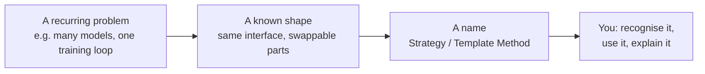

---

## 1. AIAAS in AI-engineering terms

Before the patterns, here's the system described in words you already know.

| AI concept you know | What it is in AIAAS | Where |
|---|---|---|
| **ReAct loop** (reason → act → observe) | The agent graph: `agent → tools → curate → steering → agent` | `chat/turn/agent.py` |
| **Function / tool calling** | 156 built-in tools, each declared once with a JSON schema | `chat/tools/` |
| **Context window** | A budget; old tool results are summarised or archived at 70% full | `chat/turn/curation.py`, `llm/budget.py` |
| **RAG** | Knowledge bases with vector (FAISS HNSW), keyword, raw, and hybrid backends | `inference/` |
| **Embeddings** | NVIDIA `nemotron-3-embed-1b` via API, 2048-dim, L2-normalised | `inference/engine.py` |
| **Hybrid search** | Vector + keyword results merged with reciprocal-rank fusion (RRF) | `inference/backends/` |
| **Structured output** | Named output "contracts" validated and repaired after generation | `agents/contracts.py` |
| **Multi-agent systems** | An orchestrator delegates to worker agents, depth ≤ 2, ≤ 8 in parallel | `agents/agent/orchestrator.py` |
| **Human-in-the-loop** | Risky tool calls pause for approval; the run resumes from a checkpoint | `agents/agent/hitl.py` |
| **Evaluation** | Graders + LLM-as-judge + human review; agreement between judge and humans is measured | `eval/` |
| **Guardrails** | Input sanitiser, content policy, taint tracking for prompt injection, approval gates | `core/safety/`, `chat/tools/permissions.py` |
| **Model serving / routing** | Five providers behind one interface; OpenRouter's free router is the default | `llm/` |
| **Checkpointing** | Agent state saved after each step, so runs survive restarts | `chat/turn/checkpoints.py` |
| **Cost tracking** | Tokens → rupees, per run; a spend cap stops runaway agents | `agents/spend.py` |

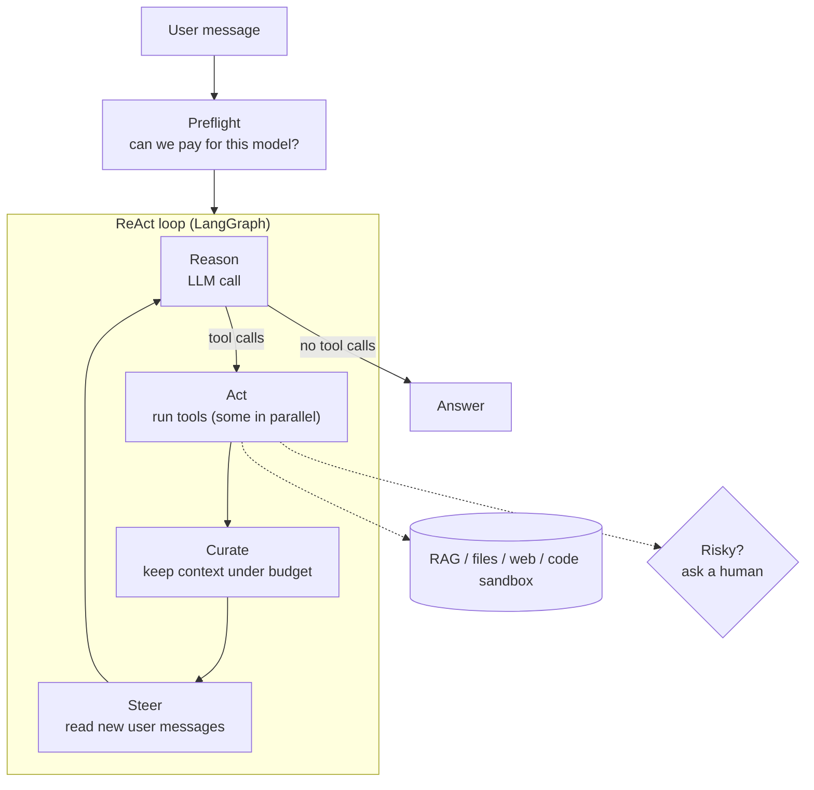

---

## 2. The bridge table: patterns you've already used

| Pattern | You've seen it in… | In AIAAS | One-line purpose |
|---|---|---|---|
| **Strategy** | `sklearn` estimators; choosing `Adam` vs `SGD` | Approval policies; sandbox engines; checkpoint backends | Swap the algorithm, keep the caller |
| **Template Method** | `nn.Module.forward`; Keras `train_step`; `BaseEstimator` | `OpenAICompatibleLLMNode` (providers override small hooks) | Fixed recipe, customisable steps |
| **Registry** | HF `AutoModel.from_pretrained("bert-base")`, `timm.create_model`, `gym.register` | `@tool`, `@grader`, output contracts, providers | Look up an implementation by name |
| **Factory** | Hydra `instantiate(cfg)`; `get_optimizer("adam")` | `checkpoints.build()`, `vfs.build_scope()` | Build the right object from config |
| **Observer / callbacks** | Keras callbacks; Lightning hooks; W&B logging | `EventSink`, `on_tool_result`, `on_model_turn` | React to events without coupling |
| **Pipeline / chain** | `sklearn.Pipeline`; `torchvision.transforms.Compose` | Middleware; the dispatch checks | Each step transforms or rejects |
| **Adapter** | HF tokenizers; LiteLLM; LangChain chat wrappers | Provider payload hooks (effort spelled 3 ways) | Make different APIs look the same |
| **Facade** | `trainer.fit()`; `pd.read_csv()` | `arun_code()`, `llm/access.py`, `eval/api.py` | One simple door to a complex subsystem |
| **Decorator** | `@torch.no_grad()`, `@functools.lru_cache`, `@retry` | `@tool(...)`, `@api_view`, `@transaction.atomic` | Add behaviour or register without editing the function |
| **Singleton** | `logging.getLogger("x")`; one loaded model per process | `ProviderRegistry`, `CredentialManager` | Exactly one shared instance |
| **Producer–consumer** | `DataLoader` workers feeding a queue | Steering mailbox (bounded deque) | Decouple who makes work from who does it |
| **State machine** | A training job: queued → running → finished/failed | Agent run / approval / schedule status | Only allowed transitions happen |
| **Snapshot / versioning** | Model checkpoints; MLflow registry; DVC | `SubAgentRevision`, `DocumentVersion` | Reproduce exactly what ran |
| **Ledger** | Experiment tracking: metrics appended, never edited | `CostEntry`, `AgentTurn`, `AgentStep` | Append-only facts; totals are sums |
| **Cache** | `joblib.Memory`; HF model cache | Redis → DB → live tool catalogue; LRU session pool | Don't redo expensive work |
| **Specification / schema** | Pydantic models; JSON Schema for LLM output | `Contract` + `coerce()` | Validate the shape of an output |
| **Null object** | `wandb` disabled mode; a no-op logger | `null_sink` | A do-nothing stand-in, so no `if x is None` everywhere |

The sections below take the most important ones one at a time: first the ML
example you know, then the AIAAS version.

---

## 3. Strategy: swap the algorithm, keep the caller

### In ML

```python
from sklearn.ensemble import RandomForestClassifier
from sklearn.linear_model import LogisticRegression

model = RandomForestClassifier() if big_data else LogisticRegression()
model.fit(X, y)                # the caller doesn't care which one it got
preds = model.predict(X_test)
```

### In AIAAS

Deciding "should this tool call pause for human approval?" has several
algorithms, picked by the agent's autonomy setting:

```python
def approval_policy_for(autonomy: str):
    if autonomy in ('full', 'plan'):
        return permissions.never              # never pause
    if autonomy == 'auto':
        return permissions.default_policy     # pause only for credentialed writes
    return permissions.unattended_policy      # pause for every credentialed call

policy = approval_policy_for(agent.autonomy)
must_pause = await policy(tool_name, args, context)   # same call, whichever policy
```

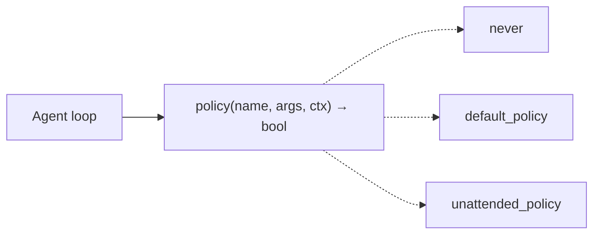

**Why it matters:** adding a new autonomy level means adding one function, not
editing the loop. Same reason you can add a new model to a scikit-learn
grid search without touching `GridSearchCV`.

---

## 4. Template Method: a fixed recipe with blanks

### In ML

```python
class MyNet(torch.nn.Module):
    def forward(self, x):          # you fill in this blank
        return self.layer(x)

# PyTorch owns the recipe: __call__ runs hooks, then your forward(), then more hooks.
```

Keras is the same: `fit()` is the fixed recipe (epochs, batches, callbacks),
and you override `train_step()` to change one step.

### In AIAAS

Four LLM providers (OpenAI, OpenRouter, NVIDIA, OpenCode Zen) speak the same
"chat completions" protocol. The base class owns the whole recipe: find the
API key, build the request, send it, stream the reply, parse tokens, count
usage, retry on network errors. Each provider fills in only what differs:

```python
class OpenAICompatibleLLMNode(BaseNodeHandler):
    base_url = ""                                  # blank
    def reasoning_payload(self, effort): ...       # overridable step
    async def execute(self, ...): ...              # the fixed recipe

class OpenAINode(OpenAICompatibleLLMNode):
    node_type = "openai"
    base_url = "https://api.openai.com/v1"         # that's almost all it needs
```

**Why it matters:** adding a provider is ~15 lines, and a bug fixed in the
recipe is fixed for all of them.

---

## 5. Registry: find the implementation by its name

### In ML

```python
from transformers import AutoModel
model = AutoModel.from_pretrained("bert-base-uncased")   # a name → the right class

import timm
net = timm.create_model("resnet50")                      # same idea
```

Behind that is a dictionary from names to classes, filled when each model
class registers itself.

### In AIAAS

Every tool the LLM can call registers itself with the JSON schema the model
sees:

```python
@tool(WEB_SEARCH_SCHEMA, parallel=True, effect="read")
async def web_search(args, context) -> str:
    ...
```

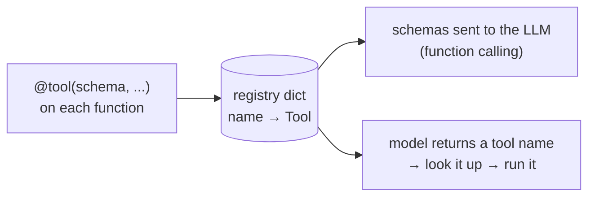

The LLM's function-calling output is literally a name plus JSON arguments, so
a **name → function registry is the natural shape**. Because the advertised
schema and the dispatched function are the same object, they can't drift
apart: a tool the model is told about is always a tool that can run.

The same pattern holds **graders** for evaluation (`@grader("regex")`) and
**output contracts** (`"research"`, `"files"`, `"findings"`...).

---

## 6. Observer / callbacks: react without being wired in

### In ML

```python
model.fit(X, y, callbacks=[EarlyStopping(), ModelCheckpoint("best.h5"), WandbCallback()])
```

The training loop doesn't know what W&B is. It just calls "on_epoch_end" on
whatever was passed in.

### In AIAAS

The agent loop calls two hooks: `on_model_turn` after each LLM call and
`on_tool_result` after each tool call. For agent runs they write database rows
(the run's trace). For chat they're `None`. The loop doesn't import the
logging code.

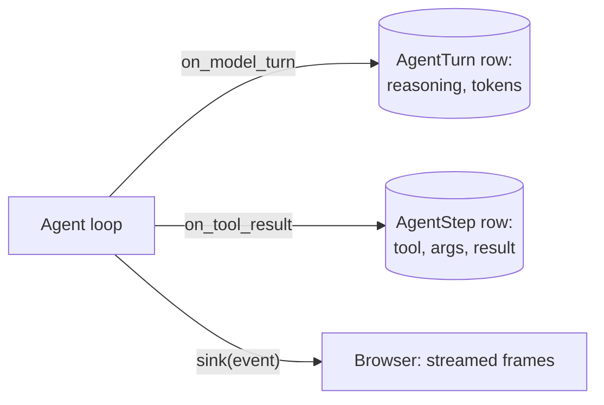

**The rule both worlds share:** a callback must never crash the thing it
observes. A failed W&B upload shouldn't kill training; a failed UI update
shouldn't kill an agent run. AIAAS wraps them in `try/except` and logs.

---

## 7. Pipeline / Chain of Responsibility: a gauntlet of steps

### In ML

```python
Pipeline([("impute", SimpleImputer()), ("scale", StandardScaler()), ("clf", SVC())])
```

Each step passes its output to the next.

### In AIAAS

A **chain of responsibility** is a pipeline where any step may *stop* the flow.
Before a tool runs, the call walks a line of checks. Each one either refuses
(with a reason the LLM can read) or passes it on:


**Why refusals are text, not exceptions:** the "caller" is an LLM. If it only
sees "denied", it tries again with different arguments until it runs out of
iterations. If it sees *why* ("per-tool permission is 'deny'"), it stops and
takes another path. **Design your error messages for the model that reads
them.**

---

## 8. Adapter: make different APIs look the same

### In ML

Every Hugging Face tokenizer has `tokenizer(text)`, whether the model uses
WordPiece, BPE or SentencePiece underneath. LiteLLM does the same for LLM APIs.

### In AIAAS

Every reasoning model accepts "how hard should you think", but each API spells
it differently. AIAAS has one vocabulary (`none | minimal | low | medium | high`)
and each provider adapts it:

| Provider | What goes on the wire for "high" |
|---|---|
| OpenAI / NVIDIA | `"reasoning_effort": "high"` |
| OpenRouter | `"reasoning": {"effort": "high"}` |
| Ollama | `"think": ...` |

One more detail an AI engineer will appreciate: a model with **no** effort
control is sent **nothing**, because OpenAI answers an unexpected field with a
400 error rather than ignoring it. The adapter knows that; callers don't have
to.

---

## 9. Facade: one door to a complex subsystem

### In ML

`trainer.fit(model, datamodule)` hides devices, mixed precision, gradient
accumulation, logging and checkpointing.

### In AIAAS

`arun_code(code)` hides where Python actually runs: a locked-down container
with no network in production, or a weaker in-process sandbox in development.
`llm/access.py` hides credentials, fallback keys, context-window clamping,
effort snapping and streaming.

**The safety angle:** if every model call goes through one function, then
"check the user can pay for this model" is written once and can't be
forgotten. AIAAS calls this **"one door"**.

---

## 10. Producer–consumer: a queue between two sides

### In ML

A PyTorch `DataLoader` with `num_workers=4`: worker processes *produce*
batches into a queue; the training loop *consumes* them. Neither waits for the
other more than it has to.

### In AIAAS

While an agent works, the user can keep typing ("also check pricing"). Those
messages are **produced** into a small queue (max 8). The agent loop
**consumes** them at one safe point per iteration: after tool results arrive,
before the model reads them.

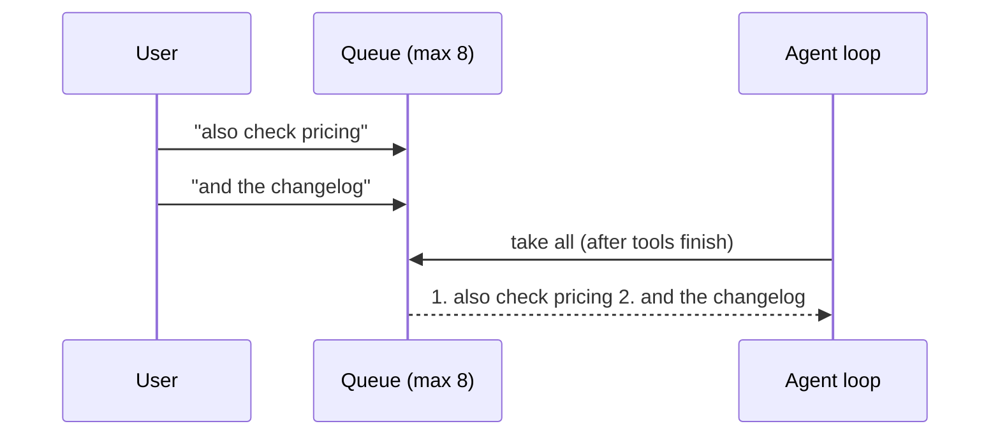

Design choices worth knowing:
- **Bounded:** an unbounded queue is a memory leak waiting to happen.
- **When full, drop the oldest:** the user is waiting on their newest message.
- **Messages are merged into one** before the model sees them, because the
  graph expects exactly one new user message per step.

---

## 11. State machine: only legal transitions

### In ML

A training job on a cluster: `queued → running → (succeeded | failed |
cancelled)`. You can't go from `succeeded` back to `running`.

### In AIAAS

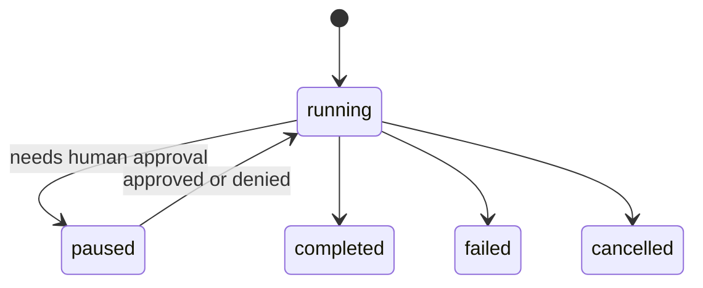

How the transitions stay legal when two things act at once (say, the Inbox
and a live WebSocket both answer the same approval): the database update
includes the expected *current* state:

```sql
UPDATE approval SET status='approved' WHERE id=7 AND status='pending';
-- 1 row changed: you won. 0 rows: someone already answered.
```

---

## 12. Snapshot / versioning: reproducibility

### In ML

You save the model checkpoint **and** the config and data version it was
trained with, so a result can be reproduced months later.

### In AIAAS

- Every agent run points at a **frozen copy of the agent's configuration**
  (`SubAgentRevision`) taken when the run started. Editing the agent mid-run
  doesn't rewrite what the run claims it used.
- The vector index records **which embedding model built it**
  (`EMBEDDER_VERSION = "<model>:<dim>"`). If the model changes, indexes built
  with the old one are rebuilt. Vectors from two different embedding models
  aren't comparable, the same way you can't compare features from two
  differently fitted scalers.

---

## 13. Specification: validate the model's output

### In ML / LLM engineering

You ask an LLM for JSON and validate it with Pydantic. If it fails, you retry
or repair.

### In AIAAS

An agent can be configured to return a named **contract** (for example
`research` = summary + findings + sources). After the model answers:

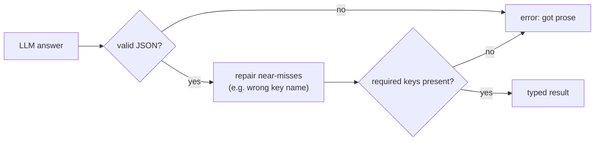

**The important decision:** a wrong-shaped answer is an **error**, not
silently wrapped as `{"text": answer}`. Silent wrapping would make every agent
look like it "passed". That's the same reason you don't let a classifier
silently return a default label on bad input.

---

## 14. Patterns that are specific to AI systems

These don't have classic "Gang of Four" names, but interviewers for AI roles
ask about them.

### 14.1 Context-window management (a memory hierarchy)

Like a CPU's cache → RAM → disk, AIAAS keeps the transcript in tiers:

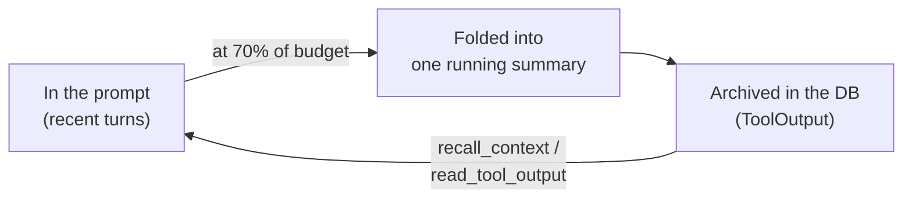

- It triggers at a **high watermark (70%)** and cuts to **45%**, rather than
  trimming a little every turn. Constantly changing the prompt's beginning
  would defeat provider **prompt caching**.
- An assistant message and the tool results answering it are **one unit**. If
  you drop one without the other, providers reject the request (a tool result
  pointing at a call that no longer exists).
- Anything removed is still **retrievable by id**, and the model is told how.
- **Chat now curates too** (2026-09-28), with a cheaper policy: compaction and
  archiving, but no paid summarising call. As the orchestrator, one chat turn
  can run many tool iterations.
- **Stable things go in the system prompt; changing things go in a per-turn
  note.** The system prompt is the part providers cache, so it holds only what
  doesn't change during a session. The per-turn note, a trailing system
  message, carries the clock, the chat's current mode ("PLAN: you can only read
  this turn…") and how many old messages were left out for length. Before the
  mode note, the model planned to delegate in `plan` mode, where delegation is
  switched off.
- **Earlier chat turns come from one source.** They come from the database
  only; the checkpoint holds just the current turn. A bug once sent them twice
  (see Part 4, story 4). In ML terms, it's like feeding a sequence model the
  same context window twice, once raw and once summarised: you pay for it, and
  it confuses the model.

### 14.2 LLM-as-judge, with the judge itself measured

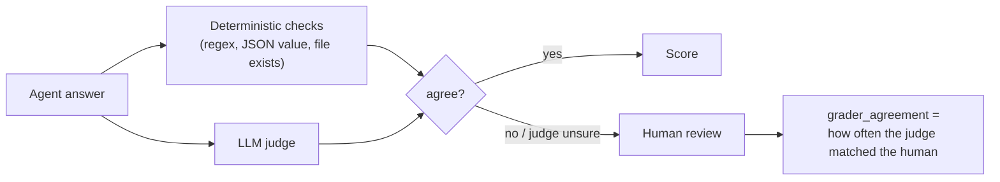

- The judge is a **different model** from the one being tested, so it isn't
  grading its own mistakes.
- Humans only review the **disagreements**, so review cost doesn't grow with
  the test suite.
- The automatic verdict is **kept** even when a human overrides it. Otherwise
  you couldn't compute how often the judge was right.
- Harder "work" cases are run **3 times** and report **pass@1 and pass^k**. A
  case that passes twice in three runs isn't a reliable feature.

### 14.3 Offline evaluation with simulated environments

An agent that sends email can't be tested against your real inbox. AIAAS builds
a fake "world" per test suite (mailbox, calendar, drive, a frozen web), and
simulators return results **in exactly the real tools' shapes**. This is the
agent version of testing a model on a held-out set instead of in production.

### 14.4 Guardrails in layers (defence in depth)

| Layer | Stops | Analogy |
|---|---|---|
| Input sanitiser | Direct prompt injection in the user's message | input validation |
| Content policy | A small set of illegal content categories | a hard filter |
| **Taint tracking** | *Indirect* injection: instructions hidden in a web page or email the agent read | tracking data provenance |
| Tool grants + scopes | An agent reaching tools / files / connections it wasn't given | least privilege |
| Approval gates | Irreversible actions without a human's OK | human-in-the-loop |
| Egress checks | Leaking data by composing URLs with secrets in them | data-loss prevention |

The **"lethal trifecta"** (private data + untrusted content + a way to send
data out) is the combination these layers are arranged to break.

### 14.5 Hybrid retrieval with rank fusion

Vector search is good for meaning; keyword search is good for exact IDs and
names. The `hybrid` backend runs both and merges them with **reciprocal-rank
fusion**: each document scores `Σ 1 / (k + rank)` across the lists. RRF uses
**ranks, not raw scores**, so cosine similarities and BM25-style scores (which
live on different scales) don't need calibrating against each other.

### 14.6 Cost and blast-radius control

Tokens are converted to money with one blended rate and **rounded up** (no run
is free), and a per-agent monthly **spend cap** is checked before each run. The
cap is a safety limit, not billing, so an approximate rate is fine; what
matters is that the number shown and the number enforced are the same number.

### 14.7 Organisational memory: a retrieval system that can say "I don't know" (added 2026-09-28)

`solutions/` saves problems people solved and finds them again for the next
person in the same organisation. To an AI engineer, it's a small retrieval
system with four ideas worth knowing.

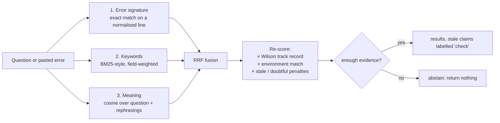

**1. Three retrievers, fused by rank.** A pasted traceback usually matches an
exact *error signature*, and when it does, the embedding call is skipped
entirely. Keywords catch exact names and IDs. Vectors catch paraphrases (each
solution stores extra "how else might this be asked" phrasings, one vector
each). The lists are merged with reciprocal-rank fusion, the same as the hybrid
knowledge-base search (§14.5).

**2. Track record, scored like a click-through rate.** Each solution counts
how often people confirmed it worked vs reported it failed. Ranking by the raw
ratio would put a fix that worked once (1/1 = 100%) above one that worked
nine times out of ten. So it uses the **Wilson score lower bound**, the same
fix used for ranking by user ratings:

```python
def wilson(positive, total, z=1.96):
    phat = positive / total
    return (phat + z*z/(2*total) - z*sqrt((phat*(1-phat) + z*z/(4*total))/total)) / (1 + z*z/total)
```

It asks "how good could this be, at worst, given how little evidence we
have?", so a single success scores about 0.21 while 9 of 10 scores about 0.60.

**3. It abstains.** A result is returned only with real evidence: a signature
hit, a close meaning match, or most of the query's weight matched. Otherwise
the answer is "nothing found". **A wrong fix shown with a colleague's name on
it is worse than no fix**, the same reasoning as a classifier with a reject
option. The thresholds are stated in the code as first guesses, to be tuned
on an offline set.

**4. Facts go stale at different speeds.** Each claim in a fix has a kind
(`principle` never expires; `config` 90 days; `time_sensitive` 30 days...).
Staleness is **computed at read time**, and a stale claim is shown marked
"check", not hidden. The prompt rule then obliges the model to re-verify it or
tell the user it may have changed. This is the retrieval version of data
drift: a model trained on last year's prices needs a freshness check, and so
does a stored fix.

**Guardrails carried over:**
- **Capture is triggered by the human** (a thumbs-up, or "that worked" in their
  next message, matched by a regex at no model cost), never by the model
  grading itself.
- **Memory poisoning** is blocked: an exchange that read instruction-shaped
  third-party text is never captured, and saving is refused in a tainted turn.
  One poisoned web page must not become an org-wide "fact".
- **Org isolation** comes from one read function (Part 2 §8.9), and the org
  comes from the chat, never from a tool argument the model could set.
- **Doubt is recorded with the model that raised it.** A later, better model
  can clear the flag or confirm it.

**Interview line:** "It's a hybrid retriever with a reject option: signature,
keyword and vector results fused by rank, re-scored by a Wilson lower bound on
track record, and it returns nothing when the evidence is thin. A wrong fix
with a colleague's name on it is worse than no answer."

---

## 15. The computer science underneath

| CS idea | Where it shows up | Why this one |
|---|---|---|
| **Hash map** | Tool / grader / provider registries | O(1) lookup by name |
| **Deque (double-ended queue)** | Steering mailbox | O(1) add at one end, drop at the other |
| **Ordered dict / LRU** | Connector session pool | Evict the least recently used when full |
| **Tree with materialised path** | Folders (`/12/45/`) | Subtree = one prefix query; "is A inside B?" = string prefix test |
| **Inverted index** | Keyword knowledge-base backend | Term → documents, like a book's index |
| **HNSW graph** | FAISS vector index | Approximate nearest neighbours in ~log time |
| **Exponential backoff** | WebSocket reconnects, retries | `min(base × 2^attempt, cap)` spreads load after failures |
| **Compare-and-swap** | `UPDATE ... WHERE value = what_I_read` | Lock-free race handling |
| **Leases** | One scheduler among many processes | Leader election with automatic expiry |
| **Finite state machine** | Run, approval, schedule status | Only legal transitions |
| **Reducer / fold** | Frontend chat stream | Screen state = fold over events (like `functools.reduce`) |
| **Bounded buffers** | Queues, caches, output caps | Memory can't grow without limit |
| **Wilson score interval** | Ranking solutions by track record | A lower confidence bound, so 1 of 1 doesn't beat 9 of 10 |
| **Round-robin under a budget** | Picking memory facts for the prompt | Every category gets a turn; priority order breaks ties |

---

## 16. How to talk about this as an AI engineer

When an interviewer asks "what design patterns did you use?", don't list
names. Tie each one to an AI problem:

> "Tool calling is name-plus-JSON, so every tool registers itself with its
> schema. The schema the model sees and the function that runs are the same
> object, so they can't drift. That's a registry."

> "Different LLM providers disagree on how to spell 'reasoning effort'. I kept
> one vocabulary and put the spelling in an adapter per provider. A model with
> no effort control gets nothing, because OpenAI 400s on unknown fields."

> "The judge in my evals is itself evaluated: I keep its original verdict when
> a human overrides it, so I can report judge–human agreement."

> "A tool refusal is returned as text with the real reason, because the caller
> is an LLM. If it only hears 'denied', it retries until the iteration cap."

---

## 17. Self-check exercises

1. You add a sixth LLM provider that also speaks the OpenAI protocol. Which
   pattern makes this small, and which class do you subclass?
   *(Template Method: subclass `OpenAICompatibleLLMNode`, set `node_type` and
   `base_url`.)*
2. Your team wants to log every tool call to an external tracing service. Where
   do you plug in without editing the agent loop? *(An observer:
   `on_tool_result` or an `EventSink`.)*
3. Why might a keyword search find an invoice "INV-2291" that vector search
   misses? What does the hybrid backend do about it? *(Embeddings smear exact
   tokens; hybrid runs both and fuses by rank.)*
4. The embedding model is upgraded from 1024 to 2048 dimensions. What must
   happen to existing indexes, and how does AIAAS notice? *(Rebuild them;
   `EMBEDDER_VERSION` no longer matches.)*
5. Two browser tabs approve the same tool call at the same moment. What stops
   the tool running twice? *(Conditional update `WHERE status='pending'`: only
   one gets a row.)*
6. Why cut the context at a 70% watermark instead of a little every turn?
   *(A stable prompt prefix keeps provider prompt caching working.)*
