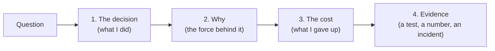

# Part 10 — Probable Interview Questions on AIAAS

> Questions a recruiter, engineer or hiring manager is likely to ask about this
> project, with model answers drawn from the real code and its history. Each
> question is tagged with its level and what the interviewer is really testing.
> Back to the [index](README.md).

**How to use this file**

- Answer out loud first, then read the model answer. Don't memorise the wording;
  memorise the **facts and the reasoning**.
- Every answer follows the same shape: **the decision → why → what it costs**.
  Interviewers trust candidates who name the cost.
- Level: 🟢 screening / recruiter · 🟡 engineer · 🔴 senior / deep dive.
- **Follow-up** lines are what you'll probably be asked next.

**Numbers worth knowing by heart**

| Fact | Value |
|---|---|
| Production box | one EC2 instance, ~913 MB RAM, Postgres + app, Caddy for TLS |
| Backend container memory limit | 384 MB |
| Restart time | ~11 s in the image (was ~44 s); ~20 s API downtime on a real deploy |
| Built-in tools | 156, each declared once with `@tool` |
| Memory in the prompt | 2,000 characters, categories take turns (`profile` first) |
| Solution freshness | `principle` never stale · `procedure` 365 d · `versioned` 180 d · `config` 90 d · `time_sensitive` 30 d |
| LLM providers | 5 (OpenRouter default, OpenAI, NVIDIA, Ollama, OpenCode Zen) |
| Default model | `openrouter/free` router, `medium` effort |
| Chat tool iterations (default) | 12 |
| Delegation depth / parallel workers | 2 / 8 |
| Tool output cap before archiving | 64,000 characters |
| Context curation | starts at 70% of the window, cuts to 45% |
| Embeddings | NVIDIA `nemotron-3-embed-1b`, 2048 dims, FAISS HNSW |
| Autonomy levels | `plan · review · ask · auto · full` |

---

## A. Project overview 🟢

**A1. In two minutes, what is AIAAS?**
An agent platform. You chat with an orchestrator that reads, plans and
delegates. The actual work is done by subagents: saved configurations of a
prompt, a model, the tools they may use and their limits. Agents can run on
demand, on a schedule or from a webhook. Every run is recorded turn by turn,
risky actions pause for human approval, and agents can be evaluated with test
suites. Stack: Django (ASGI) + LangGraph on the backend, React + TypeScript on
the frontend, Postgres, Redis, and a sandboxed Python container for code
execution.
*Testing:* can you explain a complex thing simply?
*Follow-up:* "What's the hardest part you built?" → pick one of B, D or F.

**A2. Why did you build it? Who is it for?**
To learn production AI engineering end to end, beyond prompting: tool calling,
multi-agent coordination, evaluation, safety, and running it cheaply on real
infrastructure. The user is someone who wants repeatable AI workers (a report
every Monday, an inbox triage agent) with control over what they may touch.

**A3. What are you proudest of?**
Pick one and give a number or a test: the tool registry (one declaration, can't
drift); the evaluation system that measures its own judge; or cutting restarts
from 44 s to 11 s on a 384 MB container.

**A4. What would you do differently if you started again?**
Honest answers score well: (1) split the agent loop and tool library out of
the `chat` app from day one, because `chat` and `agents` now import each other
~110 times; (2) put steering and run state in Redis from the start, so the web
tier could scale past one process; (3) write end-to-end tests on what the
client actually receives earlier. A feature once passed six unit suites while
no component rendered it.

**A5. How big is it?**
One repository since 2026-09-27 (the backend and frontend histories were
merged in). 22 Django apps plus a few plain Python packages (sandbox, office),
grouped in layers; 156 built-in tools; ~250 backend test files plus frontend
vitest and Playwright suites. Import rules between layers are enforced in CI
with import-linter.

---

## B. High-level design 🟡

**B1. Draw the architecture.**
Browser → Django ASGI (daphne) → the agent engine (a LangGraph loop, the tool
registry, the LLM access funnel, a virtual filesystem) → LLM providers, a
no-network sandbox container, Gmail/Drive/MCP connectors. Postgres holds rows
and run checkpoints; Redis is the WebSocket channel layer and a tool cache.
Chat answers stream over SSE; run logs and approval pings go over WebSockets.
(See `diagrams/hld-overview.svg`.)

**B2. Why a monolith and not microservices?**
One small box, one deploy, and one database transaction can span modules. The
risk of a monolith is modules tangling, so I declared layers (foundation →
providers/data → product) and a test fails CI if a lower layer imports a
higher one. *Cost:* the web tier is one process; scaling it out needs the
in-process pieces (steering mailbox, scheduler loop) moved to shared stores.
*Follow-up:* "What would you split first?" → the sandbox is already separate;
next would be background runs into a worker tier.

**B3. Why SSE for chat and WebSockets for other things?**
A chat answer is one response streaming to one request, which is exactly what
SSE is: plain HTTP, works through proxies, easy to reason about. I POST it with
`fetch`, because `EventSource` can't send a body or auth header. WebSockets are
for events the user didn't ask for: run logs, approval requests, notifications.

**B4. Why Django rather than FastAPI?**
Batteries included: ORM, migrations, auth, admin, and a mature ecosystem
(DRF, allauth for Google sign-in, Channels for WebSockets). It supports async
views, which the streaming needs. *Cost:* async Django needs care. The ORM is
sync underneath, so I hit real issues with thread executors and connection
pools (see F2, F3).

**B5. What happens when a user sends a message? Walk me through it.**
1. The frontend POSTs; the response is an SSE stream.
2. **Preflight**: can this model be paid for? If not, fail immediately, before
   any "thinking" appears.
3. The graph runs: the model reasons → tools run (safe ones in parallel) →
   context is curated if near the limit → queued user messages are delivered →
   the model reasons again, until it answers without a tool call.
4. Each step streams frames; a reducer on the frontend folds them into the
   screen.
5. Each model call is an `AgentTurn` row and each tool call an `AgentStep` row.

**B6. How do scheduled agents work without cron or Celery in production?**
An in-process scheduler loop, started on the first request, holds a
**database lease**, so only one process sweeps. Each schedule has an indexed
`next_due_at`. A slot is claimed with a conditional UPDATE, so two sweepers
can't fire it twice. Runs start detached. The same loop runs the other periodic
jobs (run recovery, recycle-bin purge, notification sweeps). Before that
change, jobs defined only as Celery beat entries simply never ran in
production, because production runs no Celery.

**B7. How does it survive a deploy mid-run?**
Agent state is checkpointed to Postgres after each graph step. On startup, a
recovery sweep finds runs still marked `running` past their time limit and
either resumes them on the **same execution id** (if a checkpoint exists) or
marks them failed with a clear message. It asks two separate questions: is the
checkpointer durable, and does *this run* have state? A saver switched on after
a run started says yes to the first and no to the second.

---

## C. Low-level design and patterns 🟡

**C1. Name a design pattern you used and why.**
A registry: every tool is declared once with `@tool(schema, effect=..., parallel=...)`.
The schema sent to the model and the function that runs are the same object,
so an advertised tool can't be undispatchable. Before that, a tool lived in
three places and they drifted. The same pattern carries graders, output
contracts, providers and slash commands.

**C2. Strategy vs Template Method: where did you use each?**
Template Method for LLM providers: four share the whole HTTP/streaming/parsing
recipe and override small hooks like `reasoning_payload`. Strategy for approval
policies: three unrelated functions picked by the autonomy level. The rule:
shared algorithm with small differences → inheritance; unrelated algorithms →
swap whole functions.

**C3. How do you stop a tool from running when it shouldn't?**
Two doors. First, the model is only *offered* tools its grants allow. Second,
at dispatch every call walks a chain of checks (grant, scope, per-tool deny,
connector live, eval simulation last). Both are needed because a model can name
a tool it saw earlier in the conversation. Refusals come back as text naming
the real reason, so the model stops retrying.

**C4. Why are some defaults "worst case"?**
Each tool declares `effect` (`read | reversible | irreversible`) and whether
it's safe to run in `parallel`. The defaults are `irreversible` and `False`,
because MCP tools are named at runtime by a third party and can never carry a
declaration. Unknown tools automatically get the strictest treatment.

**C5. How is the file system designed?**
It's virtual: folders and documents are database rows, never host files. A
`FileScope` says what an agent may read and a separate prefix says where it
may write. Paths are resolved one folder at a time from the scope root, never
matched as strings, so `../../etc` can't escape (and `..` at the root is simply
clamped). Folders store a materialised path of **ids** (`/12/45/`), so rename is
O(1) and "is A inside B" is a prefix check. Deletes are soft: a default manager
hides trashed rows from every query.

**C6. How did you design the steering feature (typing while the agent works)?**
A bounded FIFO queue per run (max 8), drained at one safe point per iteration:
after tool results, before the model reads them. That's the only place a new
user message can't split an assistant message from its tool replies. If full,
the oldest is dropped and counted. Queued messages are merged into one, because
the graph expects exactly one trailing user message. Leftovers at the end of a
run go back to the input box. *Cost:* it's in-process, so it needs Redis to
work across multiple web processes.

**C7. How do you validate an LLM's structured output?**
Named contracts (`research`, `files`, `findings`, `patch`...): parse JSON →
run a small repair function for near-misses → check required keys → fill
defaults. Prose is an error, never silently wrapped, because wrapping would make
every agent "satisfy" every contract. The registry is closed because the UI can
only render shapes it has a panel for.

---

## D. AI and agent engineering 🟡🔴

**D1. How does the agent loop work?**
A LangGraph state graph with four nodes per iteration:
`agent → tools → curate → steering → agent`. It ends when the model answers
without calling a tool. The step budget (`recursion_limit`) is sized as
iterations × 4 steps. When a node was added and the formula wasn't updated,
runs died at half their configured length, so a test now pins the constant to
the graph's node set.

**D2. How do you handle the context window on long runs?**
Three layers. Oversized tool outputs (>64k chars) are archived with an id, and
the model gets a preview plus how to fetch the rest. At 70% of the window, old
tool results are compacted and the oldest steps folded into one running
summary by a cheap model, cutting to 45%. Everything removed is archived and
recallable. It fires at a watermark rather than every turn, to keep the
prompt prefix stable for **prompt caching**. And an assistant tool-call message
plus its results are one unit: dropping half gets you a 400 from the provider.

**D3. How do you run tool calls in parallel safely?**
Calls in one model turn are independent, because the model issued them all
before seeing any result. Tools that only read declare `parallel=True` and run
with `asyncio.gather`. Everything else runs one at a time. Approvals are all
decided *before* anything runs, because LangGraph's `interrupt()` re-runs the
node on resume, and the outside world doesn't roll back. Results are recorded
in call order so the transcript is deterministic.

**D4. How does multi-agent delegation work, and how is it bounded?**
An orchestrator holding the `subAgents` grant calls workers. It's bounded three
ways: depth (max 2; workers get a narrowed toolbox without delegation), budget
(the spend cap is split up front, because parallel siblings would all see
"under the cap"), and result size (per-worker cap, then a proportional cap
across the fan-out; the full text is archived, not lost). Instructions are
capped too, and **refused rather than truncated**, because a trimmed
instruction makes a worker confidently do the wrong job. Workers can share a
folder with the parent, so they return file paths instead of pouring long
reports into the parent's context.

**D5. How do you evaluate agents?**
Suites of cases, graded by deterministic checks (regex, JSON values, files
produced, even spreadsheet formulas evaluated) plus an LLM judge. The judge is
a **different model** from the one under test. Humans review only the cases
where judge and checks disagree, and the original automatic verdict is kept,
so I can report **judge–human agreement**. A case with no graders is sent for
review, not counted as a pass (otherwise an empty suite scores 100%). The harder
"work" tier runs each case 3 times and reports pass@1 and pass^k.

**D6. How do you evaluate an agent that sends email without sending email?**
Each suite gets a generated fake "world": mailbox, calendar, drive, a frozen
web, and planted facts. Simulators return results in exactly the real tools'
shapes, and a test fails if a real tool gains no simulator. Simulation happens
**last**, after every real permission check. The first version simulated first,
so a read-only Gmail agent could "send" in its eval: it was testing a stronger
agent than the real one.

**D7. How do you defend against prompt injection?**
Direct: the input sanitiser refuses (never rewrites) messages matching
injection patterns, reading through disguises (look-alike letters, leetspeak,
base64). Indirect (instructions hidden in a web page or email the agent read):
tool results are scanned, and if one looks like instructions, the turn is
**tainted**, and `auto` mode then asks before anything irreversible. Data
exfiltration via URLs: fetch tools only open URLs seen verbatim, or composed
URLs that carry no data. Remote images in markdown render as links, so the
browser can't leak data by loading one. I'm honest that it's defence in depth,
not detection: a few bits can still leak through a short composed path.

**D8. How is RAG implemented?**
Knowledge bases with swappable backends behind one interface
(`ingest / search / remove_document`): **vector** (NVIDIA embeddings, FAISS
HNSW), **full-text** (my own inverted index, so SQLite dev and Postgres prod
behave identically), **raw** (store whole, the agent reads documents directly)
and **hybrid** (both, merged with reciprocal-rank fusion). The model picks the
tool; misrouting returns advice ("this is a keyword KB, use keyword_search")
instead of silently returning nothing. An agent's KB selection is enforced as a
scope, not just shown in the prompt.
*Follow-up:* "Why RRF?" → it merges by rank, so cosine and BM25-style scores
don't need to be on the same scale.

**D9. What happens when you change the embedding model?**
The index stores `EMBEDDER_VERSION = model:dim`. On startup, knowledge bases
built with a different version are re-embedded, because vectors from two models
aren't comparable.

**D10. How do you handle LLM provider failures?**
Classify, then act. 401/403 → access denied, 402 → out of credit, 410 → model
retired: shown to the user at once, never as the assistant apologising. A
network failure before any token is sent is retried twice (~4 s). After tokens
have streamed, it isn't retried (that would duplicate text). A 429 isn't
retried (that turns a rate limit into an outage). A transient failure that ends
an agent run marks it **failed**, not completed.

**D11. How do you control cost?**
Tokens → rupees at one blended rate, rounded **up** (no run is free). There's a
per-agent monthly spend cap checked before each run, and the budget is split
across parallel workers up front. Non-token costs (images, etc.) go in an
append-only ledger. Evals are tracked separately so tests don't count against
the cap. *Story:* the cap once compared against a column nothing wrote, so it
never tripped. Lesson: enforce against the number you actually record.

**D12. What is "effort" and how do you handle it across models?**
One vocabulary (`none … high`) for how hard a reasoning model should think.
Each provider adapter spells it its own way. The level is **snapped** to the
nearest one the chosen model supports (ties go down, so a tie never costs
money). Models with no effort control get nothing on the wire, because OpenAI
rejects unknown fields.

**D13. How do human approvals work mid-run?**
A risky call triggers LangGraph's `interrupt()`. The run's state is
checkpointed and an approval row is opened (idempotently, since the node
re-runs on resume). The user can approve once, for this session, or always.
The answer is recorded, the row closed, and the run resumes from the
checkpoint **on the same execution id**. An update guarded by
`status='pending'` makes sure only one of the Inbox or a WebSocket can answer.

**D14. What are the autonomy levels?**
`plan` (mutating tools are removed entirely), `review`, `ask`, `auto` (an
independent fast judge model may approve reversible calls, never spending
money or sending to new recipients, and a slow or failed judge means "ask"),
and `full`. Each tool declares its `effect`, and levels gate on that, not on
tool names, because MCP tool names aren't known in advance.

---

## E. Data and databases 🟡

**E1. SQLite in dev, Postgres in prod: any problems?**
Yes. I use SQLite WAL with immediate transactions in dev, and my own keyword
index so search behaves the same on both. Deploying needed type coercions (NUL
characters, booleans). Some indexes are Postgres-only (trigram) and are skipped
on SQLite rather than failing.

**E2. How do you prevent two processes firing the same schedule?**
Compare-and-swap in SQL:
`UPDATE trigger SET next_due_at=:new WHERE id=:id AND next_due_at=:what_I_read`.
One row changed means you won; zero means someone else did. It holds no lock,
so it can't deadlock. Plus a DB lease, so normally only one sweeper runs at all.

**E3. How do you avoid N+1 queries? Any aggregate bugs?**
`select_related` / `prefetch_related`, and every list endpoint is capped
because DRF's page size doesn't apply to function views. A real bug: a
`Count` across a LEFT JOIN counted run×approval pairs, so one run with three
approvals showed as three runs and triple the spend.

**E4. How is the recycle bin designed?**
Soft delete (`deleted_at`) and a default manager that filters trashed rows, so
every query in the codebase, including future ones, hides them automatically.
The vector index is dropped at trash time (a trashed file mustn't answer RAG
queries). A sweep purges after 30 days, documents before folders.

**E5. How do you keep a record of what a run did?**
`ExecutionLog` (the run) → `AgentTurn` (each model call, with its full
reasoning) → `AgentStep` (each tool call). The step is written **before** the
tool runs, because a tool can start a child run that needs to point at it.
Delegation points at the parent's *step*, which gives both the parent run and
what it was thinking when it delegated. Runs are pinned to the config revision
they started with. After 180 days, reasoning and payloads are cleared; the
record stays.

---

## F. Concurrency and performance 🔴

**F1. Why did one user make the server lag?**
Several causes. DB connections were held across long model calls, starving a
small pool. The SQLite checkpointer serialised whole state on the event loop.
Single-thread `sync_to_async` queued work behind each request. And memory was
overcommitted on a 913 MB box. The fixes: release the connection before model
calls, move blocking work off the event loop, and use a proper Postgres pool
sized under `max_connections`.

**F2. What bug did `asyncio.create_task` cause?**
Django runs each request inside a context that owns a thread executor. A task
started with `create_task` copies that context, so after the response was sent,
its first ORM call raised "CurrentThreadExecutor already quit". The fix is a
`spawn()` helper: start the task in a fresh context with its own executor, and
close its DB connection when it ends.

**F3. How did connectors cause an out-of-memory crash, and what fixed it?**
One chat turn asked all eight MCP connectors for their tool lists. Each was a
cold `npx` Node process (~70–150 MB) in a 384 MB container, and the kernel
killed the web server. Fixes: listing tools **never starts a process** (it's
served from a stored catalogue); starting one is **admitted against a megabyte
budget** reserved before spawning, evicting idle sessions LRU-first; and there's a
separate container-headroom backstop. Later, Google connectors became native
REST tools, and Node left the image entirely. *Lesson:* a count ("max 6
sessions") isn't a budget.

**F4. How did you get restarts from 44 s to 11 s?**
Static files are collected at build time, not on every start. Migrations and
seeding run once per container (a marker file), not on every crash restart. And
the server runs with `exec`, so `docker stop` signals it directly instead of
waiting out a 10 s kill timeout.

**F5. Frontend performance?**
Route-level code splitting (the app used to ship as one 1.23 MB file behind the
login screen), lazy-loaded heavy editors, `memo` on the markdown renderer, a
10 Hz timer isolated in its own component, and stream events batched into one
render per animation frame.

---

## G. Frontend 🟡

**G1. How is state managed?**
By lifetime: React Query for server data, `useReducer` for a streamed answer,
an external store for runs that must survive navigation, context for
auth/theme, Zustand for toasts, local/session storage for UI preferences.

**G2. What happens if I switch conversations while an answer is streaming?**
The stream lives outside React in a store keyed by session. It keeps reading
and buffers every frame. When you come back, the component re-subscribes and
the frames are **replayed** through the same pure reducer, so the screen
rebuilds exactly. A `replayed` flag skips one-time side effects like toasts.

**G3. How does token refresh work with many requests failing at once?**
The first 401 starts a refresh; the rest wait in a queue and are replayed with
the new token. A `_retry` flag prevents loops, and auth endpoints are excluded.

**G4. How do you keep frontend and backend logic in sync?**
Where both compute the same thing (cron descriptions, the effort ladder), both
test suites check against one shared table of expected outputs. Presentation
data (connector names, icons) comes from the backend.

---

## H. Security 🔴

**H1. What did your security review find?**
Pre-account takeover (Google sign-in linking into an unverified password
account), no way to revoke JWTs on password change (fixed with a "tokens valid
after" timestamp), a blacklist app configured but not installed, tokens in URL
query strings for HTTP, API keys stored unhashed, and a webhook scoped to the
wrong owner. All fixed and covered by tests.

**H2. How are users' API keys stored?**
AES-encrypted at rest. They're resolved through one credential manager with a
5-minute cache and OAuth refresh, and injected into connectors at call time,
never sent to the client. Connector subprocesses get an **allow-listed**
environment. Before that, the whole server environment, including the master
encryption key, was handed to third-party code.

**H3. How is untrusted code executed?**
In a separate container: no network, all Linux capabilities dropped, read-only
root, non-root user, memory and process limits, per-run resource limits and
process-group kill on timeout. Even a full breakout lands somewhere with no
secrets. There's no automatic fallback to the weaker in-process sandbox.

**H4. Why return 404 instead of 403?**
A 403 for "exists but isn't yours" tells an attacker the id exists: an
ownership oracle. Ownership is part of the query itself
(`get_object_or_404(Trigger, id=..., subagent__user=request.user)`), so a
foreign id and a missing id look identical.

**H5. How do you stop open redirects?**
`?next=` after sign-in only accepts same-origin paths (a single leading `/`, no
backslashes, no schemes), and hostile values are refused, not repaired.
External links only open for `http`/`https`.

---

## I. Testing and quality 🟡

**I1. How do you test an LLM system?**
Four levels. Unit tests on pure logic. **End-to-end graph tests with a stub
provider**: twenty real turns, asserting on what actually left for the provider
and what the client received. Contract tests pinning frontend callbacks. And
the evaluation benchmark for real model behaviour. Plus import contracts
enforced in CI.

**I2. Tell me about a bug your tests missed.**
The "Auto mode" judge never ran: it called `llm.complete` on an empty package,
the error was caught as "reviewer unavailable", and Auto silently behaved like
Ask. Every test mocked the judge function, which skipped the broken import.
Fix: a test that drives the real judge. Lesson: fail-safe paths need a test
that the *happy* path actually runs.

**I3. What's an end-to-end test that paid off?**
The todo-list feature: built, streamed and stored, passing six suites, but no
component rendered it. A test driving the real graph and asserting on the
client's events found it, and on its first run also found a second bug (file
writes pausing for approval in chat).

---

## J. Deployment and operations 🟡

**J1. How is it deployed?**
Images are built locally and pushed to Docker Hub, then pulled on one EC2 box
running Postgres, the backend, the frontend (nginx) and Caddy for TLS via
Docker Compose. A smoke-tier benchmark can gate deploys. Backups are
`pg_dump` from the database container.

**J2. What happens to users during a deploy?**
~20 s of API downtime. Open SSE streams drop (the client keeps what arrived).
Running agents are recovered from checkpoints. The scheduler lease is taken
over by the new process. Reminder sending is claim-then-send, so an old and new
process sweeping in the same minute don't double-send.

**J3. How do you know something is wrong in production?**
Sentry for errors (optional), structured latency logs (`[Latency] pre-model`
per turn, reviewer timings), a scheduler health endpoint reading the lease's
last beat, and failed/stuck runs visible on `/runs`.

---

## K. Scaling and trade-offs 🔴

**K1. How would this scale to 10,000 users?**
1. Move the in-process pieces (steering mailbox, chat run registry, scheduler
   loop) to Redis / a queue so web processes are stateless.
2. Run agent runs in a worker tier, not the web process.
3. Move FAISS indexes to a vector service or pgvector.
4. Put PgBouncer or a bigger pool in front of Postgres.
5. Rate-limit per user and per provider.
The design helps: one door for runs, one funnel for model calls, one registry
for tools. Each move changes one place.

**K2. What are the known limitations today?**
Single box and single web process; steering is in-process; missions don't
advance in production yet (they need a detached launch path); the content
policy is pattern-based, not model-based; MCP tool pinning is trust-on-first-use.
Solution memory (2026-09-28) is built but not yet deployed; its search
thresholds are first guesses waiting for an offline test set; and agent runs
don't carry an organisation yet, so they only search their owner's personal
library. Being able to list these is a strength.

**K3. Why not use LangChain agents or an agent framework end to end?**
I use LangGraph for the state graph and checkpointing, but own the tool
registry, permissions, approvals, curation and recording, because those are the
product. A framework's defaults would have to be checked against every
guardrail anyway.

**K4. Why FAISS rather than a vector database?**
No extra service on a 913 MB box, and it's fast in-process. *Cost:* indexes
are files tied to one host, so scaling out means moving to a shared vector
store. The backend interface (`ingest/search/remove_document`) makes that a
contained change.

---

## L. Behavioural questions about this project 🟢

**L1. Tell me about a time you found a problem nobody asked you to look for.**
The Celery beat entries: production runs no Celery, so recovery, recycle-bin
purges and checkpoint pruning had never run there, while the docs said they
did. I moved every periodic job into the in-process scheduler and added a test
that fails if a job is scheduled in neither place.

**L2. Tell me about a trade-off you made under constraints.**
Memory: a 384 MB container versus Node-based connectors. I first bounded them
with an admission controller, then replaced the Google ones with native REST
tools, which removed Node from the image entirely.

**L3. How do you keep a large codebase understandable?**
Every file starts with *why* it exists. A decision log records each design
decision. Beginner READMEs per app, an endpoint map kept current with every
route change, and import contracts that keep the layers honest.

**L4. What did you learn about AI engineering specifically?**
That most of the work is around the model: permissions, recording, recovery,
cost, evaluation and failure handling. Also that the "caller" of an error
message is often a model, so error text is a design surface.

---

## M. Rapid-fire (one-line answers) 🟢

| Question | Answer |
|---|---|
| Backend framework? | Django 5.2 (ASGI, daphne) + DRF + Channels |
| Agent runtime? | LangGraph state graph with a durable checkpointer |
| Frontend? | React 19 + TypeScript + Vite, React Query, Tailwind |
| Database? | Postgres (prod, psycopg 3 pool), SQLite (dev) |
| Vector search? | FAISS HNSW, NVIDIA embeddings, 2048 dims |
| Where does code run? | A no-network sandbox container |
| Real-time? | SSE for answers, WebSockets for events |
| Auth? | JWT + Google OAuth (allauth), revocable by timestamp |
| How many tools? | 156 built-in, plus MCP connectors |
| Repository? | One monorepo (backend + frontend + docs) since 2026-09-27 |
| Org isolation? | One read function, `solutions/access.py::visible`, enforced by a test |
| Default model? | OpenRouter's free router, medium effort |
| Eval judge? | A different model from the one under test |
| Hosting? | One EC2 box, Docker Compose, Caddy TLS |

---

## N. Questions *you* can ask the interviewer

- "How do you evaluate your agents today, and how do you know your judge is right?"
- "Where do guardrails live in your stack: in the prompt, or enforced in code?"
- "What's your biggest reliability problem with LLM providers?"
- "How do you keep cost per task visible to the team?"

---

## O. Recent work: organisations, solution memory, prompts (2026-09-28) 🟡🔴

**O1. What is solution memory, and why build it?**
When someone in an organisation solves a problem (a failing deploy, a VPN
reset), the fix is saved as a structured record: problem, symptoms, cause, fix,
and a list of claims. The next person who asks something similar gets it back.
It's saved automatically when the person gives a thumbs-up or says "that
worked", or by the assistant when a problem is clearly solved. The point is
that a junior shouldn't have to rediscover what a senior already fixed.
*Follow-up:* "Why not just put it in the RAG knowledge base?" → a fix has a
track record, an owner, a sharing scope and claims that go stale at different
speeds. A document chunk has none of those.

**O2. How do you guarantee one organisation never sees another's data?**
Three layers. (1) **One read function**: every reader goes through
`visible(user_id, org_id)`, which checks membership live, and a test fails if
any other code queries the table. (2) **The org comes from the chat, not the
model**: the tools read the org from the turn's context, fixed when the chat
was created, and there's no argument the model could use to name another org.
(3) **A chat can't move orgs**: `ChatSession.org` is read-only in the API. A
person in two orgs can't carry one org's fix into the other. Unknown and
foreign ids both return 404.

**O3. How do you stop an old fix from being stated as current?**
Each claim has a kind with a shelf life: `principle` never expires, `config`
lasts 90 days, `time_sensitive` 30 days, and a `versioned` claim is stale as
soon as your versions differ from the one it was solved on. Staleness is
computed **when the fix is read**, not stored, so no nightly job is needed. A
stale claim is shown marked "check" rather than hidden, and a prompt rule
obliges the model to re-verify it or say it may have changed.

**O4. How is search ranked? Why can it return nothing?**
Three retrievers: exact error signatures (which skip the embedding call when
they hit), keywords (BM25-style) and vectors over the question plus
rephrasings. They're merged with reciprocal-rank fusion, then re-scored by a
**Wilson lower bound** on confirmations vs failures (so 1-of-1 doesn't beat
9-of-10), by environment match, and by small penalties for stale or doubtful
rows. It **abstains** without real evidence, because a wrong fix with a
colleague's name on it is worse than none. I say plainly that the thresholds
are first guesses to tune against an offline set.

**O5. Couldn't someone poison the org's memory?**
That's the main risk, and it's handled. Capture only happens on a *human*
signal (thumbs-up or "that worked"); the model never decides a fix worked. An
exchange that read instruction-shaped third-party text (say, a malicious web
page) is never captured, and saving is refused in a tainted turn. Anyone can
flag a fix as doubtful with a reason, and the flag records which model raised
it, so a later model can clear or confirm it.

**O6. You found chat was sending the conversation twice. How?**
By testing what the provider received rather than each piece. A three-turn
test through the real graph showed earlier turns arriving twice: once from the
database (windowed and summarised) and once from the checkpoint, because
LangGraph's message reducer appends each new turn to the stored transcript. It
also counted the whole session's tool calls against one turn's limit. The fix
clears the checkpointed messages at the start of each new chat turn with
`RemoveMessage(REMOVE_ALL_MESSAGES)`, but never on an approval resume, which
still needs its checkpoint.
*Follow-up:* "Why did no test catch it before?" → every unit test checked one
piece in isolation; the bug was in how two correct pieces were combined.

**O7. How does user memory decide what goes in the prompt?**
Facts are grouped (who they are, preferences, projects, anything else) under a
2,000-character budget. Categories take turns, one fact each per round in
priority order, and a fact that doesn't fit is skipped rather than ending the
fill. It used to sort categories alphabetically, so "anything else" used up the
space before "who they are". The same selection feeds the Memory settings tab,
which marks the facts the model isn't currently shown.

**O8. What changed in the prompts, and why does placement matter?**
The per-turn note now tells the model the chat's mode (in `plan` it can only
read, so it shouldn't plan to delegate) and how many old messages were left
out, with a pointer to the history-search tool. These go in the per-turn note,
not the system prompt, because the system prompt is the provider-cached prefix:
putting anything that changes there makes every request a cache miss.

These show you've built the same problems they have.
