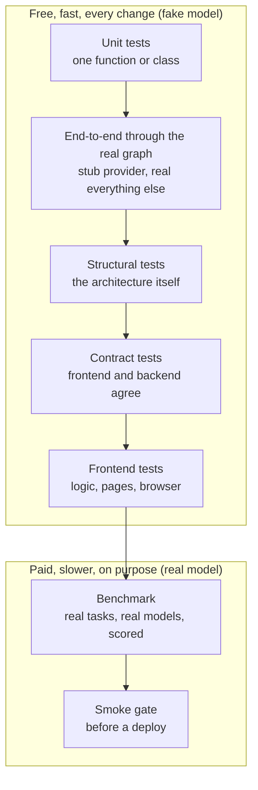
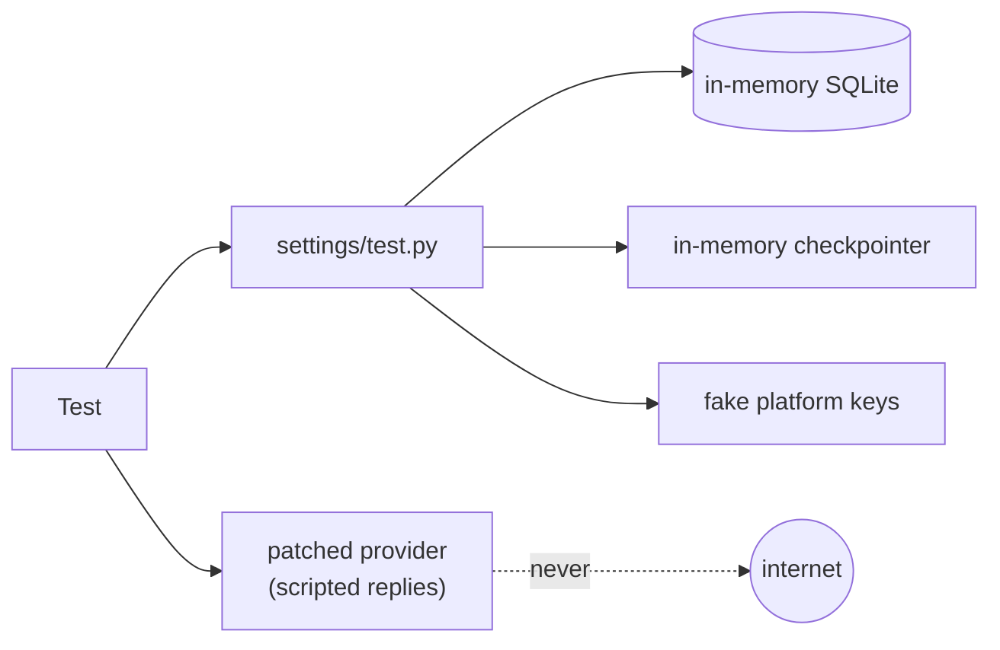
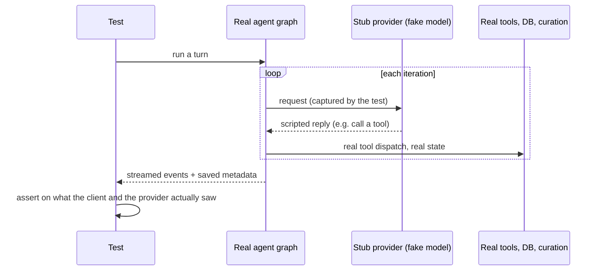
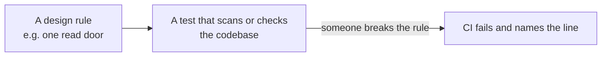
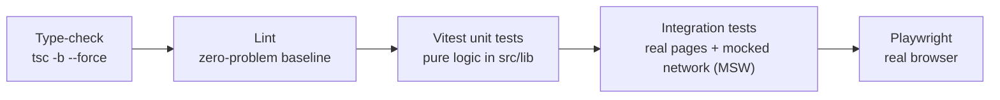
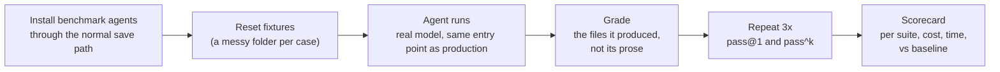

# Part 11: How We Test AIAAS

> **Who this is for:** anyone who wants to know *why we believe the platform
> works*, whether you're a new developer, an interviewer or a reviewer. It
> explains each kind of test we use, why it exists, and the real bug or risk
> that made us add it. Every claim links to a real test file. Back to the
> [index](README.md).

---

## 0. The idea in one paragraph

An AI platform can fail in two very different ways. **Our code** can be wrong:
a check is skipped, a lock is missing, a file is written twice. Or **the
model** can have a bad day: it misreads a number or forgets a step. We test
these two things separately. Our own code is tested with fast, repeatable tests
that use a **fake model**, so they give the same answer every time and cost
nothing. The model's behaviour is tested with a **benchmark** of real tasks run
against real models, scored automatically, and repeated, because one lucky run
proves nothing. Guardrails belong to the first kind. They are properties of our
code, so they must pass **100%** of the time, whatever the model does.



**Interview line:** "We split 'is our code right?' from 'is the model good
enough?'. The first is tested deterministically with a fake model, and
guardrails must pass every time. The second is measured with a benchmark,
repeated runs and a human-checked judge."

---

## 1. The numbers

| What | Count | Where |
|---|---|---|
| Backend test files | 252 | `Backend/<app>/tests/test_*.py` |
| Backend tests | 3,873 passing (+1,070 subtests) | biggest: `chat` 889, `agents` 628, `inference` 571, `eval` 395, `mcp_integration` 322 |
| Sandbox container tests | 4 files | `Backend/sandbox_service/tests/` |
| Frontend unit test files | 43 (352 tests) | `src/**/__tests__/*.test.ts(x)` |
| Frontend integration tests | 3 pages | `tests/integration/` (MSW + jsdom) |
| Browser (Playwright) tests | 3 specs + 1 demo | `tests/e2e/`, `tests/demo/` |
| Benchmark suites | 15 | `Backend/eval/benchmarks/suites/` |

**Last local run (2026-09-28):** see [§13](#13-last-run-results).

---

## 2. Rules every test follows

These conventions matter because they're what make ~3,900 tests fast and
trustworthy.

1. **One `tests/` folder per app.** Tests live in `<app>/tests/test_<topic>.py`,
   never a flat `tests.py`. Both `pytest` and `manage.py test` find them.
   Frontend tests sit beside the code in `__tests__/` folders.
2. **No network, no Redis, no database server.**
   [`settings/test.py`](../Backend/workflow_backend/settings/test.py) forces
   in-memory SQLite, a dummy cache, the in-memory checkpointer and fake
   platform keys. The keys are never sent anywhere, because the provider call
   itself is patched.
3. **The model is always faked in fast tests.** A stub provider returns scripted
   replies, so a test can say "call this tool three times, then answer" and get
   exactly that.
4. **Clear shared caches between tests.** Test databases restart ids at 1, so
   a process-wide cache keyed on a user id can leak one test's answer into the
   next. Tests that touch those caches call `cache.clear()` in `setUp`.
5. **A test names the property, not the function.** For example:
   `test_two_sweeps_at_once_send_a_reminder_only_once`, not
   `test_sweep_2`.



---

## 3. Unit tests: one piece at a time

Most tests check one function or class against its rules. They're quick to
write and quick to run, and they're the first line of defence.

| Area | What's checked | Example file |
|---|---|---|
| Autonomy ladder | each of the 5 levels gates exactly the right tools | [`agents/tests/test_autonomy.py`](../Backend/agents/tests/test_autonomy.py) |
| Approvals | approve, reject, and "once / session / always" scope | [`chat/tests/test_tool_approval.py`](../Backend/chat/tests/test_tool_approval.py) |
| Permissions | a credentialed connector call is gated unless it's clearly a read | [`chat/tests/test_permissions.py`](../Backend/chat/tests/test_permissions.py) |
| Parallel tools | safe calls overlap; results are recorded in call order | [`chat/tests/test_parallel_tools.py`](../Backend/chat/tests/test_parallel_tools.py) |
| Schedules | cron in the user's timezone; daylight-saving gaps skip, folds fire once | [`agents/tests/test_schedules.py`](../Backend/agents/tests/test_schedules.py) |
| Provider errors | a failed connection is retried only if nothing was sent yet | [`llm/tests/test_stream_retry.py`](../Backend/llm/tests/test_stream_retry.py) |
| Office graders | a formula is *evaluated*, so a typed-in total fails even when correct | [`eval/tests/test_office_graders.py`](../Backend/eval/tests/test_office_graders.py) |

**Interview line:** "Unit tests pin each rule. But they can all pass while the
pieces are wired together wrongly, which is why we have the next layer."

---

## 4. End-to-end through the real graph: the most important layer

**The problem:** every unit test can pass while the feature is broken. Each
test checks one hop (tool → side effect → state → saved data), and a chain can
pass every hop and still connect nowhere.

**Real example:** the plan (todo list) feature was built, streamed as an event
and saved on the message, and **no screen rendered it**. Six test suites were
green.

**The fix:** tests that drive the **real LangGraph agent** with only the model
faked, and then assert on the two things a user actually gets: the **events
streamed** to the browser and the **data saved** afterwards.



| Test | What it proves | Bug it caught |
|---|---|---|
| [`chat/tests/test_turn_output_e2e.py`](../Backend/chat/tests/test_turn_output_e2e.py) | The events a client receives carry what the UI needs | The invisible todo panel |
| [`chat/tests/test_curation_e2e.py`](../Backend/chat/tests/test_curation_e2e.py) | 20 tool-calling turns: the request never outgrows the window, a fact from a trimmed step can still be recalled, and the transcript stays valid | Pieces wired in the wrong order |
| [`chat/tests/test_chat_transcript.py`](../Backend/chat/tests/test_chat_transcript.py) | On turn 3, the provider receives each earlier turn **once** | Earlier turns were sent twice (from the database and from the checkpoint) |
| [`chat/tests/test_iteration_limit.py`](../Backend/chat/tests/test_iteration_limit.py) | A 40-iteration agent really gets 40 iterations | Step budget sized for a 2-node loop, so runs died at about half |

The trick in `test_curation_e2e.py` is worth copying. It plants a secret
("the reconciliation code is QX-8842") in turn 2's tool result, shrinks the
context budget so turn 2 must be trimmed away, and at the end checks that the
agent can still get the secret back from the archive.

**Interview line:** "Our most valuable tests assert on the exact request that
reached the provider and the exact events that reached the client. The
double-send bug passed every unit test, and one of these caught it."

---

## 5. Structural tests: tests that protect the architecture

Some rules aren't about one feature. They're about how the code is shaped:
"only this module may read that table", "every setting must be used". If a
rule only lives in a document, it will be broken. So we turn the rule into a
test.



| Rule | How it's enforced | File |
|---|---|---|
| Apps depend only on lower layers | import-linter contracts run as a test | [`workflow_backend/tests/test_import_contracts.py`](../Backend/workflow_backend/tests/test_import_contracts.py) |
| Only the filesystem module touches folders | a choke-point test fails on any other `Folder.objects` use | [`inference/tests/test_filesystem.py`](../Backend/inference/tests/test_filesystem.py) |
| Only one door reads saved solutions | the same kind of test for `Solution.objects` | [`solutions/tests/`](../Backend/solutions/tests/) |
| A setting the UI offers must be read by the runtime | fails if a declared tool setting is never read | [`tools_config/tests/test_config.py`](../Backend/tools_config/tests/test_config.py) |
| Every periodic job runs somewhere | fails if a scheduled job is in neither the in-process table nor the "not here, because…" table | [`agents/tests/test_scheduler.py`](../Backend/agents/tests/test_scheduler.py) |
| A fresh `migrate` gives a working install | runs against migration-only state, with nothing seeded by hand | [`mcp_integration/tests/test_fresh_install.py`](../Backend/mcp_integration/tests/test_fresh_install.py) |
| Models and migrations agree | `makemigrations --check` in CI | CI workflow |
| Every template would be accepted by the builder | each gallery template goes through the real serializer | [`agents/tests/test_gallery.py`](../Backend/agents/tests/test_gallery.py) |
| Every native tool has an eval simulator | a coverage test fails when a new tool has none | [`eval/tests/test_environments.py`](../Backend/eval/tests/test_environments.py) |
| Shipped model ids are the documented ones | pinned against the model table, and judge ≠ agent model | [`eval/tests/test_benchmarks.py`](../Backend/eval/tests/test_benchmarks.py) |

**Interview line:** "A design rule nobody enforces is a suggestion. Our
architecture rules (layers, single read doors, no dead settings) are tests,
so breaking one fails CI and names the line."

---

## 6. Contract tests: frontend and backend must agree

Some facts exist in both TypeScript and Python. If the two copies drift, the
app looks broken even though each side is "correct". We pin **both copies to
the same table**.

| Shared fact | Backend test | Frontend test |
|---|---|---|
| How a schedule is described in words ("Every weekday at 09:00") | `agents/tests/test_schedules.py::DescribeTests.CANONICAL` | [`src/lib/__tests__/cron.test.ts`](../better-n8n-frontend/src/lib/__tests__/cron.test.ts) |
| The reasoning-effort ladder (`none` … `high`) | [`llm/tests/test_effort.py`](../Backend/llm/tests/test_effort.py) | [`src/hooks/__tests__/effort.test.ts`](../better-n8n-frontend/src/hooks/__tests__/effort.test.ts) |
| The default provider, model and effort (three copies) | `ShippedDefaultTests` in `llm/tests/test_effort.py` | same values pinned |
| Chat UI callbacks get the right arguments | — | [`chatPieces.test.tsx`](../better-n8n-frontend/src/components/chat/__tests__/chatPieces.test.tsx) |

Why the schedule wording matters: the browser shows its own description while
you type, and the server's replaces it a moment later. If they differ by one
word, the sentence rewrites itself under your cursor, which looks like a bug.

We also run an **endpoint wiring check**: every URL the frontend calls is
resolved against Django's URL table. It catches calls to routes that no longer
exist, which neither the type-checker nor pytest can see.

---

## 7. Concurrency and failure tests

These tests create the awkward situations production will: two workers at
once, a stale read, a dropped connection, a restart mid-run.

| Situation | What must happen | File |
|---|---|---|
| Two reminder sweeps run in the same minute | the reminder is sent **once** | [`notifications/tests/test_scheduled_sweep.py`](../Backend/notifications/tests/test_scheduled_sweep.py) |
| An agent writes a file you changed after it read it | the write is refused, and the old version is kept | [`inference/tests/test_vfs_hardening.py`](../Backend/inference/tests/test_vfs_hardening.py) |
| A coding worker edits a file another worker changed | refused by the sha256 check | [`workspaces/tests/test_stale_write.py`](../Backend/workspaces/tests/test_stale_write.py) |
| Several workers dispatched with overlapping files | the second claim is refused, naming the holder | [`agents/tests/test_code_dispatch.py`](../Backend/agents/tests/test_code_dispatch.py) |
| Background work outlives the HTTP request | it keeps working after the response is sent | [`workflow_backend/tests/test_background.py`](../Backend/workflow_backend/tests/test_background.py) |
| A server restarts mid-run | the run is resumed only if its state was saved, otherwise closed with a reason | `agents/tests/test_recovery.py` |
| A run pauses for approval, then resumes | the safe calls in the batch are **not** run twice | `chat/tests/test_tool_approval.py` |

**Interview line:** "For every lock and every retry, there's a test that
creates the race or the failure on purpose and checks the outcome, for
example two sweeps in the same minute sending one reminder."

---

## 8. Security tests

Security tests check two directions: attacks must be stopped, and ordinary
work must **not** be blocked. A filter that blocks "sex education" or "nude
lipstick" is also broken.

| Area | What's checked | File |
|---|---|---|
| Input sanitiser | attacks disguised with look-alike letters, leetspeak, spacing and base64 are refused; normal requests about the user's own agents pass; a refused message is never saved | [`core/tests/test_sanitizer.py`](../Backend/core/tests/test_sanitizer.py) |
| Content policy | the three legal red lines are refused; near-miss phrases pass | [`core/tests/test_content_policy.py`](../Backend/core/tests/test_content_policy.py) |
| Prompt injection | tainted tool output makes auto mode ask; composed URLs can't carry data | [`chat/tests/test_injection_defences.py`](../Backend/chat/tests/test_injection_defences.py) |
| Eval isolation | a test world can't reach real mail, files or services | [`eval/tests/test_world_isolation.py`](../Backend/eval/tests/test_world_isolation.py) |
| Connector environment | third-party processes get an allow-listed environment, never our keys | `mcp_integration/tests/test_subprocess_env.py` |
| Organisation isolation | another org's ids return the same 404 as missing ones | `solutions/tests/test_isolation.py` |
| Auto-mode judge | the **real** judge code is called, not a fake | [`chat/tests/test_auto_reviewer.py`](../Backend/chat/tests/test_auto_reviewer.py) |

That last row is a lesson in itself. Every earlier test replaced the judge
with a fake, so none of them noticed that the real judge crashed on a bad
import and "auto" mode quietly behaved like "ask". **A fake in a test must not
hide the code you most need to check.**

---

## 9. Frontend tests



| Kind | What it covers | Where |
|---|---|---|
| Type-check | the whole app. Note `tsc -b --force`: a plain `tsc --noEmit` checks **zero files** here, because the root config only holds references | CI |
| Lint | ESLint with a zero-problem baseline: any new warning is a regression | `npm run lint` |
| Unit (Vitest) | pure logic kept out of components so it's testable: slash-command parsing, plan diffs, chart scales, cron wording, file paths, PDF view maths, undo history | `src/lib/__tests__/`, `src/hooks/__tests__/` |
| Integration | real pages rendered in jsdom against a mocked network (MSW): sign-in, Connections, office previews | [`tests/integration/`](../better-n8n-frontend/tests/integration/) |
| Browser (Playwright) | sign-in, connections, and the **mobile layout contract** (every page owns its scroller and fits a phone screen) | [`tests/e2e/`](../better-n8n-frontend/tests/e2e/) |

The design choice that makes this work: **logic lives in plain functions**
(`lib/planView.ts`, `lib/commands.ts`, `lib/docSpec.ts`…), and components
only draw. Plain functions are tested in milliseconds without a browser.

---

## 10. The benchmark: does it actually do the job?

Everything above uses a fake model. The benchmark uses **real models on real
tasks** and scores the result.



**Two groups, two pass bars.**

| Group | Question | Pass bar |
|---|---|---|
| **Capability** | Does the agent do the job? (clean a CSV, research and cite, build a deck) | below 100%: models have off days |
| **Guardrail** | Does the system stop where it should, whatever the model tries? (no network from code, writes wait for approval, a scoped agent can't read other files) | **100%**: a failure is a bug in our code |

**The work tier** is the hard part. Each case starts from a folder of messy
files, reset before every attempt. It's graded on the **files** the agent
produced: a cell in an xlsx, a value in a JSON file, a row in a CSV. Every
case runs three times, and the scorecard reports both **pass@1** (passed
once) and **pass^k** (passed every time). A case that works twice in three
runs isn't a feature yet.

**Checking the checker.** Two tests keep the benchmark honest:
- Each case must be **passable** with the ideal output, computed by a
  reference solution over the same fixture text.
- Each case must **fail** on the untouched fixtures, so a lazy agent can't pass
  by doing nothing.

**Judging.** Some answers need a judge model. It's deliberately a **different
model** from the one being tested, since a judge grading its own model can't
tell a bad rubric from a bad answer. The judge is **calibrated** against
human-labelled answers. Its verdict is never overwritten: a human review is
stored next to it, and **judge–human agreement** is the metric that decides
whether the score can be trusted.

**Test worlds.** For agents that use mail, calendars or files, the judge
builds a fake world (planted facts, fixtures, a frozen web) and simulated
tools replace the real ones. A tool with no simulator is removed, so an eval
can never send a real email.

**Smoke gate.** A small deterministic tier (under 5 minutes, under $0.05) can
run before a deploy: `manage.py benchmark run --tier smoke --gate`.

**Latest full scorecard (2026-09-20, `eval/benchmarks/reports/latest.md`):**

| | Result |
|---|---|
| Cases passed | 59 / 66 (89%) |
| Capability | 38 / 42 cases (90%), 16 / 18 suites at their bar |
| Guardrails | 21 / 24 cases (88%), gate **failed** on "Safe under real work" |
| Cost | $0.18 for 3.9 M tokens |

The guardrail failures are exactly what the benchmark is for: a guardrail
below 100% is a bug in our code, found with a real model under real work,
which no fake-model test had caught. Note also that this run used the same
model as agent and judge. The shipped setup now pins them to different models.

**Interview line:** "Capability is scored against a pass bar, because models
vary. Guardrails must hit 100%, because they're our code. Work cases are graded
on the files produced, run three times, and every case is proven passable and
not trivially passable."

---

## 11. Every bug becomes a test

When we fix a bug, we add a test that would have caught it. Some regressions
are grouped **by the mistake**, not by module, so the lesson stays visible.
[`agents/tests/test_regressions.py`](../Backend/agents/tests/test_regressions.py)
holds the "rename left a string behind" class: after `Workflow` became
`SubAgent`, strings like `select_related('execution__workflow')` survived. A
type-checker can't see them, and they broke live pages. It also holds a stats
query whose JOIN counted one run three times.

**Refactor parity checks.** Before and after a large refactor (for example,
splitting the 2,178-line template gallery into packs), we compare the live
objects themselves (same entries, same order, same schemas), not just the
test results. Tests alone once missed a corrupted tool schema.

---

## 12. Continuous integration

Two workflows are defined:

| Workflow | Steps |
|---|---|
| Backend `tests.yml` | install → `makemigrations --check` → `pytest` (sandbox container tests excluded) |
| Frontend `ci.yml` | `npm ci` → type-check → lint → unit tests → integration tests → build |

> **Action needed.** Both files still live in their old sub-repo folders
> (`Backend/.github/workflows/`, `better-n8n-frontend/.github/workflows/`).
> Since the two repos were merged into one on 2026-09-27, GitHub only runs
> workflows from the **root** `.github/workflows/`, so **neither currently
> runs on push**. The fix is to move both to the root and add
> `working-directory: Backend` / `better-n8n-frontend` to their steps.

Also not in CI today, by choice:
- **Playwright browser tests.** They need a running app.
- **Sandbox container tests.** They need the sidecar image.
- **The benchmark.** It costs money, so it's run on purpose, not per push.

---

## 13. Last run results

Run locally on 2026-09-28 while writing this chapter:

| Suite | Result |
|---|---|
| Backend (`pytest`, excluding the sandbox container) | **3,873 passed**, 0 failed, 21 skipped (plus 1,070 subtests passed), in 36 min 40 s |
| Frontend unit (`vitest run`) | **352 passed** in 43 files, 0 failed |

---

## 14. How to run everything

```bash
# Backend (from Backend/, venv active)
python -m pytest -q --ignore=sandbox_service      # everything
python -m pytest chat/tests/test_curation_e2e.py  # one file
python manage.py test agents.tests                # Django's runner works too
lint-imports                                      # the layer contracts, full report

# Frontend (from better-n8n-frontend/)
npx tsc -b --force        # type-check (not plain `tsc --noEmit`)
npm run lint
npm test                  # vitest unit tests
npm run test:integration  # pages against a mocked network
npx playwright test       # browser tests (app must be running)

# Benchmark (from Backend/, costs a little money)
python manage.py benchmark list
python manage.py benchmark run --user you@example.com --suite instructions
python manage.py benchmark run --tier smoke --gate --user you@example.com
```

---

## 15. Interview questions on testing

**Q: How do you test an LLM application when the model isn't deterministic?**
A: We separate the two. Our code is tested with a stub provider that returns
scripted replies, so those tests are deterministic and free. Model quality is
measured by a benchmark with pass bars, three repeats per case, and a judge
that's itself checked against human reviews.

**Q: What's the most valuable test you wrote?**
A: The end-to-end tests that run the real agent graph and assert on the exact
request sent to the provider. One caught every earlier chat turn being sent
twice, which passed every unit test.

**Q: How do you stop the architecture from decaying?**
A: The rules are tests: import-linter layers, choke-point tests for tables that
have a single read door, and tests that fail if a setting exists but nothing
reads it.

**Q: How do you know your evaluation is right?**
A: Every work case is proven passable with the ideal output and failing with
the untouched input. The judge is a different model from the one being tested
and is calibrated against humans, and we report judge–human agreement.

**Q: What would you improve?**
A: Move CI to the repository root so it runs again, add Playwright and the
smoke benchmark to the deploy pipeline, and widen the frontend integration
tests beyond three pages.
