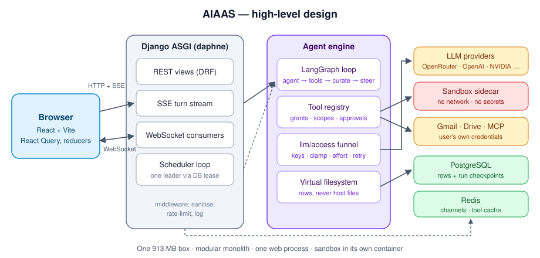
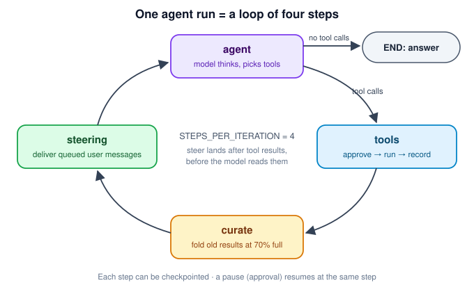
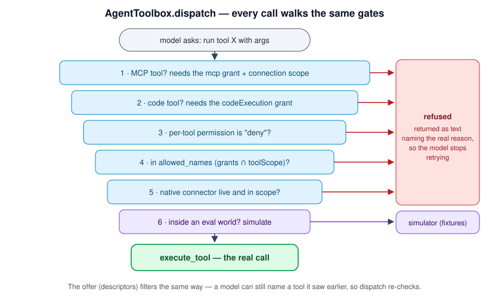
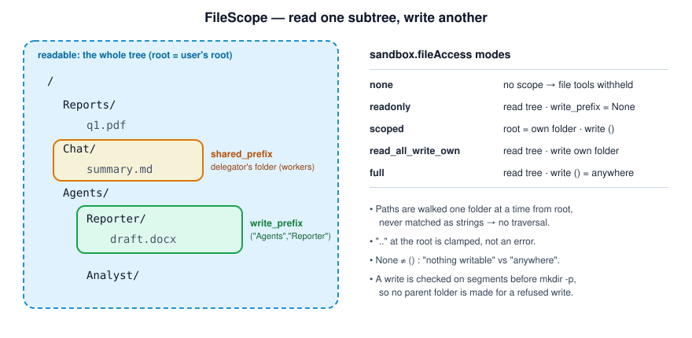

# AIAAS — Low-Level Design Guide

A study guide to the design of AIAAS, taught from its own code. It covers the
high-level design (the big boxes) and, mostly, the low-level design: the
classes, patterns, data structures and invariants inside each box, on both the
**backend** (Django / Python) and the **frontend** (React / TypeScript).

Every pattern links to the real file. Every section ends with a line you can
say in an interview. Most sections open with a picture: about 100 Mermaid
diagrams (flowcharts, sequence, class and state diagrams, a mind map) plus five
drawn images in [`diagrams/`](diagrams/). **Look at the picture first, then read.**

| Picture | Shows | Used in |
|---|---|---|
|  | The whole system on one page | Part 1 §2.2 |
|  | The four-step agent loop | Part 1 §2.3 |
|  | Every gate a tool call passes | Part 2 §7.4 |
|  | What an agent may read and write | Part 2 §10 |
|  | Where frontend state lives | Part 3 §11.2 |

Mermaid renders on GitHub and in VS Code's Markdown preview (install the
"Markdown Preview Mermaid Support" extension if a block shows as code).

> Written 2026-09-27, updated 2026-09-28. This folder is part of the AIAAS
> repository: since 2026-09-27 the backend, the frontend and the project docs
> are **one git repository** (both old histories merged in). Links are
> relative, so they open in VS Code and on GitHub.

---

## What changed recently (2026-09-28)

The guide was updated for the work that landed on 2026-09-28. If you have
already read it, these are the new or changed sections:

| Change in the code | What it teaches | Where in the guide |
|---|---|---|
| **Organisations + solution memory** (`solutions/`, `core/orgs.py`): solved problems are saved and found again, only inside the org they came from | A single read door that every query must pass (with a test that enforces it); state computed when read instead of stored; search that refuses to answer on weak evidence | Part 1 §3.3 · Part 2 §8.9, §8.10 · Part 9 §14.7 · Part 10 §O |
| **Chat sent earlier turns twice** (the database history *and* the checkpoint) | One source of truth; the bug a test on the provider's input caught | Part 1 §2.3 · Part 2 §12 · Part 4 §15.1 story 4 |
| **User memory picks facts fairly** (categories take turns under a 2,000-char budget; "Who they are" first) | Fair selection under a budget (round-robin) | Part 2 §8.11 · Part 10 §O |
| **The prompt tells the model the chat's mode** and how many old messages were left out | Put changing facts in the per-turn update, not the cached system prompt | Part 9 §14.1 · Part 10 §O |
| **`run_in_thread`**: start async work from sync code | Bridging sync and async safely | Part 2 §9.7 |
| **Frontend**: Solutions page, Organisation settings, a per-chat sharing switch, the Memory tab shows what the model actually sees | Showing users the system's real state | Part 3 §11.13 |
| **One repository** | — | This README; Part 10 §A5 |

---

## New to Python, Django, TypeScript or React? Start here

These four primers are written for beginners. Each starts with the basics in
plain words, then a glossary, then the exact syntax this codebase uses, with
real lines from it, a decoder exercise, and a cheat sheet.

| # | File | Read it if… | Time |
|---|---|---|---|
| 5 | [05_Python_Syntax.md](05_Python_Syntax.md) | Python is new, or `@decorator`, `async`, `*,` and dataclasses look strange | 45 min |
| 6 | [06_Django_Primer.md](06_Django_Primer.md) | you don't know models, the ORM, URLs, views, serializers, migrations | 60 min |
| 7 | [07_TypeScript_Syntax.md](07_TypeScript_Syntax.md) | JavaScript/TypeScript is new, or `?.`, `??`, `<T>` and unions look strange | 45 min |
| 8 | [08_React_Primer.md](08_React_Primer.md) | you don't know components, props, state, hooks, routing, React Query | 60 min |

**Suggested path for a beginner:** 5 → 6 → Part 1 → Part 2, then 7 → 8 → Part 3,
then Part 4.

## Know AI/data science but not software design? Start here

| # | File | What it gives you | Time |
|---|---|---|---|
| 9 | [09_Design_Patterns_for_AI_Engineers.md](09_Design_Patterns_for_AI_Engineers.md) | Each pattern explained from something you've used (scikit-learn, PyTorch, Keras callbacks, Hugging Face `AutoModel`, `DataLoader`), then shown in AIAAS; plus AI-specific patterns (context curation, LLM-as-judge, guardrail layers, rank fusion) and the CS underneath | 50 min |

## Preparing for interviews

| # | File | What it gives you |
|---|---|---|
| 10 | [10_Probable_Interview_Questions.md](10_Probable_Interview_Questions.md) | ~90 likely questions on this project (overview, HLD, LLD, agents, RAG, evals, data, concurrency, frontend, security, ops, scaling, behavioural, and the 2026-09-28 work on organisations, solution memory and prompts), each with a model answer, level tag and the likely follow-up; numbers to know by heart; questions to ask the interviewer |

## How we know it works

| # | File | What it gives you | Time |
|---|---|---|---|
| 11 | [11_How_We_Test.md](11_How_We_Test.md) | Every kind of test in the project and why it exists: fake-model unit tests, end-to-end tests through the real agent graph, tests that enforce the architecture, frontend/backend contract tests, concurrency and security tests, the frontend stack, and the real-model benchmark (capability vs guardrail, pass@1 vs pass^k); the latest results; the CI setup; interview answers | 30 min |

## Reading order (design)

| # | File | What it covers | Time |
|---|---|---|---|
| 1 | [01_HLD_and_Object_Model.md](01_HLD_and_Object_Model.md) | HLD vs LLD; the system's boxes and data flow; HLD decisions and their costs; the core classes and why they're shaped that way | 25 min |
| 2 | [02_Backend_LLD_Patterns.md](02_Backend_LLD_Patterns.md) | SOLID; creational, structural and behavioural patterns; persistence, concurrency and safety patterns; backend anti-patterns fixed | 90 min |
| 3 | [03_Frontend_LLD_Patterns.md](03_Frontend_LLD_Patterns.md) | Frontend layers; API client, SSE, error boundary layer; state by lifetime (React Query, reducers, external store, context, Zustand); WebSocket primitive; component design; hooks; performance; client security; FE/BE agreement; testing; frontend anti-patterns | 75 min |
| 4 | [04_Interview_Kit.md](04_Interview_Kit.md) | Designing a feature end to end; classic LLD problems (LRU, scheduler, rate limiter…) mapped to this code; STAR stories; Q&A; full cheat sheet | 45 min |

Section numbers run across all four files (§0–§16), so a reference like "see
§7.6" means section 7.6 wherever it lives: §0–3 in Part 1, §4–10 and §12 in
Part 2, §11 in Part 3, §13–16 in Part 4.

---

## Pattern finder

| Pattern | Backend | Frontend |
|---|---|---|
| Singleton | `ProviderRegistry`, `CredentialManager` (§5.1) | axios `apiClient` (§11.1.1) |
| Factory / lazy init | `checkpoints.build()`, `get_graph()` (§5.2–5.3) | `lazyPage` (§11.6) |
| Builder | LangGraph `StateGraph` (§5.4) | — |
| Facade | `arun_code`, `llm/access`, `eval/api` (§6.1) | `toast.*` over the store (§11.2.5) |
| Adapter | Provider payload hooks, eval simulators (§6.2) | `usePersistedState`, `asArray` (§11.1.3, §11.2.6) |
| Decorator / middleware | `HybridMiddleware`, `@tool` (§6.3) | axios interceptors (§11.1.1) |
| Proxy | Eval environment in `dispatch` (§6.4) | — |
| Registry / plugin | Tools, graders, contracts, commands (§7.1) | Icon map by `icon_slug` (§11.8) |
| Strategy | Approval policies, sandbox engines (§7.2) | Transport choice: SSE / WS / polling (§11.3) |
| Template Method | `OpenAICompatibleLLMNode` (§7.3) | — |
| Chain of Responsibility | `AgentToolbox.dispatch` (§7.4) | Interceptor chain (§11.1.1) |
| Observer | `EventSink`, `on_tool_result` (§7.5) | `subscribeChatRun`, `useSyncExternalStore` (§11.2.3) |
| Command / queue | Steering mailbox, slash commands (§7.6) | Undo history (§11.5) |
| State machine | Run / HITL / trigger status (§7.7) | Run status in `chatRuns` (§11.2.3) |
| Reducer / event sourcing | Whole-list `update_todos` (§7.6) | `useChatStream`, `planStream` (§11.2.2) |
| Optimistic concurrency | Slot claim, `expected_version` (§8.2) | Autosave etag (Part 2 §8.2) |
| Lease / leader election | `SchedulerLease` (§8.3) | — |
| LRU / bounded caches | MCP pool, credential cache (§9.4) | Run retention + GC (§11.2.3) |
| Admission control | `ConnectorSupervisor` (§9.3) | — |
| Allow-list validation | Env passthrough, `SHAREABLE_KEYS` (§10) | `nextPath`, `safeUrl` (§11.7) |
| Choke point / single read door | `solutions/access.py::visible`, `filesystem.resolve_folder` (§8.9) | only `src/api/` calls the backend (§11.1) |
| Derived state (computed at read time) | Solution freshness `fresh`/`check` (§8.10) | `in_prompt` shown on the Memory tab (§11.13) |
| Fair selection under a budget | Memory categories take turns (§8.11) | — |
| Single source of truth | Chat history only from the database (§12) | Screen state as a fold over events (§11.2.2) |

---

## How to study it

1. Read a section, then open the linked file and find the excerpt.
2. Write the pattern from memory in a scratch file, without the project.
3. Say the "interview line" out loud.
4. For every pattern, be ready for: *what problem? why here? what does it cost?
   what would you do at 10× scale?*

## Related notes

- `../learning/` — deep dives on single topics (OAuth/JWT, MCP, WebSockets,
  async Django concurrency, deploy downtime, the security review).
- `../START_HERE.md` — plain-language tour of the product.
- `../CLAUDE.md` — the full design history, one decision at a time.
