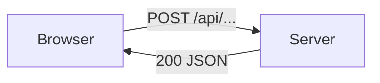
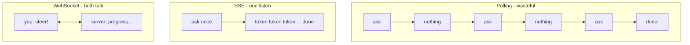
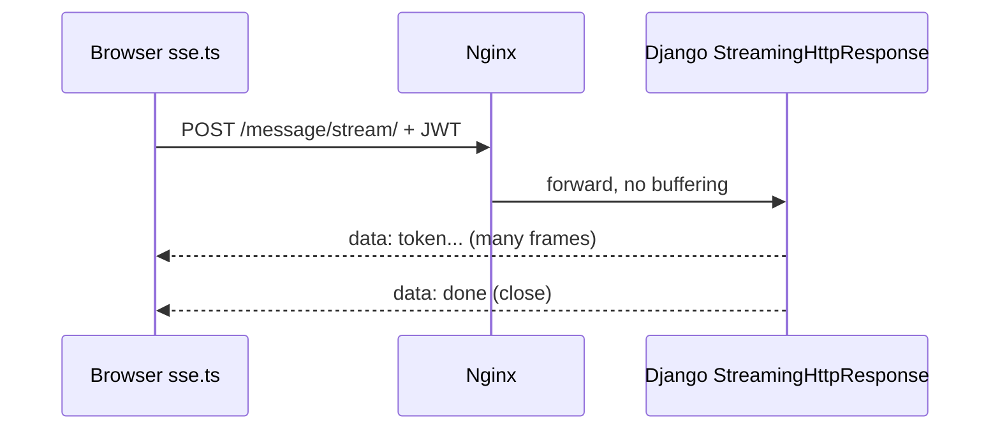
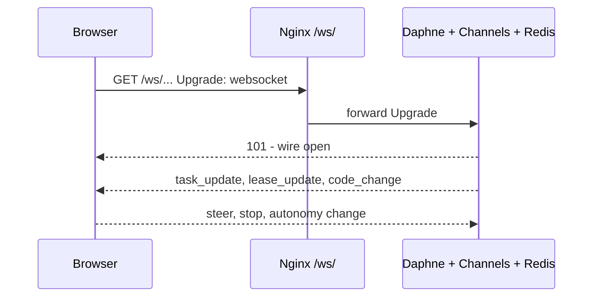
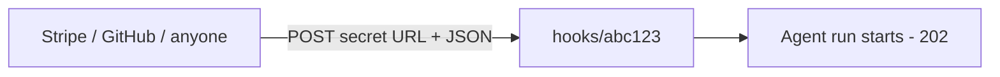
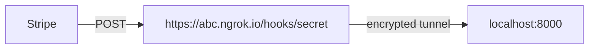
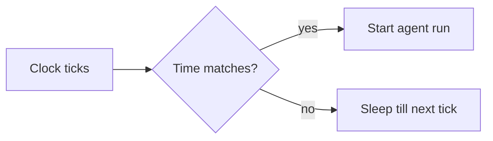
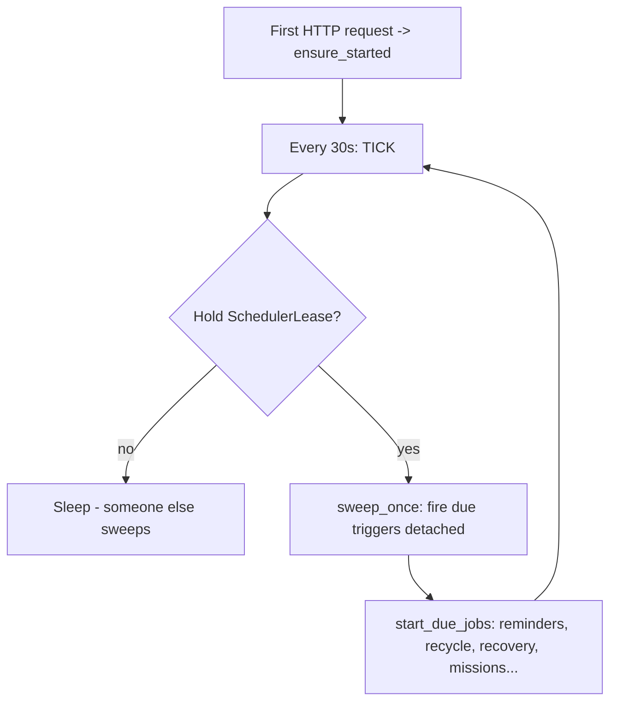

# Tunnelling, Webhooks, WebSocket, SSE, HTTP — Simple Guide

> Plain-words guide to how parts of this app talk to each other live.
> Not covered in the two earlier guides. Every section = what it is, why we need it, where it lives in this code.

---

## 1. HTTP first — the base language

**HTTP = one question, one answer.** Browser asks, server replies, connection closes.

```
POST /api/chat/sessions/123/message/stream/
{ "message": "hi" }
  -> 200 OK + reply
```

* **Methods:** `GET` = read, `POST` = do/send, `PATCH` = edit, `DELETE` = remove.
* **Status codes we use:** `200` done, `202` accepted (run started, result later), `400` your mistake, `401/403` no entry, `404` not found (also used to hide secrets), `413` too big, `500` our mistake.
* **Headers = sticky notes on the parcel:** `Authorization: Bearer <jwt>`, `Content-Type: application/json`, `Cache-Control: no-cache`.

HTTP alone cannot do "keep telling me while the agent thinks for 10 minutes". That needs SSE or WebSocket below.



---

## 2. Polling vs SSE vs WebSocket — pick the right phone

| Way | Looks like | Good for | Cost |
|---|---|---|---|
| **Polling** | Call every 5 sec: "done yet?" | Small status checks | Many wasted calls |
| **Long-polling** | Call, server waits 30s then answers | Rare events | Hanging connections |
| **SSE** | One call, server keeps talking | Chat tokens, run logs (server -> you) | One long connection |
| **WebSocket** | One wire, both talk anytime | Steer/stop mid-run, live inbox (both ways) | Needs special server |

Think: polling = knocking on door again and again. SSE = radio station you listen to. WebSocket = phone call, both speak.



**This app uses all three, on purpose:**

* Chat turns = **SSE over POST** (`text/event-stream`).
* Execution panel + HITL pings = **WebSocket** (`ws/`).
* Schedules page banner = **polling** (`triggers/health/`).

---

## 3. SSE — how chat streams here

**File proof:** `Backend/chat/transport/sse.py` + `streaming_http.py`, frontend `src/api/sse.ts`.

Server sends frames like:

```
data: {"type": "token", "content": "hello"}

data: {"type": "done"}

```

**Why POST SSE, not EventSource?**

`EventSource` (browser built-in) can only do `GET` with no headers. Our stream needs `POST` (message body) + `Authorization: Bearer <jwt>`. So `src/api/sse.ts::streamSse()` uses `fetch()` + `reader.read()` loop + `drainFrames()` that splits on `\n` and parses `data:` lines.

**Three settings that must be right or streams freeze:**

1. Django: `StreamingHttpResponse(..., content_type="text/event-stream")` + `Cache-Control: no-cache` + `X-Accel-Buffering: no`.
2. Nginx (`nginx.conf /api/`): `proxy_buffering off; proxy_cache off; proxy_read_timeout 300s;` — else nginx holds tokens until turn ends.
3. Caddy (`Caddyfile`): `flush_interval -1` — else Caddy does the same one level up.



**Recruiter line:** "SSE is one-way server-to-client over HTTP. We use POST+fetch reader because we need body and auth headers. Buffering must be off at all three layers."

Turn outlives the watcher: `runs.ChatRun` owns the work, `stream_response()` only subscribes from `from_index`. Refresh mid-turn = re-subscribe and replay, not restart.

---

## 4. WebSocket — how live control works here

**File proof:** `streaming/` (executions stream/events), `core/realtime/`, frontend `lib/websocket.ts::useSocket`.

Handshake: normal HTTP asks `Upgrade: websocket`, server says `101 Switching Protocols`, then both send frames freely — no new HTTP requests.



**What rides WS here (not SSE):**

* `task_update / lease_update / code_change` to lead's sink + plan panel.
* `ws/hitl/` device nudges, inbox live rows.
* Steer/stop mid-run: with SSE you can only listen; with WS you can interrupt.

Nginx needs: `proxy_set_header Upgrade $http_upgrade; Connection "Upgrade"; proxy_read_timeout 86400s;` — else the phone cuts after 60s.

**Scaling trap (ask this in interview):** WS connections stick to one box. Two backends + dumb balancer = user on box-1, event fired on box-2 = silence. Fix = Redis channel layer (`USE_REDIS_CHANNEL_LAYER=True`) so any box can publish to any socket, plus sticky sessions on the balancer. We run one backend now, so lease + in-memory `runs.subscribe` is enough — but it must move to Redis pub/sub before horizontal scaling.

---

## 5. Webhooks — the doorbell from outside

**Webhook = outsider knocks, our agent starts.** No login, just a secret URL.

Route: `POST /api/orchestrator/hooks/<secret>/` → `agents/views/triggers.py::webhook_receive`.



**Design rules in this code (good interview answers):**

1. **Secret in path is the password.** No auth header. Rotatable via `triggers/<id>/rotate/` without losing the row.
2. **Always 202 or 404, nothing else on success.** Success = bare `202`, no agent name, no execution id. Wrong secret, disabled trigger, no `allow_unattended` = all `404 Not found`. Else attackers can probe which secrets are live (oracle attack).
3. **Body is context, never the goal.** Goal comes from trigger/agent row. Payload is appended as `Inbound webhook payload:`. Else anyone with the URL could make your agent do anything its grants allow.
4. **Size cap** (`MAX_WEBHOOK_BODY_BYTES`, else `413`), failure counter disables flapping hooks, `last_fired_at` recorded.

**Webhooks vs polling vs SSE:**

| | Who calls | When |
|---|---|---|
| Polling | You ask them | Every minute (wasteful) |
| Webhook | They call you | On event (instant, cheap) |
| SSE/WS | You watch us | While our run goes |

Outbound webhooks (we call others) follow mirror rules: sign payload (HMAC), retry with backoff, idempotency key so double-delivery does not double-charge.

---

## 6. Tunnelling — show localhost to the internet

**Problem:** webhooks and Google OAuth need a public URL. Your code runs on `localhost:8000`. They cannot reach it.

**Tunnel = temporary public wire to your laptop.** e.g. `cloudflared`, `ngrok`.



Typical dev flow:

```bash
# terminal 1: backend
python manage.py runserver 0.0.0.0:8000
# terminal 2: tunnel
cloudflared tunnel --url http://localhost:8000
# use printed https URL as webhook URL / OAuth redirect
```

**Warnings:** tunnel URL is public — use a throwaway webhook secret, never prod DB. Latency is higher. Free URLs change on restart, so update the sender each time. Never tunnel Redis/DB ports.

Production needs no tunnel: EC2 has a real public IP + DNS + Caddy.

---

## 7. Things recruiters ask that we had not written down

**CORS:** browser blocks `frontend.com` reading `api.com` unless backend allows it. Here same-origin via Nginx (`/api` on same host), so almost no CORS. `CORS_ALLOWED_ORIGINS=https://aiaas.kaushaljain.com` only. `CORS_ALLOW_ALL + credentials` = echoes any site = hijack (fixed, see prod compose comment S5).

**CSRF:** evil site auto-submits your logged-in form. Blocked by `CSRF_TRUSTED_ORIGINS` + SameSite cookies. JWT-in-header APIs are immune (evil site cannot know the token).

**JWT auth on streams:** cookies don't flow to `fetch` streams cleanly + `EventSource` sends no headers, so `streaming_http.py::authenticate()` reads `Authorization: Bearer` manually (DRF decorators can't wrap `StreamingHttpResponse`). Short access + rotating refresh, revocation via `tokens_valid_after`.

**Rate limiting / throttling:** DRF throttle + `429 Too Many Requests` + `Retry-After`. Protects login, webhooks, model calls from brute force and bill shock. Per-user + per-IP, stricter on unauthenticated `hooks/`.

**Idempotency:** "Run once now" double-click must not start two runs. Per-slot claim in `sweep.prepare` makes second click report `busy`. Same idea for payments/webhooks: same key twice = one effect + replayed answer.

**Retries + backoff:** provider 5xx/timeout = retry twice with wait (`STREAM_CONNECT_RETRY_DELAYS`); 401/402/429 = never blind-retry (not transient). Webhook sender retries on our 5xx, never on 404 (would probe forever).

**Timeouts at every layer:** Nginx `300s` (API) / `86400s` (WS), Caddy flush, `AUTO_REVIEWER_TIMEOUT_S=3` (slow judge = ask, never auto-allow), sandbox kill on timeout (`killpg`, not just stop-waiting). No timeout = one stuck call holds workers forever.

**Heartbeats / keepalive:** long SSE/WS send `: ping` or `{type: heartbeat}` every ~25s so proxies/NAT don't silently drop idle wires. Client reconnects with `from_index` / backoff + jitter (thundering herd fix).

**Backpressure:** fast producer (model tokens) vs slow consumer (phone). Bounded in-memory queues, drop-oldest with counter for steers (`steering.py`), spill big tool outputs to `ToolOutput` + send preview + `read_tool_output` id. Never unbounded list (see `PAGE_SIZE`, `*_LIMIT` caps).

**Sticky sessions + draining on deploy:** restart takes ~11s (`manage.py boot` then `exec daphne`). Open SSE/WS die. Client must reconnect + replay; sweep recovers orphaned `running` rows (resume if durable checkpoint + state, else fail loudly). Balancer should drain (stop new, wait old) before killing a box.

**HTTP versions in one line:** `HTTP/1.1` = one request per turn (needs hacks for streams); `HTTP/2` = multiplexed, header-compressed (Caddy serves this); `HTTP/3/QUIC` = same over UDP, faster on lossy mobile. Our SSE/WS work on all three because they sit above them.

**gRPC / MQTT in one line:** gRPC = binary contract calls between services (we use JSON+HTTP instead — simpler, debuggable). MQTT = tiny pub/sub for IoT buttons/sensors (would feed webhooks here, not replace WS).

---

## 8. Cron jobs and schedules — the alarm clock

**Problem:** "Send report every day at 9 AM" needs someone awake at 9 AM to press the button.

**Cron = alarm clock lines.** Five stars = minute hour day month weekday:

```
0 9 * * 1-5  =  9:00 AM, Monday to Friday
* * * * *    =  every minute
```

Think: cron is a watchman with a list — "when clock matches, ring the bell".



**Three ways to ring the bell (we tried all three):**

| Way | Looks like | Good | Bad |
|---|---|---|---|
| **Host cron** (`crontab -e`) | `* * * * * docker exec backend python manage.py run_due_triggers` | Simple, OS-level | Manual setup, boots a whole Django (~150 MB) every minute inside a 384 MB box = OOM kills; silently dead if someone forgets the line |
| **Celery beat** (`CELERY_BEAT_SCHEDULE`) | `beat` process fires `orchestrator.sweep_triggers` | Retries, task log | Needs Redis + 2 extra processes; prod has no Celery (memory is full) |
| **In-process loop (what prod runs)** (`agents/scheduler.py::run_forever`) | Backend itself ticks every `30s` | No cron, no broker, no extra RAM; starts on first HTTP request | Must stop two boxes firing twice (solved below) |

**How our loop works — file proof `agents/scheduler.py`:**



1. **Lease = one microphone.** Row `SchedulerLease(name='triggers')`. Taker writes `holder = host:pid:random, expires_at = now + 90s` with one conditional UPDATE. Only holder sweeps. Dead holder stops owning after `90s`, another takes over. Health page polls `triggers/health/` (`running` = beat within 2× lease) — red banner if nobody sweeps.
2. **Per-slot claim = no double ring.** Even if loop + beat + hand-run fire together, `sweep.prepare` claims one slot once; second caller gets `busy`. "Run once now" double-click is safe for the same reason.
3. **Detached = slow agent never blocks others.** Old path waited for each run; loop starts each run and moves on. Other jobs (`PERIODIC_JOBS`) also `spawn()` detached — a slow purge never delays schedules or lets the lease lapse. A job still running when next due = skipped, not doubled.
4. **Timezone stored right.** `Trigger.timezone` walks local wall-clock then saves UTC in indexed `next_due_at`. Spring-forward gap skips, autumn fold fires once. `describe()` shows words ("Every weekday at 9:00 AM") so `0 9 * * 1` vs `9 0 * * 1` mistakes are visible before saving.

**What runs on the loop (`CELERY_BEAT_SCHEDULE` mirrors it, test fails if they drift):**

| Job | Every | Does |
|---|---|---|
| `orchestrator.sweep_triggers` | 60s (the loop itself, 30s tick) | Fire due schedules |
| `notifications.sweep_scheduled` | 60s | Minute-accurate user reminders |
| `notifications.sweep_hitl_reminders` | 300s | Approval nudges + digest |
| `missions.sweep_missions` | 120s | Settle finished mission runs, start due ones |
| `inference.sweep_recycle_bin` | 3600s | Permanently delete 30-day trash |
| `orchestrator.recover_runs` | slow | Resume/close runs whose process died (deploy/OOM) |
| `orchestrator.prune_chat_checkpoints` | slow | Keep latest checkpoints per thread |
| `logs.redact_old_run_detail` | daily | Drop old reasoning payloads after 180 days, keep the row |

Debug by hand without waiting: `python manage.py run_due_triggers --dry-run`, Schedules page → Run once now (same gates, answers `202` + run id).

**Recruiter line:** "Prod runs no Celery and no host cron — the backend sweeps itself every 30s under a DB lease, claims each slot atomically so two sweepers never double-fire, and runs slow jobs detached with skip-if-running. Cron/beat stay as debuggable equivalents."

---

## 9. Cheat answers for interview

* "SSE or WebSocket?" — one-way live view = SSE (`/message/stream/`); two-way control = WS (`/ws/`, steer/stop). SSE needs POST+fetch here for body+JWT, buffering off at Django+Nginx+Caddy.
* "How do webhooks stay safe with no login?" — secret URL + always-404-on-refusal + body-is-context + size cap + rotate + throttle.
* "How do you test webhooks locally?" — tunnel (`cloudflared --url localhost:8000`), throwaway secret, update sender URL.
* "What breaks when you scale to 3 backends?" — WS stickiness, in-memory subscribe must become Redis pub/sub, scheduler needs single lease-holder, DB pool sum must stay under `max_connections`, volumes must become shared/S3.
* "How does a stream survive deploy?" — it doesn't; client reconnects with resume index, server replays from run, sweep closes orphans.
* "Cron vs beat vs your loop?" — cron boots a full Django per minute (OOM on small box) and needs hand-setup; beat needs Redis+processes prod doesn't have; loop ticks in-process every 30s under `SchedulerLease`, per-slot claim stops double-fire, slow jobs detached with skip-if-running.
